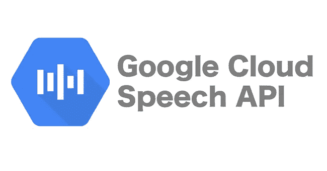
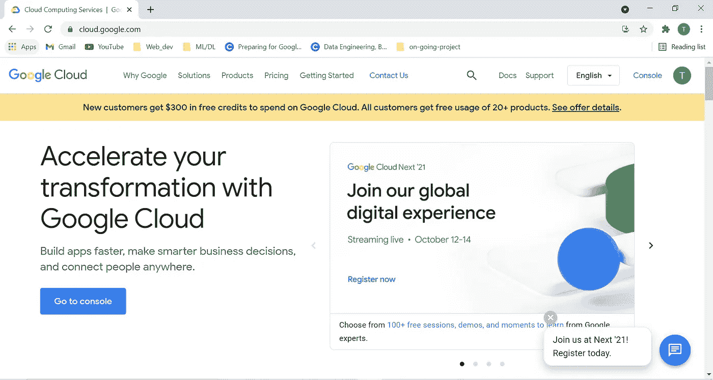
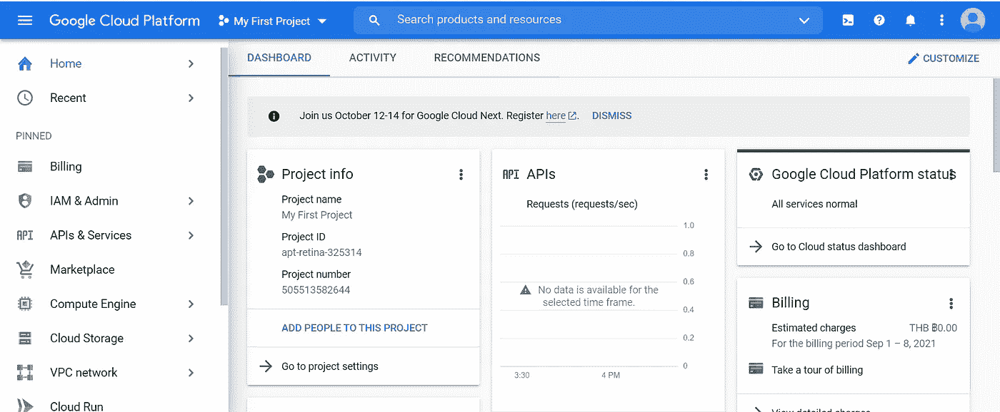
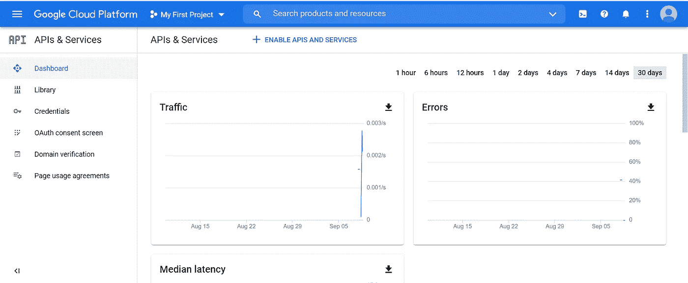
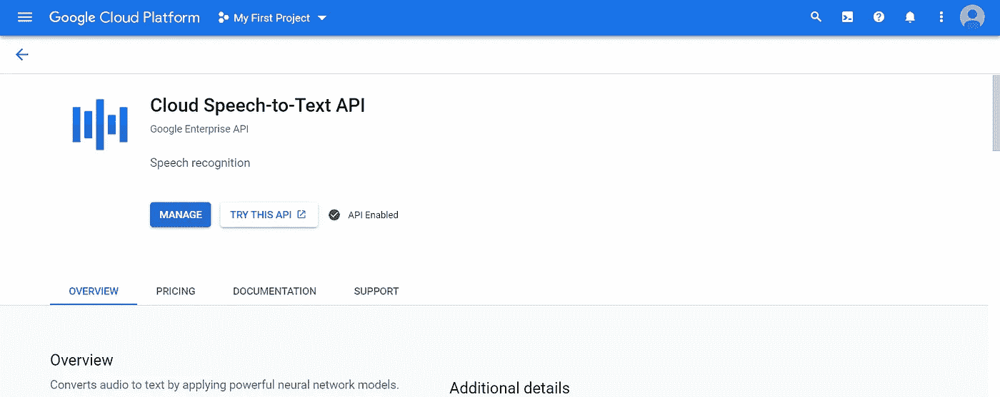
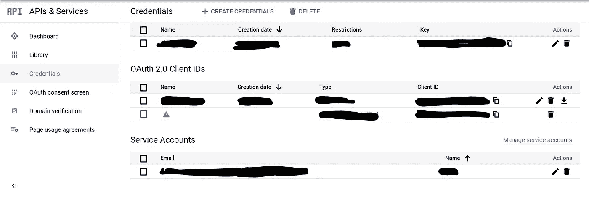

# 使用 Python 的 Google 语音转文本 API 教程

> 原文：<https://medium.com/codex/google-speech-to-text-api-tutorial-with-python-2e049ae3f525?source=collection_archive---------2----------------------->



最近，我有机会探索最伟大的深度学习算法之一，语音转文本，用于我公司的项目，以转录音频语音并删除敏感和个人数据。

如果你和我一样是第一次使用 google API，我将带你了解一下，我保证通过这篇文章你将能够使用 google API。

## 什么是 API？根据维基百科的 API 是

> “一个**应用编程接口** ( **API** )是[计算机](https://en.wikipedia.org/wiki/Computer)之间或者[计算机程序](https://en.wikipedia.org/wiki/Computer_program)之间的连接。它是一种软件[接口](https://en.wikipedia.org/wiki/Interface_(computing))，为其他[软件](https://en.wikipedia.org/wiki/Software)提供服务。[【1】](https://en.wikipedia.org/wiki/API#cite_note-1)描述如何构建这种连接或接口的文档或标准称为 *API 规范*。符合这个标准的计算机系统被称为*实现*或*公开*一个 API。术语 API 既可以指规范，也可以指实现。

简单来说，就是通过把你的电脑连接到他们的电脑上，请求使用那个特定的软件(API)来使用其他的软件(API)。是的，谷歌允许每个人以价格交换或免费借用或租赁他们的 API。如果我们想在上使用这项服务，我们可以简单地访问他们的网站并免费测试，但如果你想使用它来与你的程序或代码集成，你需要在谷歌云平台上注册。

首先你必须去这个网站:[cloud.google.com](http://cloud.google.com)



第一个云平台定时器。云平台是指基于互联网的数据中心的服务器的操作系统和硬件。它允许软件和硬件产品远程大规模共存。把云平台想象成一个地方，你可以把你的代码放在那里工作，而不用担心服务器、维护等等。但在本文中，我们使用云是为了借用他们的语音转文本软件和他们的计算能力来操作我们计算机上的语音转文本 API。

# 进入谷歌云平台

要进入他们的谷歌云平台，点击“**转到控制台**按钮。你将进入 GCP 的登陆页面。



此页面是 GCP 使用情况的汇总页面，包括 API、计费和项目。在使用他们的任何服务之前，你必须在谷歌服务的 gmail 账户上设置你的信用卡。但在这里，你不需要担心价格，因为 GCP 会给你 300 美元的使用信用，如果超过免费信用，不会自动使用你的信用卡。

要在 GCP 使用 API，首先要点击右边的**API 和服务**。你会找到这个页面，点击**库**来搜索你要找的 API。



## 搜索云语音转文本 API

起初，它会显示蓝色按钮为**启用**，点击后，它将允许您的帐户连接到 API。然后它将变为**管理**现在您已经访问了 google API 的一个步骤。



为了在 API 中使用 GCP，您必须做的最后一件事是获取凭证密钥。返回到**API 和服务页面**并点击**凭证** 现在点击您的**服务账户**。



#现在我很敏感地分享以下细节的图片。
我不会显示图片来访问和创建凭证。

# 如何获得谷歌服务帐户凭证

进入**服务账户**页面后，

1.  你点击**键**标签
2.  点击**添加密钥**并选择**创建新密钥**
3.  选择 **JSON** 以 JSON 文件的形式下载密钥，用于访问 GCP api
4.  将您的 JSON 文件保存到 google_secret_key.json 或您喜欢的其他名称

现在您已经做好了一切准备，可以在代码中使用 API 了。

# python 上的云语音转文本 API

要使用 python 中的 API，首先你需要为演讲安装谷歌云库。通过在命令行上使用 pip 安装。

```
pip install google-cloud-speech
```

现在您正在访问 GCP 的 API，让我们写一些代码。首先，我们导入使用 API 所需的最少代码。

```
from google.cloud import speech
import os
import io
```

创建一个客户机实例，用于发送请求 API 并为 API 请求设置 Google 凭证。下面是让您的操作系统知道哪个文件包含 google 凭证的代码。您必须将凭证文件放在与代码相同的文件夹中，或者设置 json 文件的路径。

```
#setting Google credential
os.environ['GOOGLE_APPLICATION_CREDENTIALS']= 'google_secret_key.json'# create client instance 
client = speech.SpeechClient()
```

阅读音频文件，你可以尝试 WAV 文件以外的其他音频格式，但为了确保它是可行的，我建议继续使用 WAV 或 MP3 格式。如果你想测试和我一样的音频你可以去这个[开源音频文件](https://www.voiptroubleshooter.com/open_speech/american.html)。

```
#the path of your audio file
file_name = "OSR_us_000_0010_8k.wav"with io.open(file_name, "rb") as audio_file:
    content = audio_file.read()
    audio = speech.RecognitionAudio(content=content)
```

现在，要使用语音，首先我们需要设置语音到文本引擎的配置，您可以在[这里](https://cloud.google.com/speech-to-text/docs/reference/rest/v1/RecognitionConfig)查看参数。

```
config = speech.RecognitionConfig(
    encoding=speech.RecognitionConfig.AudioEncoding.LINEAR16,
    enable_automatic_punctuation=True,
    audio_channel_count=2,
    language_code="en-US",
)
```

现在是我们发送请求到谷歌为我们转录音频的部分

```
# Sends the request to google to transcribe the audio
response = client.recognize(request={"config": config, "audio": audio})# Reads the response
for result in response.results:
    print("Transcript: {}".format(result.alternatives[0].transcript))
```

结果的输出如下所示

```
Transcript: The Birch canoes slid on the smooth planks.
Transcript:  Glue the sheet to the dark blue background.
Transcript:  It is easy to tell the death of a well.
Transcript:  These days, a chicken leg is a verb dish.
Transcript:  Rice is often served in round bowls.
Transcript:  The juice of lemons makes find punch.
Transcript:  The box was down beside the park truck.
Transcript:  The Hogs of food shop, corn and garbage.
Transcript:  4 hours of study work Facebook.
Transcript:  A large size in stockings is hard to sell.
```

我刚刚展示给你的这个方法只适用于小规模音频(**小于 1 分钟的音频或 10 MB** )，这样你就可以在你的本地计算机上运行。如果你想运行更长的音频文件，你需要把你的音频文件放在**谷歌云存储**中，这是另一个在云上存储数据的 API，这样它可以使用更多的计算资源。

# 现在，您已经准备好将语音转文本应用到您的应用程序中，您的代码可以开始使用了！