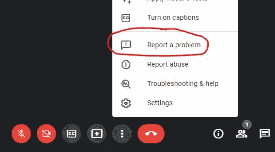

# Google Storytime:建立以用户为中心的文化

> 原文：<https://medium.com/codex/google-storytime-building-a-user-focused-culture-58d6b2786935?source=collection_archive---------7----------------------->

您知道您可以在任何谷歌产品中提交用户反馈吗？Google Meet 有 ***【报告问题】*** ，可以给工程团队发截图和文字说明。想知道窗帘后面发生了什么吗？我会告诉你一切。

除了[创建 Google Meet 本身](https://blog.startupstash.com/my-only-and-last-regret-at-google-d3f11ef1a460)，反馈工具/系统可能是我最满意的技术…