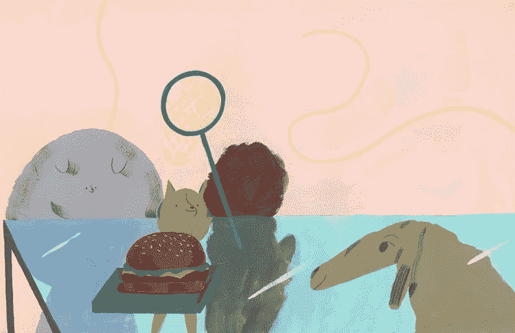

# 谷歌故事时间:实习

> 原文：<https://medium.com/codex/google-storytime-the-internship-c1e25fd267bf?source=collection_archive---------2----------------------->

朱平，“圆狗”——画布项目

你们很多人可能看过文斯·沃恩和欧文·威尔逊的电影《实习医生 T2》。让我告诉你，这和在谷歌的真实实习经历完全不同。电影《T4》很有趣，但它是虚构的。

我给你讲讲 Google Meet 团队的一个实习吧。我为这一个超级骄傲。我们称这个实习生为亚当。同样，团队中的人会知道这是谁。