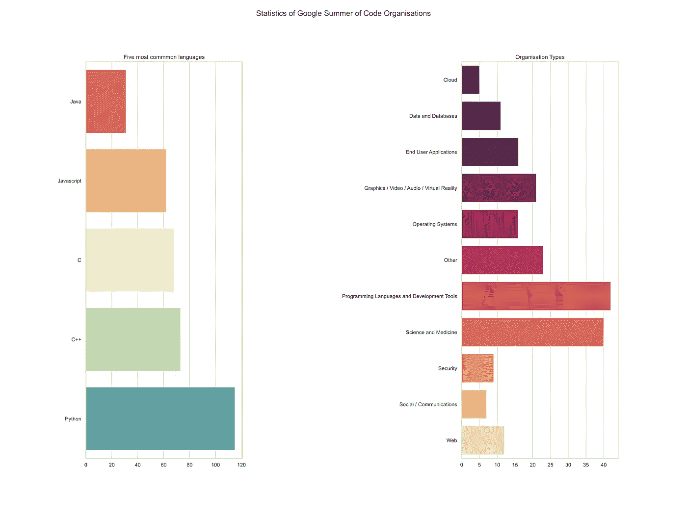
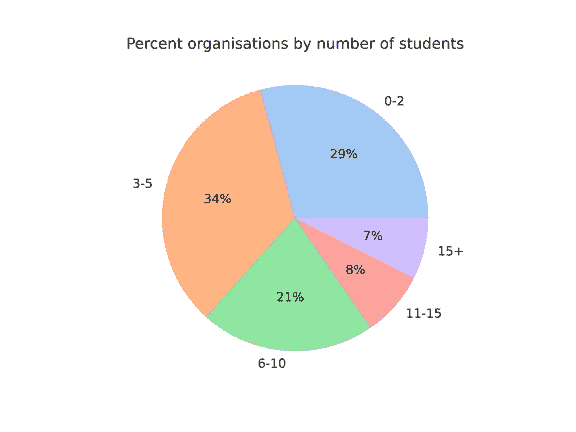
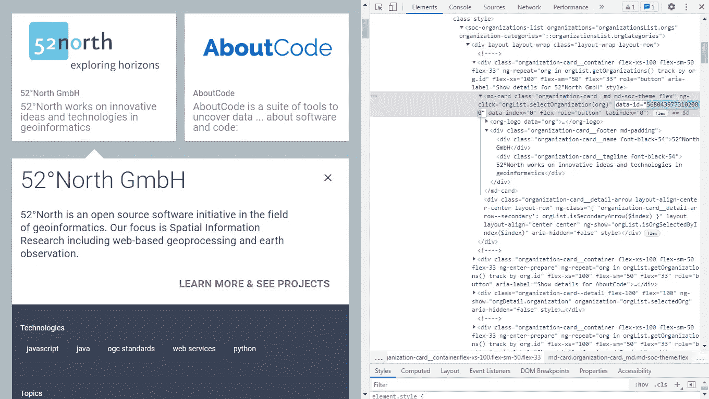

# 谷歌代码组织分析之夏

> 原文：<https://medium.com/codex/google-summer-of-code-organisations-analysis-6cf6deb424d?source=collection_archive---------3----------------------->

# 关于我，

我是 Arghya，NYU 大学自我设计项目的大一学生。我热爱数学，我开始讨厌没有数学的编程内容(但可能会有一些例外)。几个月前，我开始做开源软件，主要是用 Python，我学校教的语言，做贡献，直到现在。我希望很快能从事 Julia 和 JavaScript 的项目。除了这些语言，我对 C++和 Java 也有相当的了解。

# **什么是谷歌代码之夏？**


如果你正在阅读这篇文章，你可能对[谷歌代码之夏](https://summerofcode.withgoogle.com/)有所了解。总之，给你一个简单的概述，谷歌代码之夏(GSoC)是一个鼓励开源开发的国际项目。出于同样的原因，GSoC 不是实习，你也不是为谷歌工作。在春末夏初，你应该与[数百个 GSoC 合作组织](https://summerofcode.withgoogle.com/organizations/)中的几个联系。然后，该组织会将你放在他们的优先名单上，并向谷歌请求在其 GSoC 计划中为你安排一个位置。如果你足够幸运得到一个位置，你就可以和有帮助的导师一起度过一个硕果累累的编码之夏。此外，你还会收到 3000-6000 美元不等的津贴，这取决于你生活在哪个国家。如果你有兴趣了解更多如何参与，我建议你查看 [GSoC 指南](https://developers.google.com/open-source/gsoc/resources/guide)了解更多。

# 选择您的组织

我们谈到了与合作伙伴组织建立联系的必要性，以便我们能够参与其中。但是，在选择组织之前，你可能会考虑哪些因素呢？这是除了关于开源本身的问题之外最常被问到的问题。

我的分析旨在为你提供选择组织的更好方法。虽然 GSoC 网站为你提供了大量关于一个组织的信息，允许你根据关注的类别、单一编程语言或主题选择来过滤它们。我发现它仍然缺少一些关于如何选择一个组织的关键参数。

首先，我会从我的观察开始，使用我收集的数据。然后，我将向您展示如何自己搜集和分析组织数据。

# 最常见的语言和组织类型

对于编程新手来说，了解这一点非常重要。看着这些极其先进的项目，你想集中注意力，同时保持选择的多样性。



我们可以看到，GSoC 中最常见的语言有:

*   计算机编程语言
*   C++
*   C
*   Java Script 语言
*   Java 语言(一种计算机语言，尤用于创建网站)

考虑到 GSoC 上的大多数项目都涉及某种开发，C++和 C 出现在列表上并不奇怪。

类似地，最常见的组织类型有:

*   编程语言和开发工具
*   科学和医学
*   虚拟现实和媒体
*   最终用户应用

除其他外…

这给了我们一个清晰的概念，关于 GSoC 组织通常在寻找什么。

# 一个组织中的学生人数

理解这一点也至关重要，因为我一直得到这样的建议:大公司比小公司更欢迎初次求职者。这是有意义的，因为这些组织自 GSoC 成立以来就经常参与其中，并且知道事情是如何进行的。



我们发现，在 200 多家机构中，只有 7%的机构接受超过 15 名学生。

## 大型组织

虽然我的意图不是阻止你参加较小的组织，事实上，如果你真的有一个特殊的兴趣，知道你想做什么，那么你也可以去一个较小的组织。但如果我不提及“大型”组织，这将是不完整的。

以下是直接来自我的终端的 15 人以上的组织，排名不分先后:

```
CERN-HSF
Oppia Foundation
KDE Community
The Honeynet Project
INCF
The R Project for Statistical Computing
Rocket.Chat
GNOME Foundation
Free and Open Source Silicon Foundation
OSGeo - Open Source Geospatial Foundation
Zulip
Red Hen Lab
Digital Impact Alliance (DIAL) at UN Foundation
Processing Foundation
OWASP Foundation
International Catrobat Association
SCoRe Lab
OpenCV
The Apache Software Foundation
NumFOCUS
The LLVM Compiler Infrastructure
TensorFlow
The Linux Foundation
Liquid Galaxy project
CNCF
Python Software Foundation
National Resource for Network Biology (NRNB)
OpenMRS
Machine Learning for Science (ML4SCI) Umbrella Organization
The Julia Language
AOSSIE
```

毫不奇怪，这份名单包含了许多著名的有影响力的项目。

是的，我知道，我知道。如果您逗留了这么久，您可能会对我的代码感兴趣。你可以使用下面的链接在 Github 上阅读更多关于我的代码的内容。

[](https://github.com/sarkarghya/GSOC_org_analysis) [## GitHub-sarkarghya/GSOC _ 组织 _ 分析](https://github.com/sarkarghya/GSOC_org_analysis) 

# 技术

我使用 Python 3 和 Selenium 和 BeautifulSoup4 库。我的项目不使用点击功能，而是从内部 html 中获取组织 ID。



同一组织的 URL。

然后我们注意到，组织子页面的 URL 可以从组织的 ID 中导出。首先将这个组织 id 列表保存到一个变量中，然后使用它来迭代其余的 URL，这样可以节省我们的计算时间，并使我们的代码高效。

# 修补

这是代码，你可以随意修改。我存了不少。dat 文件供你玩。

## 摆弄现有数据

如果您想根据兴趣过滤您的组织(这显然超出了本文的范围)。你可以通过*代码*部分的*数据读取*文件来完成。我举了几个例子，你可以拿来玩玩。

您需要遵循的步骤

1.  克隆整个存储库
2.  改变时间差即天数= *与文件夹中的天数之差。我们案例中的 dat 文件，我们的案例代码为\ orgs-2021–10–05*

```
direct = f"./code/orgs-{date.today() - timedelta(**days = 7**)}/" 
```

## 数据结构

每个。dat 文件存储字典。字典关键字是:

```
'name', 'tech', 'org_type', 'org_topics', 'num_students', 'students'
```

存储在这些键中的对象属于以下类型:

```
<class 'str'>, <class 'list'>, <class 'str'>, <class 'list'>, <class 'int'>, <class 'list'>
```

此外，最后一个列表包含一个列表列表，该列表以相同的顺序*包含*学生* *姓名、项目、URL* 。*这样你就可以直接从你的 IDE 中直接查看听起来有趣的项目。

## 2021 年以外年份的数据

GSoC 网站的呈现方式很可能会保持不变，而且几年来一直如此。这是一个非常好的消息，因为你可以对其他年份进行类似的分析。

您只需要对这个文件中的[做一个小的修改，即 */code/main.py* ，将 *url* 参数改为:](https://github.com/sarkarghya/GSOC_org_analysis/blob/main/code/main.py)

```
[https://summerofcode.withgoogle.com/archive/2020/organizations/](https://summerofcode.withgoogle.com/archive/2020/organizations/)
```

或者发送到以下地址之一:

```
[https://summerofcode.withgoogle.com/archive/2019/organizations/](https://summerofcode.withgoogle.com/archive/2020/organizations/)
[https://summerofcode.withgoogle.com/archive/2018/organizations/](https://summerofcode.withgoogle.com/archive/2020/organizations/)
[https://summerofcode.withgoogle.com/archive/2017/organizations/](https://summerofcode.withgoogle.com/archive/2020/organizations/)
[https://summerofcode.withgoogle.com/archive/2016/organizations/](https://summerofcode.withgoogle.com/archive/2020/organizations/)
```

很酷吧！

你现在可以做多种分析，是的，这对任何人选择一个组织来说都是一种过度的杀戮。


由[马库斯·斯皮斯克](https://unsplash.com/@markusspiske?utm_source=medium&utm_medium=referral)在 [Unsplash](https://unsplash.com?utm_source=medium&utm_medium=referral) 上拍摄

# 结束语

希望这篇文章能帮助你对你选择的 GSoC 组织做出更好的决定。祝你的提案好运！

如果你使用我的项目，我会很感激你引用它。

另外，如果你喜欢我的内容，请考虑关注我的媒体，以便将来更新！

**想连接？**LinkedInTwitterGithub