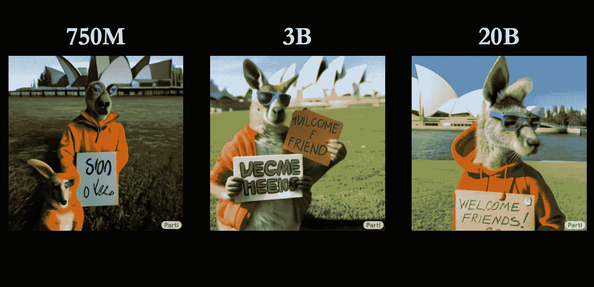

# 谷歌 200 亿参数 AI 图像生成器简直疯了

> 原文：<https://medium.com/codex/googles-20-billion-parameter-ai-image-generator-is-insane-24b5e4b0251e?source=collection_archive---------0----------------------->

截图来自[谷歌的 Parti Research](https://parti.research.google/)

文本到图像的人工智能生成模型目前非常受欢迎。

当 OpenAI 宣布 [Dall-E2](https://openai.com/dall-e-2/) 时，互联网一片狂热。

不久之后，谷歌宣布它正在开发自己的文本到图像的人工智能工具，名为 [Imagen](https://imagen.research.google/) 。

但即使在 Imagen 进入私人测试阶段之前，谷歌宣布了另一个人工智能工具…