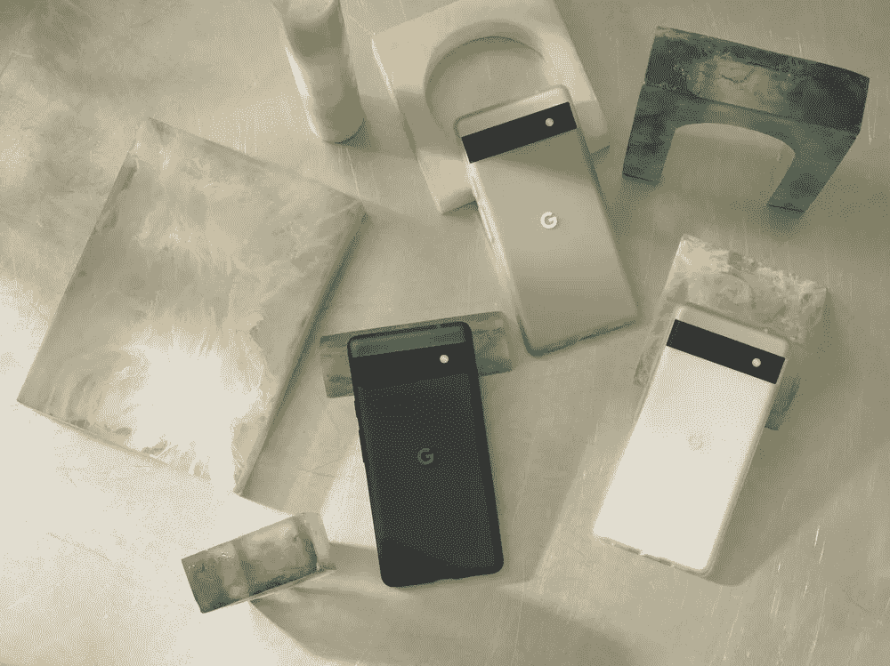
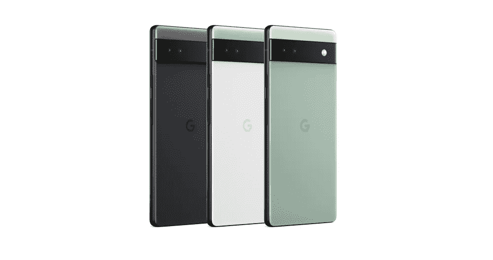

# 谷歌的 Pixels (2022)应该停止把 120 Hz 显示器当成奢侈品

> 原文：<https://medium.com/codex/googles-pixels-2022-should-stop-treating-120-hz-displays-like-a-luxury-772561bb7bdd?source=collection_archive---------6----------------------->

## 449 美元像素的 6A 值得拥有超过 60 赫兹的显示屏

来源:谷歌。

在**449 美元，谷歌的** [**新推出的像素 6A**](https://blog.google/products/pixel/pixel-6a-io-2022/) **是其阵容中最实惠的智能手机。**

它拥有旗舰级张量芯片和强大的相机设置，部分借鉴了价格更高的 Pixel 6 和 6 Pro。但随着低于 200 美元的手机提供平滑的 120 赫兹显示屏，像素 6A 的 60 赫兹有机发光二极管显示屏令人失望。

599 美元的 Pixel 6 坚持 90 赫兹，让 899 美元的 Pixel 6 Pro 标榜 120 赫兹的显示屏是一种“升级”。

谷歌不是唯一一家在这方面有罪的制造商。

这也是苹果用来区分其 799 美元的 iPhone 13 和 999 美元的 13 Pro 的策略。虽然库比蒂诺巨头的举动不太可原谅，但谷歌也不能免于审查，因为安卓手机甚至在上市前就轻松地削弱了像素 6A 的价值。

典型的例子， [Realme 的 Narzo 50](https://www.livemint.com/technology/realme-narzo-50-with-120hz-refresh-rate-goes-on-sale-today-details-here-11646283600135.html) 。120 赫兹，价格低于 200 美元。

诚然，谷歌的像素 6A 提供了一个普通的 Android 体验，再加上强大的处理器和坚固的摄像头。它还保留了其优质兄弟姐妹的遮阳板美学，尽管是塑料的。但是 449 美元，60 赫兹的显示器不像规格表上的其他部分那样有竞争力。

快速充电是另一个伤害像素 6A 野心的疏忽。

来源:谷歌。

## 高刷新率成为行业标准是有原因的

刷新率的提高是一种生活质量的提高，休闲用户和铁杆用户都可以感受到。从应用程序冲浪到滚动网页，在 90/120 Hz 的显示器上，一切都感觉更流畅。游戏也可以利用这些显示器提供丝滑的体验。

性能的代际飞跃很少影响现实世界的使用。

但 120 Hz 的显示屏让一切都感觉更快，即使是在预算有限的设备上。

这和我从苹果新推出的 429 美元的 iPhone SE 上摘到的骨头是一样的。然而，像素 6A 并不像 iPhone 一样处于不同的生态系统中。那就意味着要和从小米到 Oneplus 的所有人竞争。

450 美元的 Pixel 6A 也将不得不与昔日的旗舰产品竞争。

虽然 Pixel 手机一直吸引着 Android 清教徒人群，但不合标准的 60 Hz 显示屏将让许多爱好者有理由暂停。套餐的其余部分当然很诱人。但是一个 120 赫兹的显示屏会使 [6A 的固体规格表](https://blog.google/products/pixel/pixel-6a-io-2022/)更加完美。

谷歌也该与时俱进了。