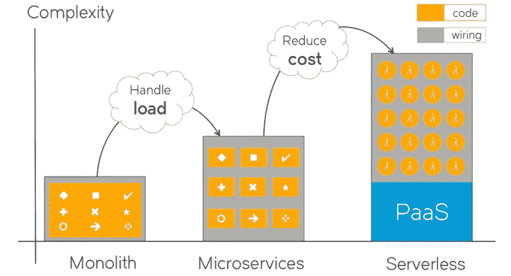
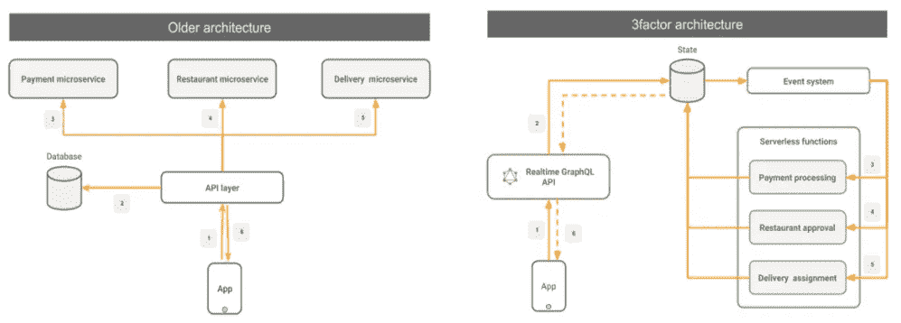
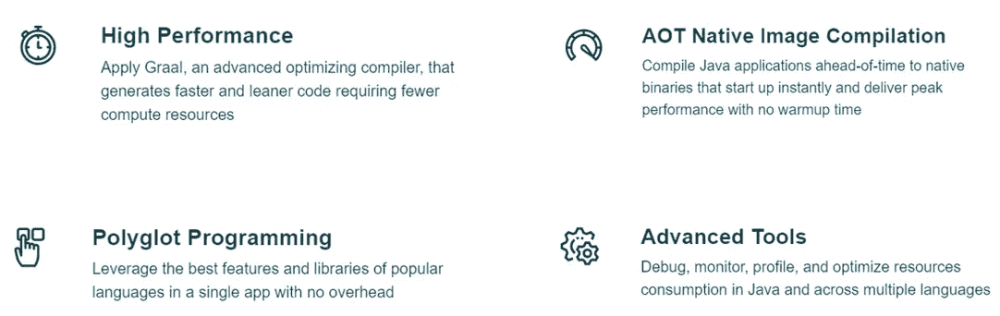
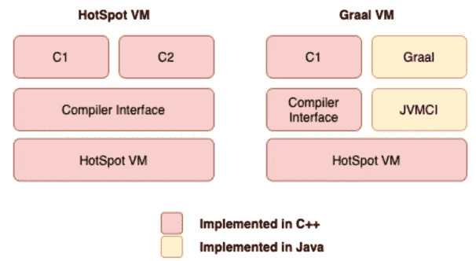
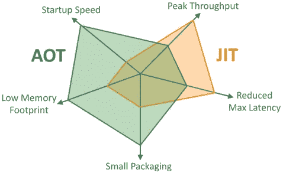
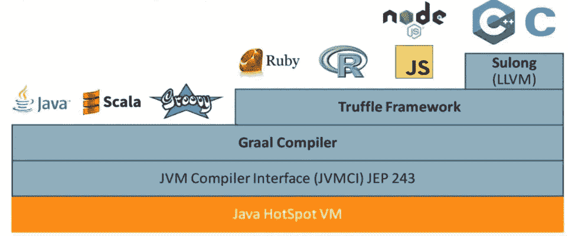
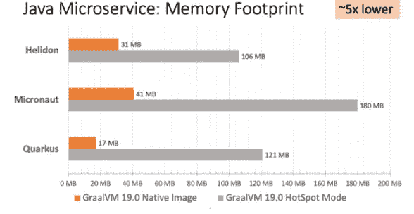
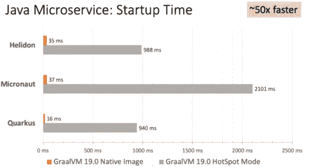
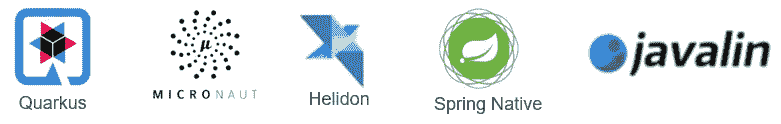
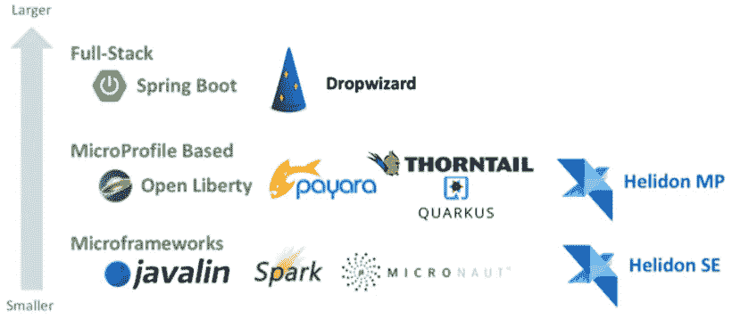

# GraalVM-本机映像和微框架

> 原文：<https://medium.com/codex/graalvm-native-images-microframeworks-9b3fab2e8f17?source=collection_archive---------3----------------------->

图像致谢—Emumba

在本文中，我们将讨论 GraalVM、本机映像和微框架，我们为什么需要它们，潜在的用例是什么，以及它们如何帮助我们踏上应用程序现代化之旅。

当我们回顾 IT(信息技术)架构演进周期时，我们从大型机开始我们的旅程，逐渐开始向 monolith 移动，随后采用微服务来克服各自架构在非功能性需求方面的限制，并最终导致松散耦合的架构。

随着无服务器平台最近的发展，非常需要分析我们现有的基于微服务的工作负载，以采用无服务器架构。这就是 GraalVM 和本机映像的亮点，它具有快速启动时间和低内存占用。

# 传统架构的挑战

众所周知，monolith 应用程序是一个紧密耦合的系统，将相关模块打包成一个可部署的可执行文件。这些系统开始随着时间的推移而增长，以满足业务需求。在某种程度上，当我们开始添加新的特性时，一个单一的应用程序开始遇到各种问题，比如大规模负载场景下的可伸缩性、延迟、容错、异步处理等。

为了应对这些挑战，我们开始用微服务取代单片，使系统松散耦合，但这增加了收益的复杂性。

随着我们从微服务转向无服务器，代码块变得更小更简单，降低了成本，而总的复杂性却在增加。

下图描述了这种情况…

图像来源—freeCodeCamp.com

# 3 要素架构&无服务器功能

3factor app 是一种基于无服务器架构创建现代应用的架构模式。

这种模式使我们能够通过使用“功能即服务”以及云的力量来构建健壮且可扩展的应用程序。“功能即服务”是 GraalVM 表现出色的地方。

下图描述了这种情况…

图片致谢 3factor.app

# GraalVM 概述

让我们对 GraalVM 做一个高层次的概述…

> GraalVM 是一个高性能的 JDK (Java 开发工具包)发行版，旨在加速用 Java 和其他 JVM (Java 虚拟机)语言编写的应用程序的执行，并支持 JavaScript、Ruby、Python 和其他几种流行的语言。—graalvm.org

## GraalVM 的主要特性:

图像来源—graalvm.org

# 热点虚拟机 vs GraalVM

由于 GraalVM 是一个高性能的 JDK (Java 开发工具包)发行版，让我们快速比较一下 Hotspot VM 和 GraalVM。

GraalVM 编译器建立在 JVMCI 之上，提供了更好的 JIT(即时)编译器实现，并做了进一步的优化。它还提供了一个 AOT(提前)选项，在这里我们可以直接创建一个独立的机器代码。

在下图中，我们可以看到编译器接口已经被 JVM 编译器接口取代，C2 编译器被 GraalVM 编译器取代。两者都是用 Java 编写的，并且在现有的 Hotspot VM 上提供了更好的优化。

图像来源—graalvm.org

# JIT vs AOT

让我们来理解 JIT(及时)和 AOT(提前)编译方法以及本机映像的概念。

如果您熟悉 java 生态系统，您可以将 JIT(及时)与传统的 Java 编译过程联系起来。Java 代码首先被编译成字节码，然后被 JVM (Java 虚拟机)解释器处理，进行机器代码转换。C1 和 C2 基于剖析算法进一步优化了代码。

AOT(提前)是将这些工作负载编译成本机映像的过程。我们通过 AOT 获得了更快的启动时间和更低的内存占用，但却失去了便携性。

通过在 GraalVM 上使用 JIT 运行现有的工作负载，可以获得更好的性能。此外，为了获得 GraalVM 的好处(更快的启动时间和更低的内存占用量)，可以将本机映像与更适合无服务器用例的 AOT 编译结合使用。

对于无服务器部署——采用 AOT 更有意义，而对于长期运行的基于容器/基于虚拟机的部署，JIT 可能更有意义。

下图描述了比较…

图像来源—graalvm.org

# GraalVM 架构

> GraalVM 向 HotSpot Java 虚拟机添加了一个用 Java 编写的高级实时(JIT)优化编译器。
> 
> 除了运行基于 Java 和 JVM 的语言，GraalVM 的语言实现框架(Truffle)使得在 JVM 上运行 JavaScript、Ruby、Python 和其他几种流行的语言成为可能。有了 GraalVM Truffle，Java 和其他支持的语言可以直接互操作，在同一个内存空间来回传递数据。—graalvm.org

图像来源—graalvm.org

# GraalVM 性能图

与 Hotspot VM 模式相比，使用 GraalVM 本机映像的各种微框架的内存占用量降低了约 5 倍，启动时间加快了约 50 倍。

Helidon、Micronaut 和 Quarkus 是微框架，我们将在下一节讨论它们。

图像来源—graalvm.org

图像来源—graalvm.org

# GraalVM [的利弊](https://github.optum.com/pages/csharm33/oi-payer-engineering/blog/graalvm#pros--cons-of-graalvm)

## 优点:

*   更快启动
*   更低的内存占用
*   原生图像
*   高性能
*   语言互操作性和多语言工具

## 缺点:

*   没有 JVMTI、Java 代理、JMX 或 JFR 支持
*   仅对较小的堆有效
*   生成的本机代码并不完全有效
*   不支持线程转储和堆转储
*   无动态类加载/卸载

# GraalVM 的微框架

> 微框架是一个用来指极简 web 应用程序框架的术语。它与全栈框架形成对比。wikipedia.org

Helidon、Micronaut、Quarkus、Javalin 和 Spring Native 是 GraalVM 生态系统中最著名的微框架。

借助 GraalVM 的 AOT 特性，我们可以用这些微框架创建本机映像，并获得性能提升。

所有这些框架都有容器支持，可以部署在无服务器平台上，如 Knative 或 AWS Lambda。

# 微服务框架对比

这是最后一节讲微服务框架之间的比较。

在我们开始之前，让我们快速地讨论一下微概要文件。

> MicroProfile 是一个社区驱动的规范，旨在提供一个基线平台定义，该定义优化了微服务架构的企业 Java，并提供了跨多个 MicroProfile 运行时(包括 Open Liberty)的应用程序可移植性。— microprofile.io

像 spring boot 这样的全栈框架在外部依赖性和集成方面提供了很大的灵活性，但与其他框架相比，它显得过于沉重。

基于微文件的框架在整个堆栈上提供了特别好的优化，重量更轻，并且符合微文件规范。该框架为微服务架构优化了企业 Java。

微框架是轻量级的，具有更快的启动时间，更低的内存占用，非常适合无服务器架构用例(作为服务的功能)。

图像来源—infoq.com

# 结论

随着 IT(信息技术)架构的发展，代码块变得越来越精简和简单，松散耦合系统的采用正在赶上，但整体复杂性正在增加。为了满足日益增长的复杂性需求并降低总体成本，采用事件驱动架构并发现无服务器架构的潜在用例有着巨大的机会。

借助 GraalVM 和本机映像，我们可以进一步优化我们的无服务器工作负载，并获得更快的启动时间和更低的内存占用的优势，最终实现有效的成本优化。

现在是时候重新评估我们半现代化的工作负载，找到潜在的用例，并开始采用基于微配置文件的框架和使用 GraalVM 的微框架。

一定要让我知道你对 GraalVM 的想法…

感谢阅读！