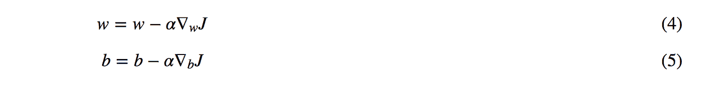

# 梯度下降

> 原文：<https://medium.com/codex/gradient-descent-cb0f02dc6eab?source=collection_archive---------7----------------------->

梯度下降是最基本但最常用的优化算法。它大量用于线性回归和分类算法。这是一种迭代优化算法，用于寻找函数的最小值或寻找成本/损失函数最小的系数

梯度下降是一种优化算法，用于找到使成本函数(cost)最小化的函数(f)的参数(系数)值。参数是指线性回归中的系数和神经网络中的权重。梯度下降是一种用于寻找局部最小值的一阶优化算法。这意味着在对参数进行更新时，它只考虑一阶导数。

**坡度**

梯度是在训练神经网络的过程中计算的方向和大小，它用于按照正确的量在正确的方向上训练网络权重。

梯度衡量的是，如果你稍微改变输入，函数的输出会改变多少。你也可以把梯度想成一个函数的斜率。斜率的概念是用来衡量变化发生的速度。梯度越高，斜率越陡，模型可以学习得越快。但是如果斜率为零，模型就停止学习。用更数学的方式说，梯度是对输入的偏导数。

上面的曲线代表了带有系数和偏差值的线性回归方程。

例如:y=4x + 3 可能代表曲线上损失函数很大的一点。

y=3x + 2 可能代表曲线上损失函数稍微降低的点。

例如:y=2x+1 可能代表最小值，使用该系数和偏差可以使损失函数最小化。

随着斜率的下降，我们对所有系数和偏置求成本函数的偏导数，得到所有系数和偏置的偏导数方程，然后将当前系数和偏置的值放入所有系数和偏置的偏导数方程，得到所有系数和偏置的值，然后从当前系数和偏置中减去所有系数和偏置的偏导数值，得到更新后的系数和偏置。我们重复这一过程，直到找到成本函数最小的系数和偏差。成本函数不能减少超过最小值，它开始再次增加，我们的系数和偏差也开始随着成本函数的增加而增加。

最小值是线性回归方程中损失函数最小的系数和偏差值的表示。

**学习率**

学习率决定了权重(对于神经网络)或系数(对于线性回归或逻辑回归)的变化速度。学习率是用于训练深度神经网络的最重要的超参数之一。训练期间权重更新的量被称为步长或学习率。一个好的学习率可能是一个没有学到任何东西的模型和一个呈现最先进结果的模型之间的差别。

学习速度决定了我们达到最佳权重的快慢。学习率 0.1(传统上常见的默认值)意味着每次更新权重时，网络中的权重被更新 0.1 *(估计权重误差)或估计权重误差的 10%。

学习速度的重要性

该值越低，我们沿下坡行驶的速度越慢。如果学习率小，那么步长就会小，容易收敛。如果你将学习率设置为一个非常小的值，训练将会进行得非常慢，因为你对网络中的权重进行了非常微小的更新，梯度下降将最终达到局部最小值，但这可能会花费太多时间。如果学习率低，那么训练更可靠，但是优化将花费大量时间，因为朝向损失函数的最小值的步骤很小。

随着学习速度的提高，我们每一步可以走更多的路，但是我们有可能会越过最低点，因为山坡的坡度是不断变化的。

如果学习率很大，那么步长会更大，模型可能不会达到局部最小值，因为它只是在梯度下降的凸函数之间来回跳动。如果学习率设置得太高，可能会导致损失函数出现不希望的发散行为，并且算法可能不会收敛。

**工作原理**

要使用梯度下降，我们需要知道我们的成本函数的梯度，即指向最大陡度方向的向量(我们希望在梯度的相反方向上重复采取步骤，以最终达到最小值)。

函数的梯度是向量，其元素是它对每个参数的偏导数。例如，如果我们试图最小化成本函数 C (B0，B1)，只有两个可变参数 B0 和 B1，则梯度将为:

C 的梯度(B0，B1) = [[dC/dB0]，[dC/dB1]]

因此，梯度的每个元素都告诉我们，如果我们对特定参数进行小的改变，成本函数会如何改变，所以我们知道要调整什么以及调整多少。

为什么要用导数/微分？

更新曲线时，要知道根据斜率在哪个方向上改变或更新曲线的量。这就是为什么我们在机器学习和深度学习的几乎每个部分都使用微分

总而言之，我们可以通过以下步骤向最小值迈进:

-计算我们当前位置的梯度(斜率)(即函数在当前点的一阶导数)，即使用我们当前的参数值计算梯度。

-修改每个参数，修改量与其梯度元素成比例，并沿其梯度元素的相反方向(从当前点按计算量沿斜率增加的相反方向移动)。例如，如果我们的成本函数相对于 B0 的偏导数为正但很小，相对于 B1 的偏导数为负且很大，那么我们希望将 B0 减少很小的量，将 B1 增加很大的量，以降低我们的成本函数。

-使用我们新调整的参数值重新计算梯度，并重复前面的步骤，直到我们达到最小值。

更新后的等式为:

**类型**

批量梯度下降

批量梯度下降也称为普通梯度下降，是梯度下降的第一种基本类型，其中我们使用可用的完整数据集来计算成本函数的梯度。它计算训练集中每个示例的误差。在评估所有训练示例后，它会更新模型参数。这个过程通常被称为训练时期。因为我们需要计算整个数据集的梯度来执行一次更新，所以批量梯度下降可能非常慢，并且对于不适合内存的数据集来说是难以处理的。如果训练样本的数量很大，那么批量梯度下降在计算上是非常昂贵的。因此，如果训练样本的数量很大，那么批量梯度下降不是优选的。相反，我们更喜欢使用随机梯度下降或小批量梯度下降。批量梯度下降的优点是它产生稳定的误差梯度和稳定的收敛，然而它要求整个训练集驻留在存储器中并且可用于算法。

-计算简单。

-易于理解和实施。

-可能陷入局部最小值。

-在计算整个数据集的梯度后，权重发生变化。因此，如果数据集太大，可能需要很长时间才能收敛到最小值。

-需要大量内存来计算整个数据集的梯度

随机梯度下降

这是一种梯度下降，每次迭代处理 1 个训练样本。因此，即使在一次迭代之后，参数也被更新。因此，这比批量梯度下降快得多。但是同样，当训练样本的数量很大时，即使这样，它也只处理一个样本，这对于系统来说是额外的开销，因为迭代的次数将非常大。一个好处是频繁的更新允许我们有一个相当详细的改进率。在 SGD 中，可能无法达到精度，但结果的计算速度更快。这些更新的频率也可能导致有噪声的梯度，这可能导致错误率跳跃(波动)而不是缓慢降低。

深度学习模型通常由随机梯度下降优化器训练。随机梯度下降有很多变种:Adam，RMSProp，Adagrad。它们都可以让你设定学习速度。

-模型参数的频繁更新因此，在更短的时间内收敛。

-需要更少的存储器，因为不需要存储损失函数值。

**-** 模型参数方差大。

-即使在达到全局最小值后也可以拍摄。

-为了获得与梯度下降相同的收敛性，需要缓慢降低学习率的值

小批量梯度下降

迷你批处理算法是最有利和最广泛使用的算法，它使用一批“m”个训练样本来产生精确和更快的结果。在 mini batch 算法中，我们不使用完整的数据集，而是在每次迭代中使用一组名为 batch 的“m”训练示例来计算成本函数的梯度。它只是将训练数据集分成小批，并对这些小批中的每一批执行更新。这样，算法减少了参数更新的方差，从而可以导致更稳定的收敛。因此，它在随机梯度下降的鲁棒性和批量梯度下降的效率之间建立了平衡。

-频繁更新模型参数，并且差异较小

-需要中等容量的内存

-可能陷入局部最小值

如果数据集很小(少于 2000 个样本)，使用批量梯度下降**。**对于较大的数据集，典型的小批量大小为 64、128、256 或 512。