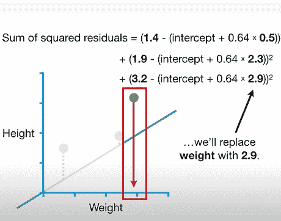
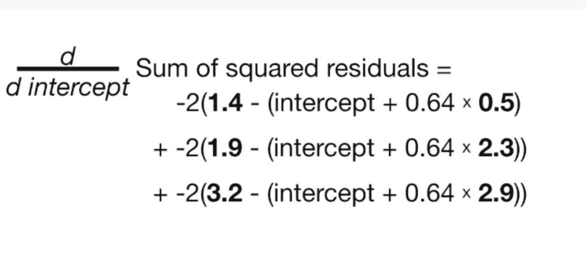
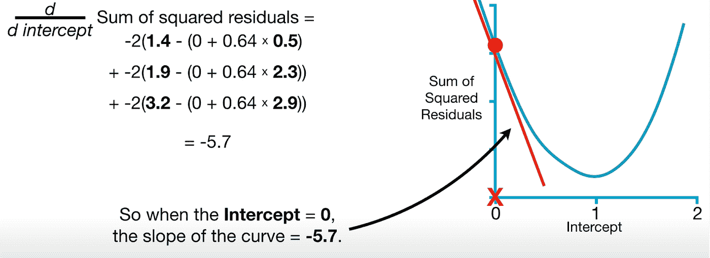

# 过度简化的梯度下降数学

> 原文：<https://medium.com/codex/gradient-descent-math-over-simplified-e2b38fddfaa0?source=collection_archive---------6----------------------->

# 梯度下降

梯度下降是大多数机器学习背后的支柱。当您将机器学习方法用于训练数据集时，您可能会使用梯度下降。在这篇文章中，我决定向你展示它是如何工作的，所以如果你想知道这背后的数学原理，请继续关注。我会试着用简单的术语来描述一切。这篇文章假设你已经知道最小二乘法和线性回归的基础知识，如果你还不了解，你可以参考我以前的文章，熟悉这些概念。

# 使用

在统计学、机器学习和其他数据科学领域，我们优化了很多东西。当我们用线性回归拟合一条线时，我们优化了截距和斜率。

当我们使用逻辑回归时，我们优化了曲线。当我们使用 t-sne 时，我们优化了集群。梯度下降很酷的一点是，它可以优化这一点，甚至更多。如果你学会了优化线的策略，你可以很容易地优化曲线，也可以在以后的时间点优化簇。不仅如此，你将能够看到统计学、ML 和数据科学中更多的优化问题。

# 到底是什么？

> 梯度下降是一种使用一阶迭代来解决优化问题的算法。由于梯度下降被设计成寻找微分函数的局部最小值，所以它被广泛用于机器学习模型**中，以寻找使模型的成本函数最小化的最佳参数**

让我们先想一个例子。我将从非常著名的《猫和老鼠》系列中挑选最受欢迎的杰里

如果我们拟合这个数据，有人告诉我杰里的体重是 1.5，我可以用直线预测杰里的身高将是 1.9(见下图截图)。

换句话说，给定 Jerry & a 线的重量→我可以预测 Jerry 的高度。

*   因此，让我们来了解一下梯度下降是如何帮助拟合数据的。
*   为了拟合数据，我们需要**找到截距和斜率的最佳值，这就是我们将在本文中讨论的内容。**

# 目标

整篇文章将围绕我们如何使用梯度下降通过寻找斜率和截距的最佳值来拟合直线。

**第 1 部分目的:我们从使用梯度下降法寻找斜率开始。**

第 2 部分目的:稍后使用梯度下降来解决截距和斜率。

# 第 1 部分的步骤 1 Aim →找到截距为 0 的最小二乘

最小二乘法**是一种统计程序，通过最小化绘制曲线**中各点的偏移或残差的总和，找到一组数据点的最佳拟合。

我们首先插入斜率的最小二乘估计值 0.64，并描绘截距的随机值。让我们选择 0，只是一些开始。这只是给了 GD 一些开始的东西，让梯度下降得到改善。我们有 3 个坐标(0.5，1.4)，(2.3，1.9)，和(2.9，3.2)表示体重和身高。

## 公式为观测高度-预测高度=残差

## 1.4(这是我们给定的实际高度)—预测高度

在这种情况下，我们将使用 intercept 作为 0，但任何数字都可以。

在这种情况下，我们将使用截距作为 0，但任何数字都可以。

# 预测身高= 0 +0.64 * 0.5 给定体重

这就给出了这条线的方程。

## 1.4(这是我们的实际身高)-0.32(这是预测身高)

## = 1.1(四舍五入)

使用残差平方和/损失函数，让我们看看这条线是如何拟合数据的。

让我们计算所有值的残差平方和。请参考下面的截图。我们有体重和身高的 3 个坐标(0.5，1.4)，(2.3，1.9)，(2.9，3.2)。

> **回答:我们现在得出截距为 0 的残差平方和为 3.1。**

## 第二步:我们将在 y 轴上绘制 3.1 的残差，在 x 轴上绘制 0 的截距。

换句话说，第一个点是图中截距为 0 且残差平方和为 3.1 的点。

## 第三步:重复第一步和第二步，取截距为 0.25 和 0.5，而不是 0

如果截距是 0.25 而不是 0，那么使用上面相同的计算，你将得到图中的第二个红点。类似地，当截距为 0.5 时，你会得到右边图中的第三个点，我们继续猜测截距..我们得到了这条 U 形曲线和残差平方和的方程。

现在我们在寻找截距，我们分别尝试了 0，0.25，0.5 的值，你开始怀疑..

*“如果截距的最佳值介于右图中的值之间，会怎么样？”如果您查看下面的右图，当截距值= 1 时，残差平方和最低。如果残差平方和是圆之间某处的一点呢？*

为了找到答案，我们必须经历使用更多值的痛苦过程。这是一个痛苦的过程。想想在超人故事的背景下，哥谭市受到坏人的攻击，当地警察很难找到坏人，我们有很多嫌疑人。

当蝙蝠女(梯度下降)介入，故事情节发生变化。利用她的超能力和她的速度，她匹配了恶棍的照片，很快扫描了所有的嫌疑人，并给恶棍戴上了手铐。梯度下降就像一个蝙蝠女侠！你可以把梯度下降想成一个大飞跃跳下高楼，不需要打车的超级英雄哈哈。与此同时，当她接近恶棍时，改变她的姿态，用小而多的步子慢慢踮着脚。
类似地，梯度下降做一些距离很远的计算&跳跃很大，但是当她接近最佳值时做更多的计算，并且以最小化最小平方和的方式做它。请注意，当远离恶棍时，步长必须足够大，但不能大到错过恶棍，并最终使最小平方和最大化。当她爬向恶棍时，脚步必须很小。
查看下面的图示，您可以看到数字 1 周围的红点数量增加。

# 进近解释后面的梯度下降数学

# 进近解释后面的梯度下降数学

梯度下降使用导数来寻找残差平方和最低的地方。

我们现在有了这条曲线的方程式(见上图)。这是当我们绘制所有残差 3.1 的截距为 0，xxx 残差的截距为 0.25，yyy 残差的截距为 0.5，等等，我们得到了这个 U 形图。

我们可以用该函数的导数来确定截距任意值的斜率。以下是步骤:

**第一步:对每个参数的损失函数求导。**

**第二步:为参数选择一个随机值**

**第三步:将参数值代入导数**

**步骤 4:计算步长{步长=斜率*学习率**

**步骤 5:计算新参数，即旧参数减去步长**

**重复第 3 步，直到步长太小或用尽最大步长 1000。**

视觉上，在宏观层面上，Bat-Woman(梯度下降)从最初的猜测到最佳值采取步骤。现在让我们进入细节。

## ***第一步:求导得到斜率***

所以我们可以把它分解成，对这三部分逐一求导。

## **第二步:在导函数中输入截距为 0 的随机值**

概括一下，我们从一个 0 作为截距的随机数开始。我们将 0 代入导数，得到斜率为-5.7。

斜率的答案是-5.7。

请注意，当截距为 0 时，斜率为-5.7。

您是否注意到，当我们接近截距的最佳值时，斜率会自动接近 0？超级爽！见下文。

这就是我们故事中的一点，蝙蝠女侠观察到她快要抓住坏人了，也就是找到了最佳价值，然后改变了姿态，迈出了小步。相比之下，当斜率远离零时，蝙蝠女侠知道她必须迈出大步，从高楼上跳下，迈出巨大的步伐。她根据坡度测量每一步的大小。接下来，我们将讨论我们的梯度下降/蝙蝠女侠中存在的超能力，以及她后脑勺发生的计算，以确定下一步的大小以及她将采取的下一步行动。让我们对此进行深入研究。

## 步骤 4:现在我们有了斜率，使用斜率来计算步长，这将决定我们的下一步应该是多大(大，小还是中等大小？)

秘方是梯度下降用一个叫做学习率的小数字乘以斜率(我们从导数函数中得到)。这种情况下的学习率是 0.1，这决定了步长-0.57 (-5.7*0.1)。我们的步长是-0.57。

## 步骤 5:根据步长找到下一步的值

## 计算旧参数或步长的新参数

我们需要从旧截距中减去这个步长来得到新截距。

所以用这个，蝙蝠女侠从 0 开始下一步，移动到 0.57。这是一个巨大的举动！
接下来呢？蝙蝠女侠需要再走一步。我们有一个新的截距 0.57，我们把它放回导数方程，得到斜率-2.3。

按照规则，我们用学习率 0.1 乘以-2.3，得到步长-0.23。
这个步长需要从旧截距中减去 0.57 -(0.23) = 0.8。与之前的步骤相比，现在梯度下降需要相对较小的步骤。正如预测的那样，当我们接近曲线底部时，台阶会越来越小。

这说明了 batwoman 是如何利用这种计算向截距的最佳值迈进一步的。

## 结果

6 步之后，梯度下降截距为 0.95，最小二乘估计也是如此。

请注意，当这些条件中的任何一个满足时，梯度下降停止。

**条件 1: T** 步长(斜率*学习率)接近于零。(假设值为 0.0009)。**或**

**条件 2:** 梯度下降停止的另一个标准是当最大步数接近 1000 时。在这一点上，梯度下降停止。

现在，我们已经学会了如何使用梯度下降来估计截距的大小，我们可以毕业并进入下一阶段，了解梯度下降如何估计斜率和截距。

注意:当同一个函数有两个或更多的导数时，它们叫做梯度。我们将使用这个梯度下降到最低的损失函数，在我们的情况下是最小二乘法。这就是为什么该算法被称为梯度下降。啊哈！！

继续下一节，讲述如何使用 GD 求解截距和斜率。

第 1 部分目的:我们从使用梯度下降来寻找斜率开始。-完成了

**第二部分目的:后面用梯度下降法求解截距和斜率。-让我们开始**

现在让我们从截距 0 和斜率=1 开始

把这个代入方程；

乘以这次 0.01 的学习率。

现在我们通过插入旧截距和旧斜率来计算新截距和新斜率。

我们将不断重复这些，直到步长变得接近 0。

# 最后的话

我们现在知道梯度下降如何优化斜率和截距。注意，最小二乘法只是损失函数的一种类型。不管损失函数的类型如何，我们的梯度下降法都是一样的。

在我离开之前，有个东西叫随机梯度下降。总而言之，这是一个我们随机选择数据子集而不是整个数据集的场景。这减少了对损失函数求导的时间。稍后会有更多关于随机下降的内容！

**参考文献**

1.  [https://machine learning mastery . com/gradient-descent-for-machine-learning/](https://machinelearningmastery.com/gradient-descent-for-machine-learning/)
2.  乔希·斯塔默的任务
3.  [https://irosyadi . github . io/course/machine-learning-Andrew ng . html](https://irosyadi.github.io/course/machine-learning-andrewng.html)