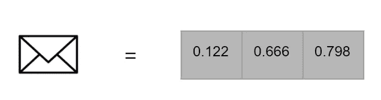
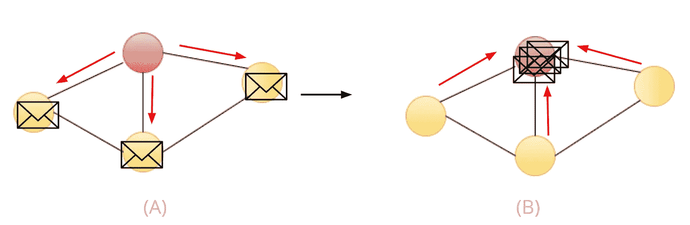
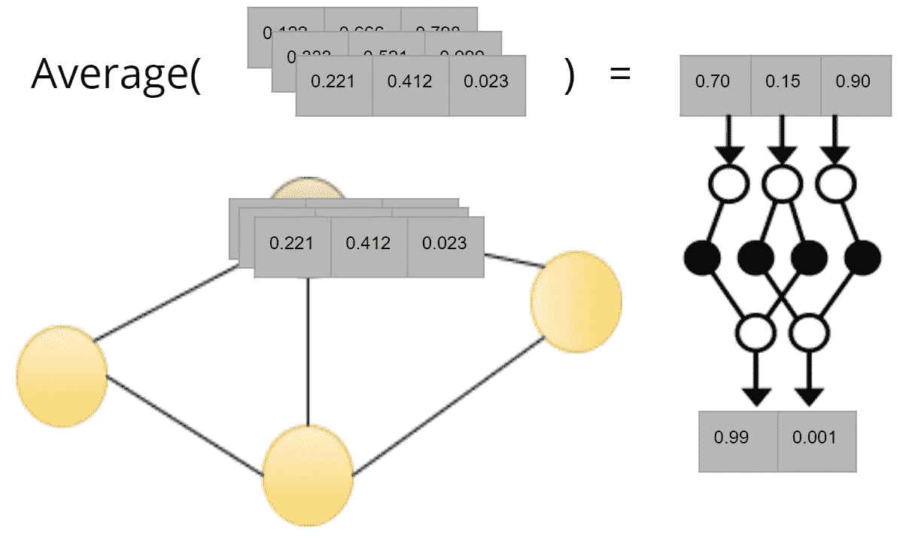

# 图形卷积网络(GCN)

> 原文：<https://medium.com/codex/graph-convolutional-network-gcn-f8ae48cd3abc?source=collection_archive---------2----------------------->

# 介绍

深度学习问题经常与卷积神经网络解决方案相关联，并且最常用于视觉图像分析。在这篇文章中，我们强调了另一个强大的概念是图卷积网络[1]。如果我们定义我们的图，我们可以说它代表了一组节点和连接这些节点的边**。**到目前为止，我们将讨论 GCN 如何将每一步考虑在内，我们还将看到一个使用 GCN 进行垃圾邮件和非垃圾邮件分类的示例。

# 它是如何工作的

从这个角度来看，我们可以说 GCN 背后的思想是图中的节点可以发送和接收消息(下图显示了一个消息的例子，很简单，它是一个数据向量)以及它的连接“邻居”。

节点可以转发或接收的消息示例

这可以被认为是分两步发生的:

(A)向邻居发送节点的状态，(B)接收节点的状态

上图显示了这两个步骤，我们把重点放在红色节点上，假设每个节点都有一个初始状态。首先，它会向它的邻居发送一个关于它自己的消息，然后，节点收集它接收到的邻居消息，并以某种方式使用它们来更新它自己或它的状态。通过这个过程，每个节点将了解其环境。

# GCN 层

在本节中，我们将探讨与 GCN 相对应的层的概念。首先，对于图中的任何节点，它获取其连接节点**(包括其消息)**的所有属性向量，并应用一些聚合函数，如下图所示的平均值，以确保每个节点具有相同的表示大小。必须对图中的每个节点执行此过程

更新给定节点的状态

平均向量将通过密集的神经网络，该网络乘以某个矩阵并应用激活函数。这个神经网络的输出是给定节点状态的新矢量表示。在这一点上，我们达到了一个单一的 GCN 层。如果我们想要第二层，我们必须重复上面讨论的过程，除了输入是来自第一层的更新向量。

# 用例示例

垃圾邮件和非垃圾邮件

垃圾邮件和非垃圾邮件是更好理解的一个基本例子。假设我们有一个垃圾邮件和非垃圾邮件内容及其地址的集合，所以我们希望使用电子邮件的实际内容作为节点属性。有几种技术可以将简单的消息转换成数据向量，比如预训练的单词嵌入。在我们的分类任务中，假设我们最终用一个 20 维向量来表示每封电子邮件。我们将满足于一个 GCN 层，每个节点将用一个 20 维向量初始化，并将密集神经网络的输出维度设置为 1，并使用典型的带有反向传播的二进制交叉熵损失函数来训练我们所有的参数。首先，对于每个节点，它将其内容向量与具有相同地址的所有邻居的内容进行聚合，聚合函数可以是简单的平均值。生成的向量将作为密集神经网络的输入，该神经网络只有一个输出来决定它是否是垃圾邮件内容。[在这里](https://github.com/mkherchouche/GCN)你可以找到一个先进的使用小行星数据集的 GCN 例子【2】。

# 结论

在本文中，我们已经快速浏览了图形卷积网络，以及该工具的一个具体用例。例如，可以考虑许多方面，例如连接可以有不同的类型。我们是否只是将所有邻居平均在一起，而不考虑连接类型，或者可能某些连接比其他连接更重要。

# 参考

[1]: Thomas N. Kipf 和 Max Welling (2017)使用图卷积网络的半监督分类[https://arxiv.org/abs/1609.02907](https://arxiv.org/abs/1609.02907)

[2]:小行星数据集[https://py torch-geometric . readthedocs . io/en/latest/_ modules/torch _ geometric/datasets/planet oid . html](https://pytorch-geometric.readthedocs.io/en/latest/_modules/torch_geometric/datasets/planetoid.html)