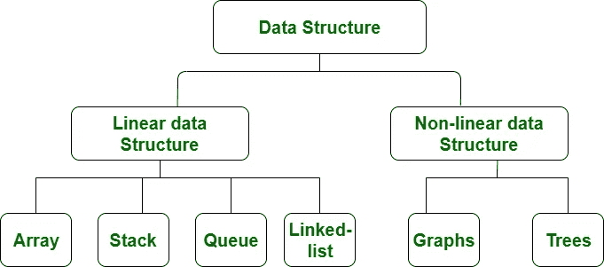

# 图形—数据结构

> 原文：<https://medium.com/codex/graph-data-structure-ddbaba50accf?source=collection_archive---------11----------------------->

## 在这个博客中，我们将讨论一种数据结构，即图形

图是由节点和边组成的非线性数据结构。节点有时被称为顶点，边是连接图中任意两个节点或顶点的线。

一个更技术性的定义可以是:

> “一个**图**是一对集合。G = (V，E)。v 是顶点的集合。e 是一组边。e 由 V 中的元素对组成(无序对)”

图表被用来解决许多现实生活中的问题。图形用于表示网络。网络可以包括城市或电话网络或电路网络中的路径。图形也用于社交网络，如 LinkedIn 和脸书。

# **图形术语**

*   **路径:**它是顶点的序列，其中每对连续的顶点由一条边连接。
*   **循环:**是以同一个顶点为起点和终点的路径。
*   **简单路径:**它是一条不与自身交叉即没有顶点重复的路径(除了第一个和最后一个)。此外，简单路径不包含循环。
*   **路径的长度:**是路径中边的个数。有时它是边的权重之和，在加权图中也是如此。
*   **顶点的度数:**是与顶点关联的边的个数。

既然我们已经理解了什么是图形数据结构及其术语，那么让我们继续看如何表示图形。

# **图形及其表示**

图形是一种数据结构，由以下两部分组成:

1.顶点的有限集合，也称为节点。
2。称为边的(u，v)形式的有序偶的有限集。该对是有序的，因为在有向图(di 图)的情况下(u，v)不同于(v，u)。形式为(u，v)的对表示存在从顶点 u 到顶点 v 的边。这些边可以包含权重/值/成本。

下面两个是最常用的图形表示。
1。邻接矩阵
2。邻接表
还有其他的表示方法，比如关联矩阵和关联列表。图形表示的选择取决于具体情况。这完全取决于要执行的操作类型和易用性。

## **邻接矩阵:**

邻接矩阵是一个大小为 V×V 的 2D 数组，其中 V 是图中顶点的数量。设 2D 数组为 adj[][]，一个 slot adj[i][j] = 1 表示从顶点 I 到顶点 j 有一条边，无向图的邻接矩阵总是对称的。邻接矩阵也被用来表示加权图。如果 adj[i][j] = w，那么存在一条从顶点 I 到顶点 j 的边，权重为 w。

上述示例图的邻接矩阵为:

优点:表示更容易实现和遵循。移除一条边需要 O (1)时间。

*缺点:*消耗更多的空间 O (N)。即使图是稀疏的(包含较少数量的边)，它也消耗相同的空间。

# **图形类型**

以下是不同类型的图表:

1.  **加权图**

加权图是边具有权重的图。所以当我说边有权重时，我想说的是它们有一些数字，这些数字通常显示了遍历一个图的成本。当我们关心遍历图的最小成本时，我们要做的是找到那些权重之和最小的路径。

示例:权重可以是城市之间的距离，也可以是旅行的费用。

加权图的示例

**2。未加权图**

无权重图是指边没有权重的图。在这种情况下，边只是显示连接。

示例:边可以显示城市之间的路径或路线。

未加权图形的示例

**3。无向图**

这些类型的图在节点之间的边上没有隐含的方向。可以在任一方向上遍历边。

无向图的示例

**4。空图**

如果一个图中没有边，则称该图为空图。

**5。平凡图**

只有一个顶点的图，也是可能最小的图。

**6。常规图形**

一种图，其中每个顶点的度数都等于图中其他顶点的度数。设每个顶点的度数为 K，那么这个图

7。完整图表

从每个节点到每个其它节点都有一条边的图。

# **树形 v/s 图**

树是图形的限制类型，只是有更多的规则。每棵树都是图，但不是所有的图都是树。链表、树和堆都是图的特例。

> 我希望这篇博客能让你对数据结构中的图有一个清晰的理解。如果这个博客有助于你理解这个概念，那么请与你的朋友分享，并随时分享你的观点和对博客的反馈。如果你喜欢这个博客，请停止鼓掌。
> 
> 点击“关注”按钮获取更多此类内容，并保持联系以了解更多数据结构。