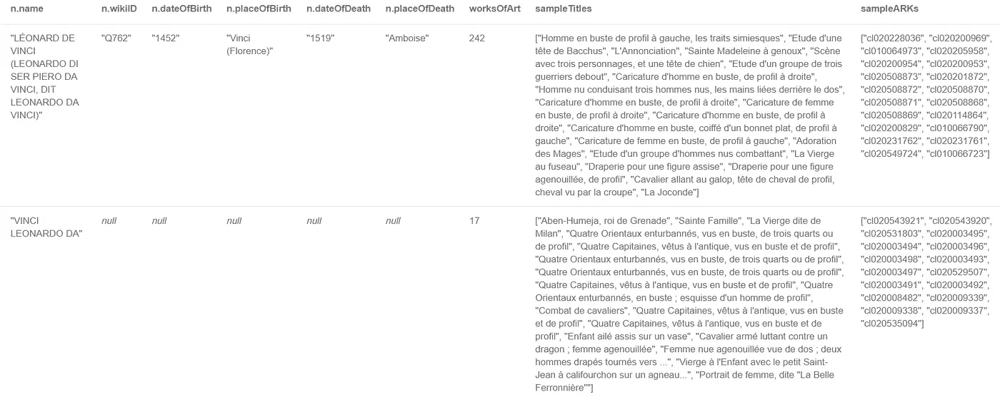

# 绘制卢浮宫

> 原文：<https://medium.com/codex/graphing-the-louvre-9a531123eca3?source=collection_archive---------11----------------------->


米卡·鲍梅斯特在 [Unsplash](https://unsplash.com?utm_source=medium&utm_medium=referral) 上的照片

T 何[卢浮宫](https://en.wikipedia.org/wiki/Louvre) [数字化](https://www.france24.com/en/culture/20210326-louvre-museum-makes-its-entire-collection-available-online)超过 48 万(！)的艺术作品，并在今年早些时候通过一个在线收藏数据库提供这些作品。从那以后，我就一直在关注这个系列，想把它们拼凑成一个图表。

在我的同事 Tom Geudens@Neo4j 对 json 摘录的帮助下(在撰写本文时，还没有发现像 [this](https://github.com/metmuseum/openaccess) one 这样的开放访问)，我将带您一步步了解如何将 JSON 摘录吸收到 [Neo4j](https://neo4j.com/) (版本。4.3+).

> 注意:这篇文章假设你对 Neo4j 和图形数据库有基本的了解。抓取网页的过程不在这篇博文的讨论范围之内。这也使得一篇冗长的文章充满了代码~密码。

卢浮宫的 480，000 多件展品中的每一件都由一个 [ARK ID](https://www.wikidata.org/wiki/Property:P9394) 唯一标识，并带有一个统一的 json 结构，如下所示；


现在，json 摘录被组织成 1000 个文件系统文件夹，每个文件夹包含大约 400 多个 json 文档，构成了我们讨论的所有卢浮宫集合。我们从接受大部分 json 结构开始(除了大型文本描述属性，比如书目、展览等。)作为标记为“Exhibit”的节点，在某个点(*即绘画、素描&版画、雕塑、家具、纺织品、珠宝&服饰、文字&铭文、物品*。

```
CREATE CONSTRAINT exhibitArkID ON (e:Exhibit) ASSERT e.arkID IS UNIQUE;CALL apoc.periodic.iterate(
"UNWIND range(0,999) AS item
WITH 'file:///Users/Priya_Jacob/Documents/neo4j43/neo4j-enterprise-4.3.0/import/louvre_collection_json/'+ apoc.text.lpad(toString(item),3,'0') AS f
RETURN f",
"CALL apoc.cypher.run('CALL apoc.load.directory(\"*.json\", $file, {recursive:false}) YIELD value AS url WITH \"file://\" + replace(url,\"\\\\\\\\\",\"/\") AS url CALL apoc.load.json(url) YIELD value RETURN value AS row',{file:f}) YIELD value  
WITH value.row AS row
MERGE (e:Exhibit {arkID:trim(row.arkId)})
SET 
e.collection = trim(row.collection),
e.category = CASE WHEN NOT row.index = [] THEN [x IN row.index.category | trim(x.value)] ELSE NULL END,
e.relatedWork = CASE WHEN NOT row.relatedWork = [] THEN [x IN row.relatedWork | SPLIT(x.objectUrl,'/')[-1]] ELSE NULL END,
e.modified = CASE WHEN NOT trim(row.modified) = '' THEN trim(row.modified) ELSE NULL END,
e.inventoryNumber = CASE WHEN NOT row.objectNumber = [] THEN [x IN row.objectNumber | trim(x.value)] ELSE NULL END,
e.description = CASE WHEN NOT trim(row.description) = '' THEN trim(row.description) ELSE NULL END,
e.dateOfDiscovery = CASE WHEN NOT trim(row.dateOfDiscovery) = '' THEN trim(row.dateOfDiscovery) ELSE NULL END,
e.title = CASE WHEN NOT trim(row.title) = '' THEN trim(row.title) ELSE NULL END,
e.objectType = CASE WHEN NOT trim(row.objectType) = '' THEN trim(row.objectType) ELSE NULL END,
e.placeOfCreation = CASE WHEN NOT trim(row.placeOfCreation) = '' THEN trim(row.placeOfCreation) ELSE NULL END,
e.provenance = CASE WHEN NOT trim(row.provenance) = '' THEN trim(row.provenance) ELSE NULL END,
e.heldBy = CASE WHEN NOT trim(row.heldBy) = '' THEN trim(row.heldBy) ELSE NULL END,
e.longTermLoanTo = CASE WHEN NOT trim(row.longTermLoanTo) = '' THEN trim(row.longTermLoanTo) ELSE NULL END,
e.namesAndTitles = CASE WHEN NOT trim(row.namesAndTitles) = '' THEN trim(row.namesAndTitles) ELSE NULL END,
e.denominationTitle = CASE WHEN NOT trim(row.denominationTitle) = '' THEN trim(row.denominationTitle) ELSE NULL END,
e.shape = CASE WHEN NOT trim(row.shape) = '' THEN trim(row.shape) ELSE NULL END,
e.titleComplement = CASE WHEN NOT trim(row.titleComplement) = '' THEN trim(row.titleComplement) ELSE NULL END,
e.inscriptions = CASE WHEN NOT trim(row.inscriptions) = '' THEN trim(row.inscriptions) ELSE NULL END,
e.placeOfDiscovery = CASE WHEN NOT trim(row.placeOfDiscovery) = '' THEN trim(row.placeOfDiscovery) ELSE NULL END,
e.technic = CASE WHEN NOT row.index = [] THEN [x IN row.index.technic | trim(x.value)] ELSE NULL END,
e.period = CASE WHEN NOT row.index = [] THEN [x IN row.index.period | trim(x.value)] ELSE NULL END,
e.material = CASE WHEN NOT row.index = [] THEN [x IN row.index.material | trim(x.value)] ELSE NULL END,
e.feature = CASE WHEN NOT row.index = [] THEN [x IN row.index.description | trim(x.value)] ELSE NULL END,
e.inscriptionType = CASE WHEN NOT row.index = [] THEN [x IN row.index.inscriptionType | trim(x.value)] ELSE NULL END,
e.place = CASE WHEN NOT row.index = [] THEN [x IN row.index.place | trim(x.value)] ELSE NULL END,
e.nameAndTitle = CASE WHEN NOT row.index = [] THEN [x IN row.index.nameAndTitle | trim(x.value)] ELSE NULL END,
e.denomination = CASE WHEN NOT row.index = [] THEN [x IN row.index.denomination | trim(x.value)] ELSE NULL END,
e.materialsAndTechniques = CASE WHEN NOT trim(row.materialsAndTechniques) = '' THEN trim(row.materialsAndTechniques) ELSE NULL END,
e.room = CASE WHEN NOT trim(row.room) = '' THEN trim(row.room) ELSE NULL END,
e.currentLocation = CASE WHEN NOT trim(row.currentLocation) = '' THEN trim(row.currentLocation) ELSE NULL END,
e.displayDateCreated = CASE WHEN NOT trim(row.displayDateCreated) = '' THEN trim(row.displayDateCreated) ELSE NULL END,
e.onomastics = CASE WHEN NOT trim(row.onomastics) = '' THEN trim(row.onomastics) ELSE NULL END
",
{batchSize:1, parallel:true}
)
```

在撰写本文时，我们粗略地检查了一下，看看这些数字是否与卢浮宫收藏页面上的 4，82，438 个列表相符(因为该网站是一个“正在进行中的工作”，来自持续的存储库更新，是博物馆文档工作的一部分)。


```
MATCH (n:Exhibit)
RETURN n.collection AS collection, COUNT(n) AS cnt
ORDER BY cnt DESC
```

接下来，我们引入每个展览的创作者，这是一个带有艺术家标签、维基数据标识符、链接、属性和来源(日期和地点)的地图列表。


```
CALL apoc.periodic.iterate(
"UNWIND range(0,999) AS item
WITH 'file:///Users/Priya_Jacob/Documents/neo4j43/neo4j-enterprise-4.3.0/import/louvre_collection_json/'+ apoc.text.lpad(toString(item),3,'0') AS f
RETURN f",
"CALL apoc.cypher.run('CALL apoc.load.directory(\"*.json\", $file, {recursive:false}) YIELD value AS url WITH \"file://\" + replace(url,\"\\\\\\\\\",\"/\") AS url CALL apoc.load.json(url) YIELD value RETURN value AS row',{file:f}) YIELD value  
WITH value.row AS row
MATCH (e:Exhibit {arkID:trim(row.arkId)})
WITH e, row AS row WHERE NOT row.creator = []
WITH e, row.creator AS l, range(0,size(row.creator)-1) AS nl
UNWIND nl AS n
WITH e, 
COLLECT(CASE WHEN NOT l[n].label = '' THEN  l[n].label ELSE '' END) AS labels, 
COLLECT(CASE WHEN NOT l[n].wikidata = '' THEN l[n].wikidata ELSE '' END) AS wikidata, 
COLLECT(CASE WHEN NOT l[n].linkType = '' THEN l[n].linkType ELSE '' END) AS linkTypes, 
COLLECT(CASE WHEN NOT l[n].attributionLevel = '' THEN l[n].attributionLevel ELSE '' END) AS attributionLevels,COLLECT(CASE WHEN size([y IN [x IN CASE WHEN NOT l[n].dates = [] THEN range(0,size(l[n].dates)-1) ELSE [] END | CASE WHEN l[n].dates[x].type = 'date de naissance' THEN l[n].dates[x].date END] WHERE y IS NOT NULL|y])=0 THEN '' ELSE [y IN [x IN CASE WHEN NOT l[n].dates = [] THEN range(0,size(l[n].dates)-1) ELSE [] END | CASE WHEN l[n].dates[x].type = 'date de naissance' THEN l[n].dates[x].date END] WHERE y IS NOT NULL|y][0] END) AS dob,COLLECT(CASE WHEN size([y IN [x IN CASE WHEN NOT l[n].dates = [] THEN range(0,size(l[n].dates)-1) ELSE [] END | CASE WHEN l[n].dates[x].type = 'date de naissance' THEN l[n].dates[x].place END] WHERE y IS NOT NULL|y])=0 THEN '' ELSE [y IN [x IN CASE WHEN NOT l[n].dates = [] THEN range(0,size(l[n].dates)-1) ELSE [] END | CASE WHEN l[n].dates[x].type = 'date de naissance' THEN l[n].dates[x].place END] WHERE y IS NOT NULL|y][0] END) AS pob,COLLECT(CASE WHEN size([y IN [x IN CASE WHEN NOT l[n].dates = [] THEN range(0,size(l[n].dates)-1) ELSE [] END | CASE WHEN l[n].dates[x].type = 'date de mort' THEN l[n].dates[x].date END] WHERE y IS NOT NULL|y])=0 THEN '' ELSE [y IN [x IN CASE WHEN NOT l[n].dates = [] THEN range(0,size(l[n].dates)-1) ELSE [] END | CASE WHEN l[n].dates[x].type = 'date de mort' THEN l[n].dates[x].date END] WHERE y IS NOT NULL|y][0] END) AS dod,COLLECT(CASE WHEN size([y IN [x IN CASE WHEN NOT l[n].dates = [] THEN range(0,size(l[n].dates)-1) ELSE [] END | CASE WHEN l[n].dates[x].type = 'date de mort' THEN l[n].dates[x].place END] WHERE y IS NOT NULL|y])=0 THEN '' ELSE [y IN [x IN CASE WHEN NOT l[n].dates = [] THEN range(0,size(l[n].dates)-1) ELSE [] END | CASE WHEN l[n].dates[x].type = 'date de mort' THEN l[n].dates[x].place END] WHERE y IS NOT NULL|y][0] END) AS podSET e.creatorLabel = labels, 
e.creatorWikiData = wikidata, 
e.creatorLinkType = linkTypes, 
e.creatorAttributionLevel = attributionLevels,
e.creatorDOB = dob,
e.creatorPOB = pob,
e.creatorDOD = dod,
e.creatorPOD = pod
",
{batchSize:1, parallel:true}
)
```

现在，事实证明，我没有法语通信，因此很难理解大多数不明显的文学作品的意思，没有有效的方法将手头的文集翻译成英语，我选择的语言。因此，我求助于维基数据来寻找更多的信息，这将解决我的部分问题。现在，我以前从未使用过 [RDFs](https://www.w3.org/RDF/) ，因此我发现自己很想使用 SPARQL 进行查询。在这篇文章的最后，我会提供一些帮助我顺利通过的参考资料。你要注意的是，维基数据并没有在卢浮宫的每一个展览中都提到*，所以我不得不将就一下关于 10K 的，这还不算太糟，考虑到这些应该会在大众投票或熟悉度中排名，因为它们首先被人类或机器记录下来。*

```
SELECT (COUNT(DISTINCT ?ark) AS ?cnt)
WHERE {
    ?item wdt:P9394 ?ark .
}
```

我开始编写这个查询，但是不知道 SPARQL 包中的所有技巧，我不得不分解它以防止超时。因此，本质上，我试图阅读展品的附加信息(用英语)，如标签、描述、别名、流派、材料、描述、运动和主题以及 URI 维基百科(你知道，为了后代)。

```
SELECT ?ark 
(GROUP_CONCAT(DISTINCT(?item); separator = ";") AS ?uri)
(GROUP_CONCAT(DISTINCT(?itemLabel); separator = ";") AS ?label)
(GROUP_CONCAT(DISTINCT(?itemDescription); separator = ";") AS ?description)
(GROUP_CONCAT(DISTINCT(?itemGenreLabel); separator = ";") AS ?genre)
(GROUP_CONCAT(DISTINCT(?itemMaterialLabel); separator = ";") AS ?material)
(GROUP_CONCAT(DISTINCT(?itemDepictLabel); separator = ";") AS ?depiction)
(GROUP_CONCAT(DISTINCT(?itemSubjectLabel); separator = ";") AS ?subject)
(GROUP_CONCAT(DISTINCT(?itemMovementLabel); separator = ";") AS ?movement)
(GROUP_CONCAT(DISTINCT(?itemAltLabel); separator = ";") AS ?alias)
WHERE {
    ?item wdt:P9394 ?ark .
    OPTIONAL {
      ?item rdfs:label ?itemLabel .
      FILTER (lang(?itemLabel) = 'en') .
    }
    OPTIONAL {
      ?item schema:description ?itemDescription .
      FILTER (lang(?itemDescription) = 'en') .    
    }
    OPTIONAL {
      ?item wdt:P135 ?itemMovement .
      ?itemMovement rdfs:label ?itemMovementLabel .
      FILTER (lang(?itemMovementLabel) = 'en') .
      }
    OPTIONAL {
      ?item wdt:P921 ?itemSubject .
      ?itemSubject rdfs:label ?itemSubjectLabel .
      FILTER (lang(?itemSubjectLabel) = 'en') .
      }
    OPTIONAL {
      ?item wdt:P180 ?itemDepict .
      ?itemDepict rdfs:label ?itemDepictLabel .
      FILTER (lang(?itemDepictLabel) = 'en') .
      }
    OPTIONAL {
      ?item wdt:P186 ?itemMaterial .
      ?itemMaterial rdfs:label ?itemMaterialLabel .
      FILTER (lang(?itemMaterialLabel) = 'en') .
      }
    OPTIONAL {
      ?item wdt:P136 ?itemGenre .
      ?itemGenre rdfs:label ?itemGenreLabel .
      FILTER (lang(?itemGenreLabel) = 'en') .
      }
    OPTIONAL {
      ?item skos:altLabel ?itemAltLabel .
      FILTER (lang(?itemAltLabel) = 'en') .
     }
}
GROUP BY ?ark
```

样本输出(确实运行了)；


上面的查询显然是低效的，因为我必须在短时间内进行查询才能更新“Exhibit”节点。

```
//update wikiURI
CALL apoc.periodic.iterate(
'WITH
"SELECT ?ark 
(GROUP_CONCAT(DISTINCT(?item); separator = \';\') AS ?uri)
WHERE {
    ?item wdt:P9394 ?ark .
}
GROUP BY ?ark" AS query
CALL apoc.load.jsonParams("[http://query.wikidata.org/sparql?format=json&query=](http://query.wikidata.org/sparql?format=json&query=)" + apoc.text.urlencode(query), {}, null) 
YIELD value 
RETURN value',
'WITH value.results.bindings AS arks
UNWIND arks AS ark
WITH \'cl\'+ark.ark.value AS ark, ark.uri.value AS uri
MATCH (e:Exhibit {arkID:ark})
SET e.wikiURI = uri',
{batchSize:100, parallel:true}
)//update wikiLabel
CALL apoc.periodic.iterate(
'WITH
"SELECT ?ark 
(GROUP_CONCAT(DISTINCT(?itemLabel); separator = \';\') AS ?label)
WHERE {
    ?item wdt:P9394 ?ark .
    ?item rdfs:label ?itemLabel .
    FILTER (lang(?itemLabel) = \'en\') .
    }
GROUP BY ?ark" AS query
CALL apoc.load.jsonParams("[http://query.wikidata.org/sparql?format=json&query=](http://query.wikidata.org/sparql?format=json&query=)" + apoc.text.urlencode(query), {}, null) 
YIELD value 
RETURN value',
'WITH value.results.bindings AS arks
UNWIND arks AS ark
WITH \'cl\'+ark.ark.value AS ark, ark.label.value AS label
MATCH (e:Exhibit {arkID:ark})
SET e.wikiLabel = label',
{batchSize:100, parallel:true}
)//update wikiDescription
CALL apoc.periodic.iterate(
'WITH
"SELECT ?ark 
(GROUP_CONCAT(DISTINCT(?itemDescription); separator = \';\') AS ?description)
WHERE {
    ?item wdt:P9394 ?ark .
    ?item schema:description ?itemDescription .
    FILTER (lang(?itemDescription) = \'en\') .    
}
GROUP BY ?ark" AS query
CALL apoc.load.jsonParams("[http://query.wikidata.org/sparql?format=json&query=](http://query.wikidata.org/sparql?format=json&query=)" + apoc.text.urlencode(query), {}, null) 
YIELD value 
RETURN value',
'WITH value.results.bindings AS arks
UNWIND arks AS ark
WITH \'cl\'+ark.ark.value AS ark, ark.description.value AS description
MATCH (e:Exhibit {arkID:ark})
SET e.wikiDescription = description',
{batchSize:100, parallel:true}
)//update wikiGenre
CALL apoc.periodic.iterate(
'WITH
"SELECT ?ark 
(GROUP_CONCAT(DISTINCT(?itemGenreLabel); separator = \';\') AS ?genre)
WHERE {
    ?item wdt:P9394 ?ark .
    ?item wdt:P136 ?itemGenre .
    ?itemGenre rdfs:label ?itemGenreLabel .
    FILTER (lang(?itemGenreLabel) = \'en\') .
}
GROUP BY ?ark" AS query
CALL apoc.load.jsonParams("[http://query.wikidata.org/sparql?format=json&query=](http://query.wikidata.org/sparql?format=json&query=)" + apoc.text.urlencode(query), {}, null) 
YIELD value 
RETURN value',
'WITH value.results.bindings AS arks
UNWIND arks AS ark
WITH \'cl\'+ark.ark.value AS ark, ark.genre.value AS genre
MATCH (e:Exhibit {arkID:ark})
SET e.wikiGenre = genre',
{batchSize:100, parallel:true}
)//update wikiMaterial
CALL apoc.periodic.iterate(
'WITH
"SELECT ?ark 
(GROUP_CONCAT(DISTINCT(?itemMaterialLabel); separator = \';\') AS ?material)
WHERE {
    ?item wdt:P9394 ?ark .
    ?item wdt:P186 ?itemMaterial .
    ?itemMaterial rdfs:label ?itemMaterialLabel .
    FILTER (lang(?itemMaterialLabel) = \'fr\') .
    }
GROUP BY ?ark" AS query
CALL apoc.load.jsonParams("[http://query.wikidata.org/sparql?format=json&query=](http://query.wikidata.org/sparql?format=json&query=)" + apoc.text.urlencode(query), {}, null) 
YIELD value 
RETURN value',
'WITH value.results.bindings AS arks
UNWIND arks AS ark
WITH \'cl\'+ark.ark.value AS ark, ark.material.value AS material
MATCH (e:Exhibit {arkID:ark})
SET e.wikiMaterial = material',
{batchSize:100, parallel:true}
)//update wikiDepiction
CALL apoc.periodic.iterate(
'WITH
"SELECT ?ark 
(GROUP_CONCAT(DISTINCT(?itemDepictLabel); separator = \';\') AS ?depiction)
WHERE {
    ?item wdt:P9394 ?ark .
    ?item wdt:P180 ?itemDepict .
    ?itemDepict rdfs:label ?itemDepictLabel .
    FILTER (lang(?itemDepictLabel) = \'en\') .
    }
GROUP BY ?ark" AS query
CALL apoc.load.jsonParams("[http://query.wikidata.org/sparql?format=json&query=](http://query.wikidata.org/sparql?format=json&query=)" + apoc.text.urlencode(query), {}, null) 
YIELD value 
RETURN value',
'WITH value.results.bindings AS arks
UNWIND arks AS ark
WITH \'cl\'+ark.ark.value AS ark, ark.depiction.value AS depiction
MATCH (e:Exhibit {arkID:ark})
SET e.wikiDepiction = depiction',
{batchSize:100, parallel:true}
)//update wikiSubject
CALL apoc.periodic.iterate(
'WITH
"SELECT ?ark 
(GROUP_CONCAT(DISTINCT(?itemSubjectLabel); separator = \';\') AS ?subject)
WHERE {
    ?item wdt:P9394 ?ark .
    ?item wdt:P921 ?itemSubject .
    ?itemSubject rdfs:label ?itemSubjectLabel .
    FILTER (lang(?itemSubjectLabel) = \'en\') .
}
GROUP BY ?ark" AS query
CALL apoc.load.jsonParams("[http://query.wikidata.org/sparql?format=json&query=](http://query.wikidata.org/sparql?format=json&query=)" + apoc.text.urlencode(query), {}, null) 
YIELD value 
RETURN value',
'WITH value.results.bindings AS arks
UNWIND arks AS ark
WITH \'cl\'+ark.ark.value AS ark, ark.subject.value AS subject
MATCH (e:Exhibit {arkID:ark})
SET e.wikiSubject = subject',
{batchSize:100, parallel:true}
)//update wikiMovement
CALL apoc.periodic.iterate(
'WITH
"SELECT ?ark 
(GROUP_CONCAT(DISTINCT(?itemMovementLabel); separator = \';\') AS ?movement)
WHERE {
    ?item wdt:P9394 ?ark .
    ?item wdt:P135 ?itemMovement .
    ?itemMovement rdfs:label ?itemMovementLabel .
    FILTER (lang(?itemMovementLabel) = \'en\') .
}
GROUP BY ?ark" AS query
CALL apoc.load.jsonParams("[http://query.wikidata.org/sparql?format=json&query=](http://query.wikidata.org/sparql?format=json&query=)" + apoc.text.urlencode(query), {}, null) 
YIELD value 
RETURN value',
'WITH value.results.bindings AS arks
UNWIND arks AS ark
WITH \'cl\'+ark.ark.value AS ark, ark.movement.value AS movement
MATCH (e:Exhibit {arkID:ark})
SET e.wikiMovement = movement',
{batchSize:100, parallel:true}
)//update wikiAlias
CALL apoc.periodic.iterate(
'WITH
"SELECT ?ark 
(GROUP_CONCAT(DISTINCT(?itemAltLabel); separator = \';\') AS ?alias)
WHERE {
    ?item wdt:P9394 ?ark .
    ?item skos:altLabel ?itemAltLabel .
    FILTER (lang(?itemAltLabel) = \'en\') .
}
GROUP BY ?ark" AS query
CALL apoc.load.jsonParams("[http://query.wikidata.org/sparql?format=json&query=](http://query.wikidata.org/sparql?format=json&query=)" + apoc.text.urlencode(query), {}, null) 
YIELD value 
RETURN value',
'WITH value.results.bindings AS arks
UNWIND arks AS ark
WITH \'cl\'+ark.ark.value AS ark, ark.alias.value AS alias
MATCH (e:Exhibit {arkID:ark})
SET e.wikiAlias = alias',
{batchSize:100, parallel:true}
)
```

在“展示”节点上引入所有需要的属性后，在此阶段进行快速属性数据分析。

```
MATCH (n:Exhibit)
WITH n, KEYS(n) AS l
UNWIND l AS i
RETURN i, COUNT(n) AS cnt
ORDER BY cnt DESC
```

接下来，我们准备通过扩大我们的标签足迹来进一步拓展业务。我们首先定义我们的模式，以确保没有节点重复，然后创建额外的节点和关系。

```
CREATE CONSTRAINT collection ON (c:Collection) ASSERT c.collection IS UNIQUE;
CREATE CONSTRAINT category ON (c:Category) ASSERT c.category IS UNIQUE;
CREATE CONSTRAINT objectType ON (o:ObjectType) ASSERT o.objectType IS UNIQUE;
CREATE CONSTRAINT shape ON (s:Shape) ASSERT s.shape IS UNIQUE;
CREATE CONSTRAINT provenance ON (p:Provenance) ASSERT p.provenance IS UNIQUE;
CREATE CONSTRAINT technique ON (t:Technique) ASSERT t.technique IS UNIQUE;
CREATE CONSTRAINT material ON (m:Material) ASSERT m.material IS UNIQUE;
CREATE CONSTRAINT feature ON (f:Feature) ASSERT f.feature IS UNIQUE;
CREATE CONSTRAINT inscriptionType ON (i:InscriptionType) ASSERT i.inscriptionType IS UNIQUE;
CREATE CONSTRAINT place ON (p:Place) ASSERT p.place IS UNIQUE;
CREATE CONSTRAINT period ON (p:Period) ASSERT p.period IS UNIQUE;
CREATE CONSTRAINT room ON (r:Room) ASSERT r.room IS UNIQUE;
CREATE CONSTRAINT genre ON (g:Genre) ASSERT g.genre IS UNIQUE;
CREATE CONSTRAINT element ON (d:Depiction) ASSERT d.element IS UNIQUE;
CREATE CONSTRAINT subject ON (s:Subject) ASSERT s.subject IS UNIQUE;
CREATE CONSTRAINT movement ON (m:Movement) ASSERT m.movement IS UNIQUE;CALL apoc.periodic.iterate(
"MATCH (e:Exhibit)
RETURN e",
"WITH eFOREACH ( x IN CASE WHEN e.collection IS NOT NULL THEN [1] ELSE [] END | MERGE (cn:Collection {collection:toUpper(trim(e.collection))}) MERGE (e)-[:COLLECTION]->(cn) )FOREACH ( x IN CASE WHEN e.category IS NOT NULL THEN [1] ELSE [] END | FOREACH ( y IN e.category | MERGE (cy:Category {category:toUpper(trim(y))}) MERGE (e)-[:CATEGORY]->(cy) ) )FOREACH ( x IN CASE WHEN e.relatedWork IS NOT NULL THEN [1] ELSE [] END | FOREACH ( y IN e.relatedWork | MERGE (oth:Exhibit {arkID:trim(y)}) MERGE (e)-[:ASSOCIATION]->(oth) ) )FOREACH ( x IN CASE WHEN e.objectType IS NOT NULL THEN [1] ELSE [] END | FOREACH ( y IN SPLIT(e.objectType,';') | MERGE (oe:ObjectType {objectType:toUpper(trim(y))}) MERGE (e)-[:OBJECT_TYPE]->(oe) ) )FOREACH ( x IN CASE WHEN e.shape IS NOT NULL THEN [1] ELSE [] END | MERGE (se:Shape {shape:toUpper(trim(e.shape))}) MERGE (e)-[:SHAPE]->(se) )FOREACH ( x IN CASE WHEN e.provenance IS NOT NULL THEN [1] ELSE [] END | FOREACH ( y IN SPLIT(e.provenance,';') | MERGE (pe:Provenance {provenance:toUpper(trim(y))}) MERGE (e)-[:PROVENANCE]->(pe) ) )FOREACH ( x IN CASE WHEN e.technic IS NOT NULL THEN [1] ELSE [] END | FOREACH ( y IN e.technic | MERGE (te:Technique {technique:toUpper(trim(y))}) MERGE (e)-[:TECHNIQUE]->(te) ) )FOREACH ( x IN CASE WHEN e.material IS NOT NULL THEN [1] ELSE [] END | FOREACH ( y IN e.material | MERGE (ml:Material {material:toUpper(trim(y))}) MERGE (e)-[:MATERIAL]->(ml) ) )FOREACH ( x IN CASE WHEN e.feature IS NOT NULL THEN [1] ELSE [] END | FOREACH ( y IN e.feature | MERGE (fe:Feature {feature:toUpper(trim(y))}) MERGE (e)-[:FEATURE]->(fe) ) )FOREACH ( x IN CASE WHEN e.inscriptionType IS NOT NULL THEN [1] ELSE [] END | FOREACH ( y IN e.inscriptionType | MERGE (ie:InscriptionType {inscriptionType:toUpper(trim(y))}) MERGE (e)-[:INSCRIPTION_TYPE]->(ie) ) )FOREACH ( x IN CASE WHEN e.place IS NOT NULL THEN [1] ELSE [] END | FOREACH ( y IN e.place | MERGE (pe:Place {place:toUpper(trim(y))}) MERGE (e)-[:PLACE]->(pe) ) )FOREACH ( x IN CASE WHEN e.period IS NOT NULL THEN [1] ELSE [] END | FOREACH ( y IN e.period | MERGE (pd:Period {period:toUpper(trim(y))}) MERGE (e)-[:PERIOD]->(pd) ) )FOREACH ( x IN CASE WHEN e.room IS NOT NULL THEN [1] ELSE [] END | MERGE (rm:Room {room:toUpper(trim(e.room))}) MERGE (e)-[:ROOM]->(rm) )FOREACH ( x IN CASE WHEN e.wikiGenre IS NOT NULL THEN [1] ELSE [] END | FOREACH ( y IN SPLIT(e.wikiGenre,';') | MERGE (ge:Genre {genre:toUpper(trim(y))}) MERGE (e)-[:GENRE]->(ge) ) )FOREACH ( x IN CASE WHEN e.wikiMaterial IS NOT NULL THEN [1] ELSE [] END | FOREACH ( y IN SPLIT(e.wikiMaterial,';') | MERGE (wml:Material {material:toUpper(trim(y))}) MERGE (e)-[:MATERIAL]->(wml) ) )FOREACH ( x IN CASE WHEN e.wikiDepiction IS NOT NULL THEN [1] ELSE [] END | FOREACH ( y IN SPLIT(e.wikiDepiction,';') | MERGE (dn:Depiction {element:toUpper(trim(y))}) MERGE (e)-[:DEPICTION]->(dn) ) )FOREACH ( x IN CASE WHEN e.wikiSubject IS NOT NULL THEN [1] ELSE [] END | FOREACH ( y IN SPLIT(e.wikiSubject,';') | MERGE (st:Subject {subject:toUpper(trim(y))}) MERGE (e)-[:SUBJECT]->(st) ) )FOREACH ( x IN CASE WHEN e.wikiMovement IS NOT NULL THEN [1] ELSE [] END | FOREACH ( y IN SPLIT(e.wikiMovement,';') | MERGE (mt:Movement {movement:toUpper(trim(y))}) MERGE (e)-[:MOVEMENT]->(mt) ) )
",
{batchSize:1000, parallel:false}
)
```

大多数展品都附有“当前位置”,知道并记录了位置。现在，这个“地点”很可能在卢浮宫境内，也可能在国外，在国内。对于在卢浮宫内*的一个“房间”中的每个展品，或者在卢浮宫*中发现“当前位置”的地方，我们用“卢浮宫”来标记它，对于其他所有东西，我们保留它原来的“当前位置”标记。

```
//link location
CREATE CONSTRAINT location ON (l:Location) ASSERT l.location IS UNIQUE;CREATE INDEX exhibitRoom FOR (e:Exhibit) ON (e.room);
CREATE INDEX exhibitCurrentLocation FOR (e:Exhibit) ON (e.currentLocation);-- set the current location to Musée du Louvre where room present 
MATCH (e:Exhibit)
WHERE e.room IS NOT NULL
MERGE (l:Location {location:toUpper('Musée du Louvre')})
MERGE (e)-[:LOCATION]->(l)-- set the current location to Musée du Louvre where room NULL and current location contains Musée du Louvre
MATCH (e:Exhibit)
WHERE e.room IS NULL AND e.currentLocation CONTAINS 'Musée du Louvre'
MERGE (l:Location {location:toUpper('Musée du Louvre')})
MERGE (e)-[:LOCATION]->(l)-- set current location to current location for everything else
CALL apoc.periodic.iterate(
"MATCH (e:Exhibit)
WHERE e.room IS NULL AND e.currentLocation IS NOT NULL AND NOT e.currentLocation CONTAINS 'Musée du Louvre'
RETURN e",
"MERGE (l:Location {location:toUpper(trim(e.currentLocation))})
MERGE (e)-[:LOCATION]->(l)",
{batchSize:1000, parallel:false})-- current location not known
MATCH (n:Exhibit)
WHERE size((n)-[:LOCATION]->()) = 0
RETURN COLLECT(DISTINCT n.currentLocation), COLLECT(DISTINCT n.heldBy), COLLECT(DISTINCT n.longTermLoanTo)
```

接下来，我们确定每个展品的“持有”和“租赁”权限，这意味着虽然一件展品可能被卢浮宫收藏，但它很可能被长期租赁给另一家机构。这些收藏品也反映了其他机构租给卢浮宫的展品。

```
//link holding and leasing authority 
CREATE CONSTRAINT authority ON (a:Authority) ASSERT a.authority IS UNIQUE;CREATE INDEX exhibitHeldBy FOR (e:Exhibit) ON (e.heldBy);
CREATE INDEX exhibitLongTermLoanTo FOR (e:Exhibit) ON (e.longTermLoanTo);-- set the authority to Musée du Louvre where longTermLoanTo/heldBy contains Musée du Louvre 
CALL apoc.periodic.iterate(
"MATCH (e:Exhibit) 
WHERE e.heldBy CONTAINS 'Musée du Louvre'
RETURN e",
"MERGE (a:Authority {authority:toUpper('Musée du Louvre')})
MERGE (e)-[:HOLDING]->(a)",
{batchSize:1000, parallel:false})CALL apoc.periodic.iterate(
"MATCH (e:Exhibit)
WHERE e.longTermLoanTo CONTAINS 'Musée du Louvre'
RETURN e",
"MERGE (a:Authority {authority:toUpper('Musée du Louvre')})
MERGE (e)-[:LEASE]->(a)",
{batchSize:1000, parallel:false})-- set the authority to longTermLoanTo/heldBy where longTermLoanTo/heldBy does not contain Musée du Louvre
CALL apoc.periodic.iterate(
"MATCH (e:Exhibit)
WHERE NOT e.heldBy CONTAINS 'Musée du Louvre'
RETURN e",
"MERGE (a:Authority {authority:toUpper(trim(e.heldBy))})
MERGE (e)-[:HOLDING]->(a)",
{batchSize:1000, parallel:false})CALL apoc.periodic.iterate(
"MATCH (e:Exhibit)
WHERE NOT e.longTermLoanTo CONTAINS 'Musée du Louvre'
RETURN e",
"MERGE (a:Authority {authority:toUpper(trim(e.longTermLoanTo))})
MERGE (e)-[:LEASE]->(a)",
{batchSize:1000, parallel:false})
```

最后，我们把创作者和他们的艺术作品联系起来！这在很大程度上是最具挑战性的部分，因为没有像样的方法来识别人和地方，两者都是可互换的**关联**(学校/工作室/圈子、随从/模仿/流派/时期/认同/归因于等)。)和**归因**(当前/原始/古代/库存/其他等。)到他们的作品中，在 json 结构中。

几幅插图；

```
[
{
  "creatorRole": "",
  "attributedYear": "",
  "attributedBy": "",
  "doubt": "",
  "linkType": "École de",
  "label": "Italie",
  "authenticationType": "",
  "attributionLevel": "Attribution actuelle",
  "wikidata": ""
}
,
{
  "creatorRole": "",
  "attributedYear": "",
  "attributedBy": "",
  "doubt": "",
  "linkType": "Attribué à",
  "dates": [
    {
      "date": "1698",
      "place": "Florence",
      "type": "date de mort"
    },
    {
      "date": "1611",
      "place": "Florence",
      "type": "date de naissance"
    }
  ],
  "label": "Pignoni, Simone",
  "authenticationType": "",
  "attributionLevel": "Attribution actuelle",
  "wikidata": "Q963528"
}
,
{
  "creatorRole": "",
  "attributedYear": "",
  "attributedBy": "",
  "doubt": "",
  "linkType": "",
  "dates": [
    {
      "date": "1657",
      "place": "Gênes",
      "type": "date de mort"
    },
    {
      "date": "1632",
      "place": "Gênes",
      "type": "date de naissance"
    }
  ],
  "label": "Biscaino, Bartolommeo",
  "authenticationType": "",
  "attributionLevel": "Ancienne Attribution",
  "wikidata": "Q2886080"
}
]
```


```
[
{
  "creatorRole": "",
  "attributedYear": "",
  "attributedBy": "",
  "doubt": "",
  "linkType": "École de",
  "dates": [
    {
      "date": "1516",
      "place": "Venise",
      "type": "date de mort"
    },
    {
      "date": "vers 1430/1435",
      "place": "Venise",
      "type": "date de naissance"
    }
  ],
  "label": "Bellini, Giovanni",
  "authenticationType": "",
  "attributionLevel": "Attribution actuelle",
  "wikidata": "Q17169"
}
,
{
  "creatorRole": "",
  "attributedYear": "",
  "attributedBy": "",
  "doubt": "",
  "linkType": "École de",
  "label": "Italie",
  "authenticationType": "",
  "attributionLevel": "Attribution actuelle",
  "wikidata": ""
}
,
{
  "creatorRole": "",
  "attributedYear": "",
  "attributedBy": "",
  "doubt": "",
  "linkType": "",
  "dates": [
    {
      "date": "1516",
      "place": "Venise",
      "type": "date de mort"
    },
    {
      "date": "vers 1430/1435",
      "place": "Venise",
      "type": "date de naissance"
    }
  ],
  "label": "Bellini, Giovanni",
  "authenticationType": "",
  "attributionLevel": "Inventorié Comme",
  "wikidata": "Q17169"
}
,
{
  "creatorRole": "",
  "attributedYear": "",
  "attributedBy": "",
  "doubt": "",
  "linkType": "Attribué à",
  "dates": [
    {
      "date": "1554",
      "place": "Venise",
      "type": "date de mort"
    },
    {
      "date": "vers 1470",
      "place": "Trévise",
      "type": "date de naissance"
    }
  ],
  "label": "Bissolo, Francesco",
  "authenticationType": "",
  "attributionLevel": "Ancienne Attribution",
  "wikidata": "Q2566320"
}
]
```


所以，跟着走。我们从简单的规则开始，逐步走向复杂。

```
//link creators
CREATE CONSTRAINT artistName ON (a:Artist) ASSERT a.name IS UNIQUE;//map labels with a wiki entity reference
CALL apoc.periodic.iterate(
"MATCH (e:Exhibit) WHERE size([z IN e.creatorLabel WHERE NOT size(trim(z))=0]) > 0 RETURN e",
"WITH e FOREACH ( y IN [x IN range(0,size(e.creatorLabel)-1) WHERE NOT size(trim(e.creatorLabel[x])) = 0 AND NOT size(trim(e.creatorWikiData[x])) = 0|x] | MERGE (a:Artist {name:toUpper(trim(e.creatorLabel[y]))}) SET a.wikiID = trim(e.creatorWikiData[y]), a.dateOfBirth = CASE WHEN NOT trim(e.creatorDOB[y]) = '' THEN trim(e.creatorDOB[y]) ELSE a.dateOfBirth END, a.placeOfBirth = CASE WHEN NOT trim(e.creatorPOB[y]) = '' THEN trim(e.creatorPOB[y]) ELSE a.placeOfBirth END, a.dateOfDeath = CASE WHEN NOT trim(e.creatorDOD[y]) = '' THEN trim(e.creatorDOD[y]) ELSE a.dateOfDeath END, a.placeOfDeath = CASE WHEN NOT trim(e.creatorPOD[y]) = '' THEN trim(e.creatorPOD[y]) ELSE a.placeOfDeath END MERGE (e)-[:CREATOR]->(a) )",
{batchSize:1000, parallel:false}
)//map labels that are comma separated supposedly meant to signify names
CALL apoc.periodic.iterate(
"MATCH (e:Exhibit) WHERE size([z IN e.creatorLabel WHERE NOT size(trim(z))=0]) > 0 RETURN e",
"WITH e FOREACH ( y IN [x IN range(0,size(e.creatorLabel)-1) WHERE size(trim(e.creatorWikiData[x])) = 0 AND trim(e.creatorLabel[x]) CONTAINS ',' |x] | MERGE (a:Artist {name:toUpper(trim(e.creatorLabel[y]))}) SET a.dateOfBirth = CASE WHEN NOT trim(e.creatorDOB[y]) = '' THEN trim(e.creatorDOB[y]) ELSE a.dateOfBirth END, a.placeOfBirth = CASE WHEN NOT trim(e.creatorPOB[y]) = '' THEN trim(e.creatorPOB[y]) ELSE a.placeOfBirth END, a.dateOfDeath = CASE WHEN NOT trim(e.creatorDOD[y]) = '' THEN trim(e.creatorDOD[y]) ELSE a.dateOfDeath END, a.placeOfDeath = CASE WHEN NOT trim(e.creatorPOD[y]) = '' THEN trim(e.creatorPOD[y]) ELSE a.placeOfDeath END MERGE (e)-[:CREATOR]->(a) )",
{batchSize:1000, parallel:false}
)//from the rest, map below titles & generalizations to anonymous
ANONYME
maître/MAITRE
peintre/painter
potierCALL apoc.periodic.iterate(
"MATCH (e:Exhibit) WHERE size([z IN e.creatorLabel WHERE NOT size(trim(z))=0]) > 0 RETURN e",
"WITH e FOREACH ( y IN [x IN range(0,size(e.creatorLabel)-1) WHERE size(trim(e.creatorWikiData[x])) = 0 AND (toUpper(trim(e.creatorLabel[x])) CONTAINS 'ANONYME' OR toLower(trim(e.creatorLabel[x])) CONTAINS 'maître' OR toUpper(trim(e.creatorLabel[x])) CONTAINS 'MAITRE' OR toLower(trim(e.creatorLabel[x])) CONTAINS 'peintre' OR toLower(trim(e.creatorLabel[x])) CONTAINS 'painter' OR toLower(trim(e.creatorLabel[x])) CONTAINS 'potier')|x] | MERGE (a:Artist {name:'ANONYME'}) MERGE (e)-[:CREATOR]->(a) )",
{batchSize:1000, parallel:false}
)
```

现在，我们的任务仍然是从剩下的地图中识别来自不同地方的人。我们再一次求助于维基数据，用法语列出国家，然后我们可以用它从我们的数据中删除。不完全是清教徒式的执行实体识别的方式，但这种方式目前可以完成工作。

```
//retain class/family/series/group/manufacturer/atelier
//eliminate countries (incl. "pay", French for country)//create countries
CREATE CONSTRAINT countryURI IF NOT EXISTS ON (c:Country) ASSERT (c.uri) IS UNIQUE;WITH 
"SELECT ?country ?countryENLabel ?countryFRLabel WHERE {
    ?country wdt:P31 wd:Q6256 .
    OPTIONAL {
    ?country rdfs:label ?countryENLabel .
    FILTER (lang(?countryENLabel) = 'en') .
    }
    OPTIONAL {
    ?country rdfs:label ?countryFRLabel .
    FILTER (lang(?countryFRLabel) = 'fr') .
    }
}
ORDER BY ?countryENLabel" AS query
CALL apoc.load.jsonParams("[http://query.wikidata.org/sparql?format=json&query=](http://query.wikidata.org/sparql?format=json&query=)" + apoc.text.urlencode(query), {}, null) 
YIELD value 
WITH value.results.bindings AS countries
UNWIND countries AS country
WITH country.country.value AS uri, country.countryENLabel.value AS countryEN, country.countryFRLabel.value AS countryFR
MERGE (c:Country {uri:uri})
SET c.countryEN = countryEN,
c.countryFR = countryFR//eliminate places from attributions
CALL apoc.periodic.iterate(
"
MATCH (c:Country) WHERE c.countryFR IS NOT NULL
WITH COLLECT(toUpper(trim(c.countryFR))) AS l   
MATCH (e:Exhibit) WHERE size([z IN e.creatorLabel WHERE NOT size(trim(z))=0]) > 0 AND size((e)-[:CREATOR]->()) = 0 
RETURN l, e",
"
WITH l, e 
FOREACH ( y IN [x IN range(0,size(e.creatorLabel)-1) WHERE (NOT trim(e.creatorLabel[x]) = '') AND (NOT toUpper(trim(e.creatorLabel[x])) CONTAINS 'PAY') AND (size([i IN l WHERE toUpper(trim(e.creatorLabel[x])) CONTAINS i|i])=0)|x] | MERGE (a:Artist {name:toUpper(trim(e.creatorLabel[y]))}) SET a.dateOfBirth = CASE WHEN NOT trim(e.creatorDOB[y]) = '' THEN trim(e.creatorDOB[y]) ELSE a.dateOfBirth END, a.placeOfBirth = CASE WHEN NOT trim(e.creatorPOB[y]) = '' THEN trim(e.creatorPOB[y]) ELSE a.placeOfBirth END, a.dateOfDeath = CASE WHEN NOT trim(e.creatorDOD[y]) = '' THEN trim(e.creatorDOD[y]) ELSE a.dateOfDeath END, a.placeOfDeath = CASE WHEN NOT trim(e.creatorPOD[y]) = '' THEN trim(e.creatorPOD[y]) ELSE a.placeOfDeath END MERGE (e)-[:CREATOR]->(a) )",
{batchSize:1000, parallel:false}
)//finally map those creators with a wiki entity reference but missing label
CALL apoc.periodic.iterate(
"MATCH (e:Exhibit) WHERE size([z IN e.creatorLabel WHERE NOT size(trim(z))=0]) > 0 RETURN e",
"WITH e FOREACH ( y IN [x IN range(0,size(e.creatorLabel)-1) WHERE size(trim(e.creatorLabel[x])) = 0 AND NOT size(trim(e.creatorWikiData[x])) = 0|x] | MERGE (a:Artist {name:toUpper(trim(e.creatorWikiData[y]))}) SET a.wikiID = trim(e.creatorWikiData[y]), a.dateOfBirth = CASE WHEN NOT trim(e.creatorDOB[y]) = '' THEN trim(e.creatorDOB[y]) ELSE a.dateOfBirth END, a.placeOfBirth = CASE WHEN NOT trim(e.creatorPOB[y]) = '' THEN trim(e.creatorPOB[y]) ELSE a.placeOfBirth END, a.dateOfDeath = CASE WHEN NOT trim(e.creatorDOD[y]) = '' THEN trim(e.creatorDOD[y]) ELSE a.dateOfDeath END, a.placeOfDeath = CASE WHEN NOT trim(e.creatorPOD[y]) = '' THEN trim(e.creatorPOD[y]) ELSE a.placeOfDeath END MERGE (e)-[:CREATOR]->(a) )",
{batchSize:1000, parallel:false}
)//delete incorrect references to countries made from comma separated text mappings earlier
MATCH (a:Artist)
WHERE a.name CONTAINS 'PAYS-BAS'
DETACH DELETE a
```

…那一刻，当你认为你完成了，但你还没有完全读“艺术家”歧义(**叹息**)。我们将不得不模糊匹配并标记*我们认为我们知道*是潜在的重复。

```
MATCH (n:Artist), (m:Artist)
WHERE n.name <> m.name AND apoc.text.clean(n.name) = apoc.text.clean(m.name)
RETURN n.name, n.wikiID, n.dateOfBirth, n.placeOfBirth, n.dateOfDeath, n.placeOfDeath, size(()-[:CREATOR]->(n)) AS worksOfArt
ORDER BY n.name
```


```
//fuzzy match and associate potential duplicates
MATCH (n:Artist), (m:Artist)
WHERE n.name <> m.name AND apoc.text.clean(n.name) = apoc.text.clean(m.name)
AND ((n.wikiID = m.wikiID) OR (n.wikiID IS NULL AND m.wikiID IS NULL) OR (n.wikiID IS NULL AND m.wikiID IS NOT NULL) OR (n.wikiID IS NOT NULL AND m.wikiID IS NULL))
WITH n, m
ORDER BY n.name
WITH n, COLLECT(m) AS l
FOREACH (x IN l | MERGE (n)-[:ARTIST_FUZZY_MATCH]-(x))//query total works of art by artists with potential duplicates
MATCH p=(:Artist)-[:ARTIST_FUZZY_MATCH*1..]->(:Artist)
WITH p, [x IN NODES(p)][0] AS startNode, [x IN NODES(p)][-1] AS endNode
WHERE NOT EXISTS (()-[:ARTIST_FUZZY_MATCH]->(startNode)) AND NOT EXISTS ((endNode)-[:ARTIST_FUZZY_MATCH]->())
WITH apoc.coll.sort([x IN NODES(p)|x.name]) AS l
WITH l[0] AS artist, apoc.coll.toSet(apoc.coll.flatten(COLLECT(l[1..]))) AS matches
WITH artist, [artist]+matches AS l, matches AS `fuzzy-match`
RETURN artist, toInteger(apoc.coll.sum([x IN l | size(()-[:CREATOR]->(:Artist {name:x}))])) AS worksOfArt, `fuzzy-match`
ORDER BY artist
```

比如说；


现在，我们完全可以决定 [**合并**](https://neo4j.com/labs/apoc/4.2/graph-updates/graph-refactoring/merge-nodes/) 潜在的重复“艺术家”节点，但我决定让它们保持原样，因为首先，我们不太确定它们是如何被卢浮宫映射的，其次，合并时必须组合节点属性，然后能够无缝地查询/处理它们的整个过程并不容易。此外，我们所做的所有标记都是最佳情况估计，因为它显然没有考虑到这种情况；



或者这个；


最后，可悲的是，仍然没有被映射的是…不是我们*顺便说一下*成功消除的地方，而是人们聪明地伪装成这样。它本质上涉及到梳理混合物，以消除不相关的东西。由于这是一个相对较小的数字(150+)，我们选择继续前进，假设我们已经绘制了大多数重要人物的地图。

```
//what did not map
MATCH (e:Exhibit) WHERE size([z IN e.creatorLabel 
WHERE NOT size(trim(z))=0]) > 0 AND size((e)-[:CREATOR]->()) = 0
UNWIND e.creatorLabel AS i
WITH DISTINCT i 
ORDER BY i
RETURN COUNT(i), COLLECT(i)
```

由于卢浮宫的摘录并没有说很多关于艺术家的事情，所以这是一个很好的主意来扩充我们所拥有的，另外从维基数据中，如果我们手头有维基数据实体参考的话。我感兴趣的是艺术家的国籍、职业、运动、流派和影响者。

```
CALL apoc.periodic.iterate(
'MATCH (a:Artist)
WHERE a.wikiID IS NOT NULL
RETURN a',
'WITH a,
"SELECT ?item      
(GROUP_CONCAT(DISTINCT(?itemCountryLabel); separator = \';\') AS ?country)
(GROUP_CONCAT(DISTINCT(?itemOccupationLabel); separator = \';\') AS ?occupation)
(GROUP_CONCAT(DISTINCT(?itemMovementLabel); separator = \';\') AS ?movement)
(GROUP_CONCAT(DISTINCT(?itemGenreLabel); separator = \';\') AS ?genre)
(GROUP_CONCAT(DISTINCT(?itemStudent); separator = \';\') AS ?student)
(GROUP_CONCAT(DISTINCT(?itemStudentOf); separator = \';\') AS ?studentOf)
WHERE {
    VALUES ?item { wd:"+ a.wikiID +" }
    OPTIONAL {
      ?item wdt:P27 ?itemCountry .
      ?itemCountry rdfs:label ?itemCountryLabel .
      FILTER (lang(?itemCountryLabel) = \'en\') .
      }
    OPTIONAL {
      ?item wdt:P106 ?itemOccupation .
      ?itemOccupation rdfs:label ?itemOccupationLabel .
      FILTER (lang(?itemOccupationLabel) = \'en\') .
      }  
    OPTIONAL {
      ?item wdt:P135 ?itemMovement .
      ?itemMovement rdfs:label ?itemMovementLabel .
      FILTER (lang(?itemMovementLabel) = \'en\') .
      }  
    OPTIONAL {
      ?item wdt:P136 ?itemGenre .
      ?itemGenre rdfs:label ?itemGenreLabel .
      FILTER (lang(?itemGenreLabel) = \'en\') .
      }
    OPTIONAL {
      ?item wdt:P802 ?itemStudent .
      }   
    OPTIONAL {
      ?item wdt:P1066 ?itemStudentOf .
      }    
} GROUP BY ?item" AS query
CALL apoc.load.jsonParams("[http://query.wikidata.org/sparql?format=json&query=](http://query.wikidata.org/sparql?format=json&query=)" + apoc.text.urlencode(query), {}, null) 
YIELD value 
WITH a, value.results.bindings AS artists
UNWIND artists AS artist
WITH a, artist.country.value AS country, 
artist.occupation.value AS occupation, 
artist.movement.value AS movement, 
artist.genre.value AS genre, 
artist.student.value AS student, 
artist.studentOf.value AS studentOf
SET
a.wikiCountryCitizenship = CASE WHEN NOT country = \'\' THEN country ELSE NULL END,
a.wikiOccupation = CASE WHEN NOT occupation = \'\' THEN occupation ELSE NULL END,
a.wikiMovement = CASE WHEN NOT movement = \'\' THEN movement ELSE NULL END,
a.wikiGenre = CASE WHEN NOT genre = \'\' THEN genre ELSE NULL END,
a.wikiStudent = CASE WHEN NOT student = \'\' THEN student ELSE NULL END,
a.wikiStudentOf = CASE WHEN NOT studentOf = \'\' THEN studentOf ELSE NULL END',
{batchSize:10, parallel:true}
)
```

现在，我遇到了一个 HTTP 429 错误，它与在一个时间范围内读取太多请求有关。如果是这样的话，我们需要进一步限定我们的要求。


```
MATCH (a:Artist)
WHERE a.wikiID IS NOT NULL
FOREACH ( x IN CASE WHEN a.wikiOccupation IS NOT NULL THEN [1] ELSE [] END | FOREACH ( y IN SPLIT(a.wikiOccupation,';') | MERGE (o:Occupation {occupation:toUpper(trim(y))}) MERGE (a)-[:OCCUPATION]->(o) ) )
FOREACH ( x IN CASE WHEN a.wikiMovement IS NOT NULL THEN [1] ELSE [] END | FOREACH ( y IN SPLIT(a.wikiMovement,';') | MERGE (m:Movement {movement:toUpper(trim(y))}) MERGE (a)-[:MOVEMENT]->(m) ) )
FOREACH ( x IN CASE WHEN a.wikiGenre IS NOT NULL THEN [1] ELSE [] END | FOREACH ( y IN SPLIT(a.wikiGenre,';') | MERGE (g:Genre {genre:toUpper(trim(y))}) MERGE (a)-[:GENRE]->(g) ) )MATCH (a:Artist)
WHERE a.wikiID IS NOT NULL AND a.wikiCountryCitizenship IS NOT NULL
WITH a, SPLIT(a.wikiCountryCitizenship,';') AS countries
UNWIND countries AS country
MATCH (c:Country)
WHERE toUpper(trim(c.countryEN)) = toUpper(trim(country)) 
MERGE (a)-[:COUNTRY]->(c)MATCH (a:Artist)
WHERE a.wikiID IS NOT NULL AND a.wikiStudent IS NOT NULL
WITH a, [x IN SPLIT(a.wikiStudent,';')|SPLIT(x,'/')[-1]] AS students
UNWIND students AS student
MATCH (s:Artist {wikiID:toUpper(trim(student))})
MERGE (s)-[:TEACHER]->(a)MATCH (a:Artist)
WHERE a.wikiID IS NOT NULL AND a.wikiStudentOf IS NOT NULL
WITH a, [x IN SPLIT(a.wikiStudentOf,';')|SPLIT(x,'/')[-1]] AS teachers
UNWIND teachers AS teacher
MATCH (t:Artist {wikiID:toUpper(trim(teacher))})
MERGE (a)-[:TEACHER]->(t)
```

仔细观察来自卢浮宫 json 摘录的“特征”数据和来自维基数据的“描述”数据(我们确实用它们额外丰富了“展示”节点)，我认为它们可能意味着相同的事情。同样的观察也适用于卢浮宫 json 摘录中的“周期”和维基数据中的“运动”数据。当你的*唯一的*所谓的单一事实来源无法提供时，从可信的外部来源填补缺失的数据可能是值得的。在我们的案例中，我们看到维基数据记录了“运动”，而展览中的“时期”却不见了。

```
MATCH (n:Exhibit)
WHERE n.wikiMovement IS NOT NULL AND n.period IS NULL
RETURN COUNT(n)
```

现在，由于“运动”节点数据是英语语言，它们的法语翻译看起来与法语语言的“时期”数据不完全一致，我们可以尽可能使用模糊匹配将法语翻译及其别名从维基数据映射到“时期”节点数据。


```
//fetch the translations for movements
CALL apoc.periodic.iterate(
'WITH
"SELECT DISTINCT ?itemMovementLabelEN ?itemMovementLabelFR 
(GROUP_CONCAT(DISTINCT(?itemAltLabelFR); separator = \';\') AS ?aliasFR)
WHERE {
    ?item wdt:P9394 ?ark .
    ?item wdt:P135 ?itemMovement .
    ?itemMovement rdfs:label ?itemMovementLabelEN .
    FILTER (lang(?itemMovementLabelEN) = \'en\') .
    OPTIONAL {
      ?itemMovement rdfs:label ?itemMovementLabelFR .
      FILTER (lang(?itemMovementLabelFR) = \'fr\') .
    }
    OPTIONAL {
      ?itemMovement skos:altLabel ?itemAltLabelFR .
      FILTER (lang(?itemAltLabelFR) = \'fr\') .
    }
}
GROUP BY ?itemMovementLabelEN ?itemMovementLabelFR" AS query
CALL apoc.load.jsonParams("[http://query.wikidata.org/sparql?format=json&query=](http://query.wikidata.org/sparql?format=json&query=)" + apoc.text.urlencode(query), {}, null) 
YIELD value 
RETURN value',
'WITH value.results.bindings AS movements
UNWIND movements AS movement
WITH toUpper(trim(movement.itemMovementLabelEN.value)) AS movementEN, toUpper(trim(movement.itemMovementLabelFR.value)) AS movementFR, toUpper(trim(movement.aliasFR.value)) AS aliasFR
MATCH (m:Movement {movement:movementEN})
SET m.movementFR = movementFR,
m.aliasFR = CASE WHEN NOT aliasFR = \'\' THEN aliasFR ELSE NULL end',
{batchSize:10, parallel:true}
)//fuzzy match movements with periods
MATCH (p:Period)
WITH p
MATCH (m:Movement)
WITH p, m, [m.movementFR]+SPLIT(m.aliasFR,';') AS l
WITH p, m, [x IN l WHERE (apoc.text.levenshteinSimilarity(x, p.period) + apoc.text.sorensenDiceSimilarity(x, p.period))/2 > 0.6|x] AS i
WHERE size(i) > 0
RETURN p.period AS period, apoc.coll.flatten(COLLECT([m.movementFR]+SPLIT(m.aliasFR,';'))) AS movements
```


好吧，除了少数例外(我们可以稍后手动清理)，现在看起来确实令人满意，所以我们可以继续将两者联系起来。

```
MATCH (p:Period)
WITH p
MATCH (m:Movement)
WITH p, m, [m.movementFR]+SPLIT(m.aliasFR,';') AS l
WITH p, m, [x IN l WHERE (apoc.text.levenshteinSimilarity(x, p.period) + apoc.text.sorensenDiceSimilarity(x, p.period))/2 > 0.6|x] AS i
WHERE size(i) > 0
MERGE (m)-[:FUZZY_MATCH]->(p)
```

接下来，我们来看看 json 摘录中的“特征”和维基数据外部丰富的“描述”之间的相似性。我们确实有这样的情况，一个展品缺少 json 摘录中的“特征”,但在维基数据中有记录的“描述”。

```
MATCH (n:Exhibit)
WHERE n.wikiDepiction IS NOT NULL AND n.feature IS NULL
RETURN COUNT(n)
```

假设它们是相同的，我们将“描述”添加到“特征”语料库，并将展示重新映射到“特征”,以查看我们可以解释多少额外的缺失参考。

```
//fetch the translation for depictions
CALL apoc.periodic.iterate(
'WITH
"SELECT ?ark 
(GROUP_CONCAT(DISTINCT(?itemDepictLabel); separator = \';\') AS ?depiction)
WHERE {
    ?item wdt:P9394 ?ark .
    ?item wdt:P180 ?itemDepict .
    ?itemDepict rdfs:label ?itemDepictLabel .
    FILTER (lang(?itemDepictLabel) = \'fr\') .
    }
GROUP BY ?ark" AS query
CALL apoc.load.jsonParams("[http://query.wikidata.org/sparql?format=json&query=](http://query.wikidata.org/sparql?format=json&query=)" + apoc.text.urlencode(query), {}, null) 
YIELD value 
RETURN value',
'WITH value.results.bindings AS arks
UNWIND arks AS ark
WITH \'cl\'+ark.ark.value AS ark, ark.depiction.value AS depiction
MATCH (e:Exhibit {arkID:ark})
SET e.wikiDepictionFR = depiction',
{batchSize:100, parallel:true}
)//map the missing features to exhibits
CALL apoc.periodic.iterate(
"MATCH (e:Exhibit)
RETURN e",
"
WITH e
FOREACH ( x IN CASE WHEN e.wikiDepictionFR IS NOT NULL THEN [1] ELSE [] END | FOREACH ( y IN SPLIT(e.wikiDepictionFR,';') | MERGE (fe:Feature {feature:toUpper(trim(y))}) MERGE (e)-[:FEATURE]->(fe) ) )
",
{batchSize:1000, parallel:false}
)
```

继续，如果你还不知道的话，卢浮宫不只是在法国，而是在全世界！在法国，有“尤金·德拉克洛瓦国家博物馆”、“卢浮宫透镜”和“卢浮宫保护中心”，它们是卢浮宫的延伸，而“阿布扎比卢浮宫”是法国和阿联酋前所未有的合作的结果，也是法国在海外最大的文化项目。


这意味着，我们必须检查我们的位置地图，看看它是否全部加起来。*顺便说一下*(组织技能和免费午餐到此为止)。所以有工作要做。

```
-- update louvre lens' locations to "LOUVRE-LENS"
MATCH (lens:Location {location:'LOUVRE-LENS'})
MATCH (e:Exhibit)-[r:LOCATION]->(l:Location)
WHERE l <> lens AND l.location CONTAINS 'LOUVRE-LENS' 
WITH e, r, lens
MERGE (e)-[:LOCATION]->(lens)
DELETE rMATCH (l:Location)
WHERE l.location CONTAINS 'LOUVRE-LENS' AND NOT l.location = 'LOUVRE-LENS'
DELETE lMATCH (e:Exhibit)-[:LOCATION]->(l:Location)
WHERE l.location CONTAINS 'LOUVRE-LENS' 
RETURN l.location, COUNT(e)-- update delacroix locations to "MUSÉE NATIONAL EUGÈNE DELACROIX"
MATCH (d:Location {location:'MUSÉE NATIONAL EUGÈNE DELACROIX'})
MATCH (e:Exhibit)-[r:LOCATION]->(l:Location)
WHERE l <> d AND l.location CONTAINS 'DELACROIX' 
WITH e, r, d
MERGE (e)-[:LOCATION]->(d)
DELETE rMATCH (l:Location)
WHERE l.location CONTAINS 'DELACROIX' AND NOT l.location = 'MUSÉE NATIONAL EUGÈNE DELACROIX'
DELETE lMATCH (e:Exhibit)-[:LOCATION]->(l:Location)
WHERE l.location CONTAINS 'DELACROIX' 
RETURN l.location, COUNT(e)
```

这就是标记库存的样子。现在，这些加起来与上述场地预测不符，可能是因为超过 180，000 件艺术品的“当前位置”被归类为“未曝光”。我们可以进一步求助于展品的“持有”和“租赁”权限，但不能确定其“当前位置”。所以我们到此为止。


```
MATCH (e:Exhibit)-[:LOCATION]->(l:Location)
WHERE NOT l.location CONTAINS 'LOUVRE' AND NOT l.location CONTAINS 'DELACROIX'
RETURN l.location, COUNT(e)MATCH (e:Exhibit)-[:LOCATION]->(l:Location {location:'NON EXPOSÉ'})
MATCH (e)-[r]->(a:Authority)
WHERE a.authority CONTAINS 'LOUVRE' OR a.authority CONTAINS 'DELACROIX'
RETURN a.authority AS authority, TYPE(r) AS type, COUNT(e) AS cnt
ORDER BY cnt DESC, authority
```

最后，我们按照卢浮宫收藏网站上描述的类别给每件展品贴上标签。由于 json 摘录中没有父类别标记，唯一的方法是从卢浮宫收藏页面下载按“类别”过滤的 csv 摘录，其中基本包含标题、艺术家、时间线和收藏详细信息中的 ark ID。通过匹配 ark ID，我们可以标记“Exhibit”节点，以符合卢浮宫收藏页面上的“Category”编号。为了节省时间和减少痛苦，我就不做这个练习了。*其他要做的事情是从展览创作地&发现地/艺术家出生地&死亡地检查“地点”，圈出未映射的艺术家并将其映射到他们的创作作品，删除与运动参考无关的时期。*

好吧！至此，我们已经很好地解释了我们一直在寻找连接的数据。或者至少，我们尝试过。

外卖？这是我的。
-真实世界的数据很少以可供消费的形式出现，请准备好在早期投入时间进行数据管理
-你的分析准确性取决于你的数据
-使用可信的外部来源(如维基数据)填补缺失的参考文献/数据；如果对 Google 足够好，对你也足够好
- Neo4j 可以通过内置和扩展的库支持来处理数据转换；随意利用(这里使用的 APOC 库必须是 Neo4j 工具箱中的一个工具)

现在怎么办？如果你已经来了 ***这个*** 远(而那个 ***是*** 整个九码为 ***一个*** 部分的 1 个系列)，请继续关注我打算对卢浮宫合集做些什么！


Igor Miske 在 Unsplash 上拍摄的照片

参考资料:

[https://schema.org/VisualArtwork](https://schema.org/VisualArtwork)
[https://www.w3.org/TR/rdf-schema/](https://www.w3.org/TR/rdf-schema/)
[https://www . wiki data . org/wiki/Wikidata:Relation _ between _ properties _ in _ RDF _ and _ in _ wiki data](https://www.wikidata.org/wiki/Wikidata:Relation_between_properties_in_RDF_and_in_Wikidata)
[https://www . wiki data . org/wiki/wiki data:SPARQL _ query _ service/query _ optimization](https://www.wikidata.org/wiki/Wikidata:SPARQL_query_service/query_optimization)
[https://www . wiki data . org/wiki/wiki data:SPARQL _ query](https://www.wikidata.org/wiki/Wikidata:SPARQL_query_service/suggestions#Performance_surprises)

[https://www.louvre.fr/en](https://www.louvre.fr/en)