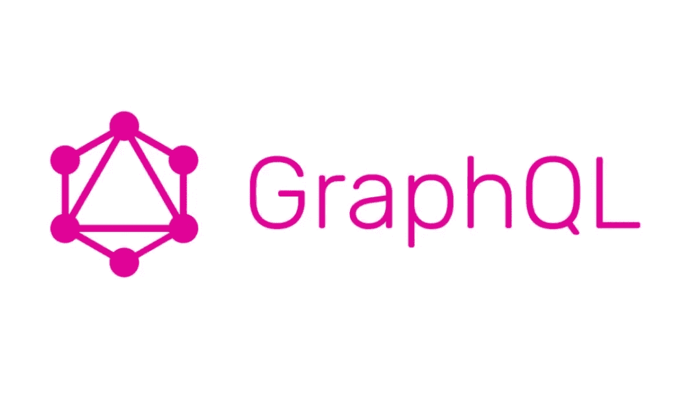

# GraphQL 基础知识

> 原文：<https://medium.com/codex/graphql-basics-82d69b280198?source=collection_archive---------12----------------------->

## RESTful APIs 的替代方案



图片来源:[freesion.com](https://www.freesion.com/article/67601031375/)

# 起源故事

2012 年，脸书的开发团队引入了 GraphQL，作为他们在原生移动平台上遇到的一些抓取问题的解决方案。用他们自己的话说，他们“需要一个足够强大的数据获取 API 来描述整个脸书，同时又足够简单，便于我们的产品开发人员学习和使用”。于是，GraphQL 诞生了，后来在 2015 年发布供公众使用。

它可以与几乎任何编程语言结合使用，并从此获得了惊人的普及。开发人员喜欢它在客户机-服务器通信中提供的灵活性和效率。GitHub、Twitter、PayPal、Yelp 和 Shopify 只是财富 500 强公司中使用 GraphQL 的几家。

# 介绍

定义就在名字里。GraphQL 代表图形查询语言。它被用作 REST 和查询 API 的替代品，只检索所需的特定信息。在向客户端发送响应之前查询我们的 API 的好处之一是，我们不必过度获取不必要的数据，这可以加快我们的应用程序。

另一方面，如果我们需要从几个不同的模型中获取数据，我们可以在一个请求中完成。以用户仪表板为例。您可能希望显示用户的姓名、上次登录、他们关注的其他用户、他们保存的一些文章等。这些信息需要从模式中的不同位置提取，但是可以在一个请求中完成，而不是在 RESTful API 架构中对不同端点的多个请求。

# 查询和突变

想象一下 GraphQL 充当我们的客户机和数据库之间的中间人。它接受来自客户端的查询请求，并只返回需要的内容。

下面是一个查询示例:

```
query [
  user(id:278){
    name
    subscriptions {
      title
     }
     bio
     friends (first:3){
       name
     }
  }
]
```

如您所见，GraphQL 是一种强类型语言，因此它可以帮助我们快速捕捉错误。传入用户的 id 允许我们只获取特定用户的数据。传入 first: 3 to friends 允许我们只获取该用户数据库中前 3 个朋友的数据。我们也可以最后传入并改变我们想要返回的朋友的数量。响应是一个 JSON 对象，如下所示…

```
{
 "data":{
   "user": {
      "name": "Lucy",
      "subscriptions": [
          {title: "Tech for Good"}
          {title: "Daily Digest"}
        ], 
       "friends": [
          {name: "Todd"},
          {name: "Tammy"}
         ]
      }   
    }
}
```

看看我们如何获得与该用户相关的数据，如订阅标题和朋友的名字。我们可以收集更多关于用户朋友的信息，比如他们订阅了什么，但是我们只收集了客户需要的信息。查询用于从后端读取数据，但是当我们需要操作一些数据时呢？

为了更新或删除数据，我们以突变的形式发送请求。我们的变异中的信息将被用作 HTTP 请求中的对象。请查看 GraphQL 文档中的这个示例:

```
mutation CreateReviewForEpisode($ep: Episode!, $review: ReviewInput!) {
  createReview(episode: $ep, review: $review) {
    stars
    commentary
  }
}
```

请注意！在剧集和回顾之后。这是告诉 GraphQL 我们需要这些值返回除 null 之外的值的一种方式。您可能无法理解上面的所有代码，但是您可能会猜到$ep 和$review 是作为参数传入的变量，用于创建一个 review。我们必须这样定义这些…

```
{
  "ep": "JEDI",
  "review": {
    "stars": 5,
    "commentary": "This is a great movie!"
  }
}
```

就是这样！如果我们简单地在突变后添加一个 return 语句，数据将被更新，客户端可以反映这种变化。

# 模式和类型

您可以看到，查询基本上只是在字段中搜索已定义的对象。模式定义了我们可以从一个根对象中访问的字段，如果有子对象，那么也可以从这些子对象中访问哪些类型的字段。根据模式对查询进行验证，以确保我们正在寻找的内容是可用的，并且我们期望返回的数据类型反映了数据库中特定字段的类型。

所有模式都有一个查询类型，以便我们可以读取数据。如果预期要对数据库进行更改，那么模式也需要一个突变类型。如果没有这些，我们在发送查询和变异请求时就不能收到任何反馈。

```
schema {
  query: Query
  mutation: Mutation
}
```

然后，您可以在您的模式中添加其他类型对象，如下所示:

```
type: Member {
  id: ID!
  name: String
  bio: String
}
```

如果需要，类型字段可以接受参数。

默认的内置类型有 Int、Float、String、Boolean 和 ID。也可以创建自定义的标量和枚举类型。

如果您熟悉 TypeScript 接口，它们在 GraphQL 中是可以接受的。接口是我们定义的一种类型，它具有由不同对象共享的特定字段。这有点像分类。当我们定义一个包含与接口相同字段的类型时，我们可以扩展接口。看看这个实现车辆接口的汽车类型的例子。

```
interface Vehicle {
  make: String
  model: String
  year: Int
}type Car implements Vehicle {
  id: ID!
  make: String
  model: String
  year: Int
}
```

注意，汽车类型可以有比定义为车辆更多的字段，但至少，它必须有我们期望从车辆接口得到的所有相同的字段。

当我们希望不止一种类型作为返回值有效时，我们可以使用联合类型。例如，如果我们的数据库中的一些数字是整数，一些是字符串，那该怎么办？您可以定义一个 union 并将其赋给 Int | String。该语法允许返回任一类型。

最后，我们有输入类型。当我们需要创建一个传递给变异的对象时，就会用到这些。可以把它想象成补丁请求中的 JSON 对象。它们的定义很简单，使用 input 关键字，后跟任何合适的名称和一个将被传递给变异的对象。

```
input KarmaScore {
  score: Int
  comments: String
}
```

## 便利的工具和库

正如我们前面讨论的，GraphQL 是最近的热门话题。一路走来，已经有许多贡献和库来帮助我们。

您首先想要熟悉的工具之一是浏览器内 IDE graphic QL(发音:graphical)。您可以查看模式以了解在查询和变异中使用什么类型的字段，编写这些查询或变异，然后查看结果。它非常适合测试验证。最重要的是，它是自文档化的！

对于基于 JavaScript 的应用程序，Apollo 库通常用于客户机和/或服务器。一些 React 应用程序使用 Relay 库作为替代。其他流行的工具有 GraphQL Yoga 和 Express GraphQL。

## GraphQL 的案例

GraphQL 太神奇了！它允许我们在一个请求中从多个 API 获取信息，并只获取我们需要的信息。它为前端和后端开发人员独立工作提供了灵活性。此外，我们应用程序的最终用户将获得更快响应时间的好处。

如果您还不喜欢这项技术，请查看 GraphQL 社区中的大量沟通和支持渠道！

如果你在 Twitter 上，看看#graphql、#graphqlweekly 和#apolloql。您还可以通过访问[https://graphql.org/community](https://graphql.org/community/)加入正在进行的讨论或参加世界各地举行的众多 GraphQL 会议之一。