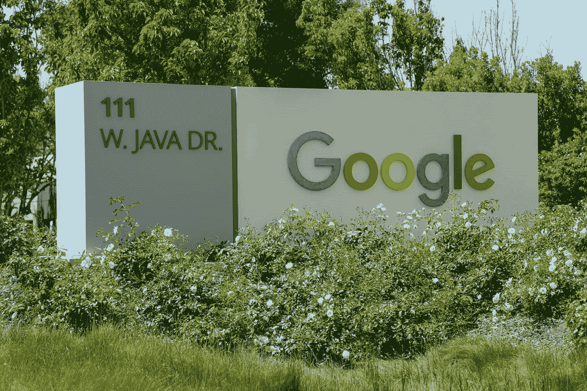

# 谷歌将在下一次大会上发布重大公告

> 原文：<https://medium.com/codex/great-announcements-from-google-at-next-conference-38916948fab2?source=collection_archive---------6----------------------->

## Data Studio 现在叫 Looker，更 PostgreSQL，更 AI

格雷格·布拉在 [Unsplash](https://unsplash.com/s/photos/google?utm_source=unsplash&utm_medium=referral&utm_content=creditCopyText) 上的照片

谷歌已经在下一次会议上宣布了几项创新，尤其是在数据领域。谷歌希望在 Looker Studio 中巩固其在数据收集和分析方面的专业知识。在数据库领域也有重大发布。