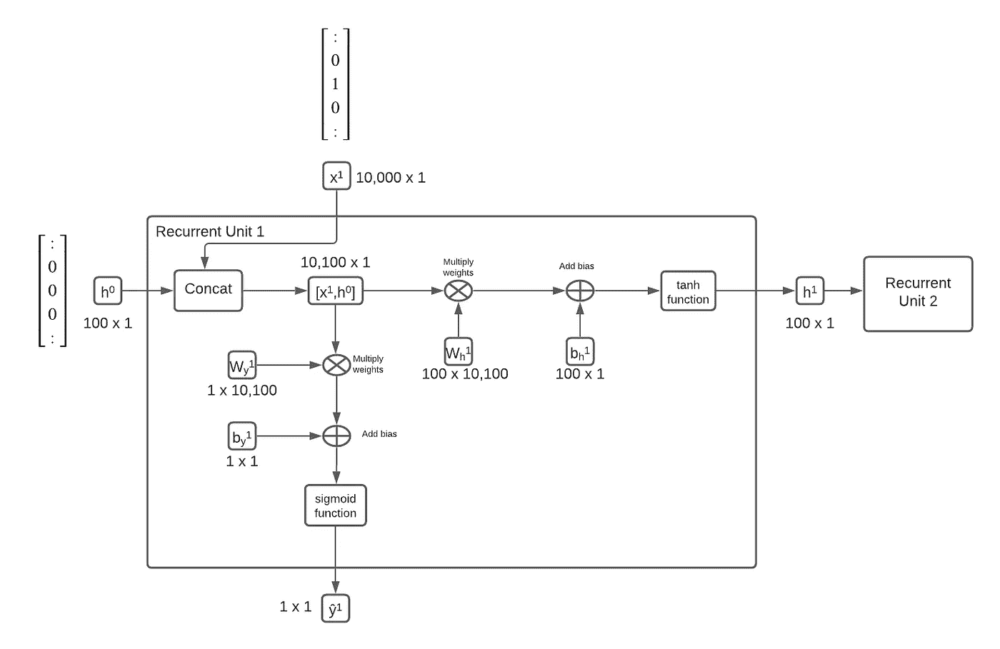
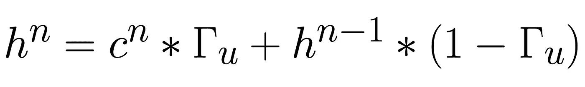
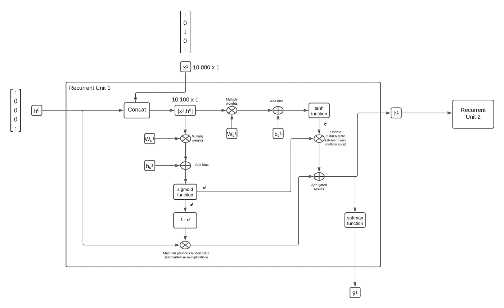
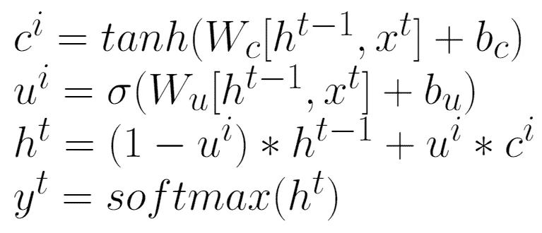
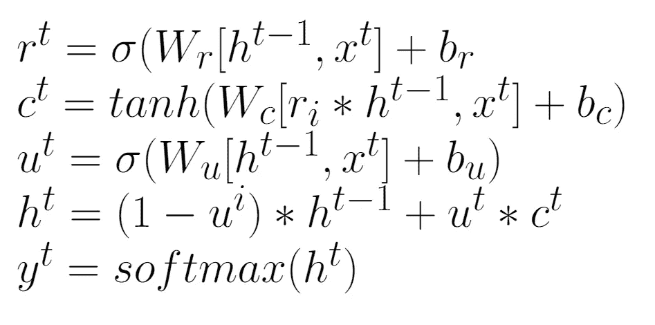
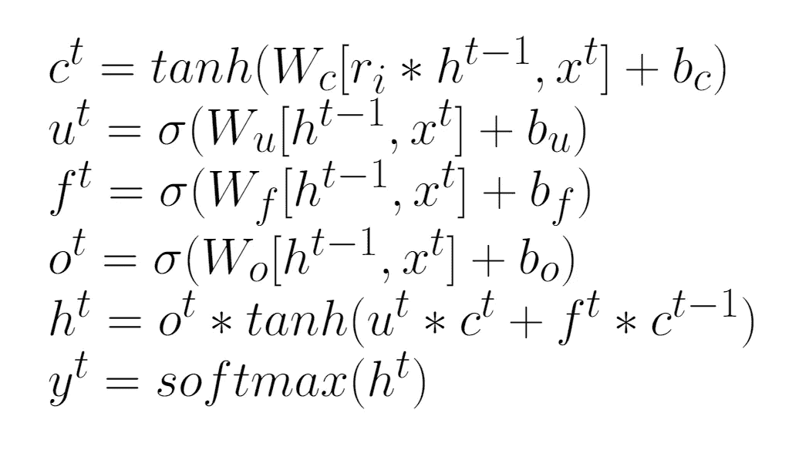

# 用于自然语言处理的 GRUs 和 LSTMs

> 原文：<https://medium.com/codex/grus-and-lstms-for-natural-language-processing-c858010f6d8c?source=collection_archive---------11----------------------->

门控递归单元(GRU)和长短期记忆(LSTM)是递归神经网络(RNN)，它们提供了对传统 RNNS 的改进，并已被证明在自然语言处理的学习任务中非常有用。

这篇文章建立在我的自然语言处理的 RNNs 文章的基础上，推荐作为先决条件阅读。

 [## 自然语言处理的 RNNs

### rnn 对于理解 BERT、T5 或 GPT-3 等架构的当前状态至关重要

medium.com](/@matthewkramer_20144/rnns-for-natural-language-processing-d7242e6e0842) 

# 香草味 RNNs 的不足之处

正如在[自然语言处理的 RNNs](/@matthewkramer_20144/rnns-for-natural-language-processing-d7242e6e0842)中所描述的，传统的 RNNs 有一个缺点，即在较长的序列中会丢失早期单词的上下文。这通常被称为消失梯度。例如，考虑《低俗小说》中的这个剧本:

《T4》朱尔斯:我认为她最大的成就是出演了一部试播剧。

文森特:什么是飞行员？

朱尔斯:嗯，你知道电视上的节目吗？

文森特:我不看电视。

朱尔斯:是的，但是你知道有一项发明叫做电视，在这项发明上他们播放节目？

文森特:是啊。

朱尔斯:他们挑选电视节目的方式是制作一个节目，这个节目叫做试播集。他们向挑选节目的人展示一个节目，根据这个节目的实力，他们决定是否要制作更多的节目。有的被接受成为电视节目，有的没有，什么都不是。她主演了一部一无是处的电影。"

假设我们希望构建一个 NLP 系统来提供语法和拼写建议。该系统将接受低俗小说脚本，并突出显示不符合语法约定的单词，就像微软的 Word 一样。

考虑一下剧本中的最后一句话:*她出演了其中一部变得一无是处。*系统如何确定*‘她’*是正确的代词？读剧本时，你可以从第一句话中辨别出*她*是正确的代词:*我认为她最大的收获是出演了一部试播剧。*

然而，正如您所看到的，确定正确代词所需的第一句话在脚本中出现得更早。一个普通的 RNN 会冲淡这个上下文，因为它必须通过每个输入单元传递它的隐藏状态，在这个例子中，大约是 100 个单词。这 100 个单词对确定正确的代词没有用，而且淹没了第一句话的信号。

GRUs 和 LSTMs 试图通过向网络添加专门的门来解决这个问题，以便更容易地“记住”序列的较早部分，并且“忘记”序列的不相关部分。

# 门控循环网络

回想一下自然语言处理的 RNNs，一个普通 RNN 的基本单元可以是这样的:

隐藏状态 h^t 从一个递归单元传递到另一个递归单元，每一步都产生一个输出ŷ。在每个单元中，隐藏状态总是根据网络中学习到的权重和偏差更新为新值。GRU 在递归网络中增加了一些额外的步骤，以使隐藏状态能够*可选地*在每个单元更新隐藏状态。这意味着隐藏状态可以几乎不加改变地直接通过。

门控循环单元的简化版本可以概括为:

1.  类似于我们的普通 RNN，连接隐藏状态向量 h 和输入向量 x 来创建:[x^t，h^t]
2.  制作两个连接向量的副本
3.  类似于我们的普通 RNN，乘以权重(Wh)，加上偏差(b_h)，并在级联向量的一个副本上使用双曲正切激活函数——这将是我们的候选值(c^n ),我们可以用它来更新隐藏状态。
4.  引入一组新的权重(Wu)和偏差(b_u ),称为更新权重/偏差，并将连接向量的第二个副本相乘，并将该结果通过 sigmoid 函数。因为我们使用 sigmoid 函数，所以结果将是一个非常接近 1 或 0 的数字。这个结果被称为更新值， *u*
5.  然后，我们使用这个更新值 *u* ，来确定我们是否应该将先前的隐藏状态传播为新的隐藏状态，或者使用我们的候选值来更新隐藏状态。这可以由以下等式表示，如果 *u* 为 0，则保持先前的隐藏状态，或者如果 *u* 为 1，则用候选值更新隐藏状态。

6.最后，要获得当前输出值(ŷ),请将结果输入 softmax 函数。

下图为简单 GRU 中的每个步骤提供了直观的参考

简单 GRU 视觉图

这个简化的 GRU 也可以用一系列等式来表示(*表示为逐元素乘法):

简化的 GRU 方程

GRU 的完整版本使用了一个额外的“相关性”门，允许网络学习隐藏状态与每个单元的相关性。

全 GRU 方程

总之，我们允许网络学习一些附加参数，以便让网络忽略序列中的某些输入，并且对具有更多噪声的更长序列更有弹性。

# 长短期记忆(LSTM)

与 GRU 类似，LSTMs 使网络更容易忽略序列中不相关的部分。然而，LSTMs 稍微复杂一点，使用额外的门来实现与 GRUs 类似的效果。使用单独的权重和偏置来计算三个门:更新门、 *u、*遗忘门、 *f* 和输出门、 *o.* 不是将先前的隐藏状态乘以更新门的相反值(1 - *u* ，而是使用遗忘门。此外，输出门用于对来自更新门和遗忘门的结果输出进行加权。这可以用以下等式表示:

LSTM 方程

# 有用的资源

*   https://www.coursera.org/learn/nlp-sequence-models[吴恩达关于序列模型的课程(点击‘审计课程’可免费观看所有视频)](https://www.coursera.org/learn/nlp-sequence-models)