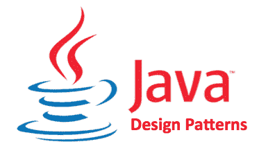

# 指南:设计模式在 Java 中的实现

> 原文：<https://medium.com/codex/guide-implementation-of-design-patterns-in-java-821611f15f64?source=collection_archive---------0----------------------->



指南:设计模式在 Java 中的实现

设计模式是 Java 开发人员中流行的一种开发方式。所以一个重要的问题是设计模式到底是什么？设计模式是解决特定任务或问题的明确定义的解决方案。设计模式本身是独立编程的，并定义了解决常见问题的行业标准策略。通过使用设计模式，您可以使您的代码更加灵活、可重用和易于维护。

要成为一名更好的软件开发人员，至少了解一些针对编码问题的流行设计模式是有帮助的。在本文中，我们将讨论不同类型的设计模式，以及它们的独特之处，因此在本文结束时，您可能能够选择最适合您的下一个项目的设计模式。

# 设计模式

设计模式在 Java 中起着非常重要的作用。它们提高了代码的可读性，并为常见问题提供了合适的解决方案。它们在 Java 开发人员中非常流行，因为语言本身是基于设计模式的。这使得 Java 成为业界非常流行的语言。

在 Java 的核心中有 3 种主要的设计模式，可以进一步划分为子类。在本文中，我们将看看 Java 中使用的一些最流行的设计模式。

# 创造性设计模式

创造性设计模式提供了一种实例化单个对象来优化代码并增加其灵活性和可重用性的方法。

## 1)单例模式:

单例模式是 Java 开发人员使用的最流行的设计模式。在单例模式中，用户创建一个对象的单个全局实例，这样就可以对这个实例进行公共访问。


假设你拥有一家巧克力工厂，里面有电脑控制的锅炉。锅炉的工作是用巧克力和牛奶作为配料，将它们煮沸，然后传递到下一个阶段，制作巧克力棒。下面的代码显示了一个 Chocolateboiler 的单独实例。

```
public class ChocolateBoiler {private boolean empty;private boolean boiled;private static ChocolateBoiler uniqueInstance;private ChocolateBoiler(){empty = true;boiled = false;}public static ChocolateBoiler getInstance(){*if* (uniqueInstance == null){uniqueInstance = *new* ChocolateBoiler();}*return* uniqueInstance;}public void fill() {*if* (isEmpty()) {empty = false;boiled = false;*// fill the boiler with a milk/chocolate mixture*}}public void drain() {*if* (!isEmpty() && isBoiled()) {*// drain the boiled milk and chocolate*empty = true;}}public void boil() {*if* (!isEmpty() && !isBoiled()) {*// bring the contents to a boil*boiled = true;}}public boolean isEmpty() {*return* empty;}public boolean isBoiled() {*return* boiled;}}
```

该代码提出了一些标志，例如，如果混合物已经煮沸，则不允许它煮沸，排出 500 加仑未煮沸的混合物，或者当它已经满了时再装满锅炉。这有助于我们对单例模式及其使用有一个基本的了解。

## 2)工厂模式:

Java 开发人员经常使用工厂设计模式。当一个超类有多个子类时使用它。在 Java 中，工厂设计模式提供了在超类中创建对象的接口，但允许在子类中创建对象类型。

想象一下有一家比萨饼店。您需要编写一些代码来确定比萨饼的类型，然后着手制作它。很快你就会意识到希腊风味卖得不多了，所以你决定把它们从菜单上拿掉，同时增加新的时尚披萨。

```
public class SimplePizzaFactory {public Pizza createPizza(String type) {Pizza pizza = null;*if* (type.equals(“cheese”)) {pizza = *new* CheesePizza();} *else* *if* (type.equals(“pepperoni”)) {pizza = *new* PepperoniPizza();} *else* *if* (type.equals(“clam”)) {pizza = *new* ClamPizza();} *else* *if* (type.equals(“veggie”)) {pizza = *new* VeggiePizza();}*return* pizza;}}public abstract class PizzaStore {public Pizza orderPizza(String type) {Pizza pizza;pizza = createPizza(type);pizza.prepare();pizza.bake();pizza.cut();pizza.box();*return* pizza;}abstract Pizza createPizza(String type);}
```

创建一个单独的比萨饼店类不会让我们特许经营我们的商店或帮助定义不同类型的比萨饼。所以我们实现了一个工厂模式来帮助我们定义我们的商店。


这允许我们将所有的比萨饼制作活动本地化到 PizzaStore 类，同时让特许经营者自由地拥有他们的区域风格，同时允许子类决定覆盖和扩展具体类的功能的方法。

# 结构设计模式

结构模式提供了不同的方法来使用继承和组合将对象和类组装成更大的结构，同时保持它们的高效和灵活。

## 1)适配器模式:

顾名思义，适配器模式提供了一个接口，使得接口不兼容的对象可以协作。连接这些接口的对象称为适配器。

让我们看一个例子，看看适配器模式是如何工作的。

想象一下，定义一个 Duck 类，实现一只会飞会嘎嘎叫的鸭子。

```
public interface Duck {public void quack();public void fly();}
```

现在可以创建一个名为绿头鸭的鸭子子类，它简单地打印出鸭子正在做的事情:

```
public class MallardDuck implements Duck {public void quack() {System.out.println(“Quack”);}public void fly() {System.out.println(“I’m flying”);}}
```

还可以实现一个简单的火鸡类，这样火鸡对象就可以像鸭子一样咯咯叫和飞翔。

```
public interface Turkey {public void gobble();public void fly();}
```

现在想象一下鸭子对象用完了。因为火鸡对象的行为就像鸭子对象，所以你想把火鸡伪装成鸭子。我们不能简单地使用 turkey 类，我们必须首先使用一个适配器来改变它。

```
public class TurkeyAdapter implements Duck {Turkey turkey;public TurkeyAdapter(Turkey turkey) {this.turkey = turkey;}public void quack() {turkey.gobble();}public void fly() {*for*(int i=0; i < 5; i++) {turkey.fly();}}}
```

适配器实现目标接口，并保存适配器的一个实例。TurkeyAdapter 类更改 turkey 对象，使其行为和功能就像鸭子一样。

## 2)装饰图案:

顾名思义，装饰模式通过将对象放在包含行为的特殊包装对象中来操纵对象的输出。这只会更改有问题的对象，而该对象的所有其他实例保持不变。

想象一下经营一家咖啡店。最初，他们的商业模式是这样的:


因为你发展如此之快，你想更新你的系统，以增加你的，是饮料产品。

如果出于某种原因，你采用了相同的设计模式，你将不得不管理多个子类。每一个子类都是不同混合物、它们的风味和它们的调味品的排列，它们可以很快变大。

我们的目标是在不修改现有代码的情况下，允许类被容易地扩展以包含新的行为。这可以通过实现对变化有弹性并且足够灵活以采用新功能来满足不断变化的需求的设计来实现。相反，我们将从饮料开始，并在运行时用调味品“装饰”它。


我们将首先定义饮料类别:

```
public abstract class Beverage {String description = “Unknown Beverage”;public String getDescription() {*return* description;}public abstract double cost();}
```

饮料类很简单。让我们也实现调味品(装饰)的抽象类:

```
public abstract class CondimentDecorator extends Beverage {public abstract String getDescription();}
```

现在我们已经解决了基类的问题，让我们实现一些饮料。我们将从浓咖啡开始。记住，我们需要为特定的饮料设置一个描述，还需要实现 cost()方法。

```
public class Espresso extends Beverage {public Espresso() {description = “Espresso”;}public double cost() {*return* 1.99;}}public class HouseBlend extends Beverage {public HouseBlend() {description = “House Blend Coffee”;}public double cost() {*return* .89;}}public class Mocha extends CondimentDecorator {Beverage beverage;public Mocha(Beverage beverage) {this.beverage = beverage;}public String getDescription() {*return* beverage.getDescription() + “, Mocha”;}public double cost() {*return* .20 + beverage.cost();}}
```

我们可以惊叹于设计的灵活性，它允许我们动态地计算成本，并且如果需要，可以毫不费力地扩展其功能。

# 行为设计模式

行为模式与算法有关，为对象之间更好的交互和它们之间的责任分配提供更好的解决方案。

## 1)模板方法模式:

模板方法，也许是最重要的行为设计模式，在超类中定义了算法的框架，但让子类覆盖算法的特定步骤，而不改变整个结构。让我们看一个例子。

许多人以一杯咖啡或茶开始他们的一天。它们都含有共同的成分咖啡因，能给人们一天所需的能量。现在，如果我们要编写制作咖啡或茶的代码，我们会有相同的方法。例如，咖啡分 4 步准备，烧开水，煮咖啡，倒入杯中，然后加入牛奶或糖。除了第二步我们用茶包之外，泡茶的方法也是一样的。


我们可以看到，这两种饮料有共同的步骤，会导致代码重复。这就是我们使用模板模式将算法分解成可以在子类中覆盖的步骤的地方。因此，我们可以定义一个抽象的父类 CaffineBeverages，它可以在 Tea 和 Coffee 子类中扩展。这可以帮助我们减少重复，并使算法满足我们的特定需求。

```
public abstract class CaffeineBeverage {final void prepareRecipe() {boilWater();brew();pourInCup();addCondiments();}abstract void brew();abstract void addCondiments();void boilWater() {System.out.println(“Boiling water”);}void pourInCup() {System.out.println(“Pouring into cup”);}}public class Tea extends CaffeineBeverage {public void brew() {System.out.println(“Steeping the tea”);}public void addCondiments() {System.out.println(“Adding Lemon”);}}public class Coffee extends CaffeineBeverage {public void brew() {System.out.println(“Dripping Coffee through filter”);}public void addCondiments() {System.out.println(“Adding Sugar and Milk”);}}
```

# 最后的想法

设计模式是一个成功的 Java 开发人员口袋里的强大武器库。它们提供了蓝图，可以帮助您定制解决代码中反复出现的问题。设计模式允许您实现适合自己特定需求的解决方案。它们增加了可读性，并帮助其他开发人员协作。

我希望这篇文章能帮助你掌握设计模式的基础，并帮助你为下一个编程项目选择一个配方。

# 参考

*   弗里曼，埃里克，伊丽莎白罗布森，凯西塞拉和伯特贝茨。*头先设计图案*。塞瓦斯托波尔，加利福尼亚州:奥莱利，2004 年。打印。