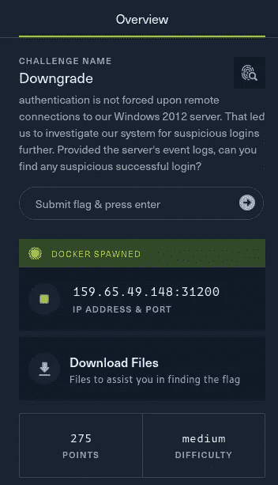
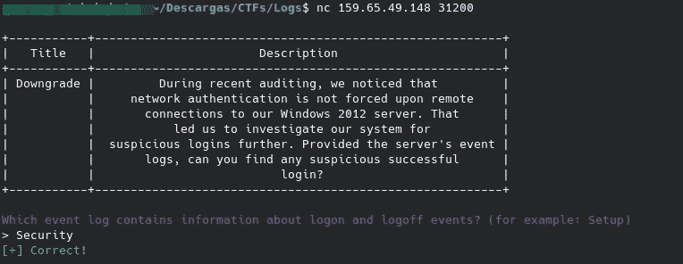
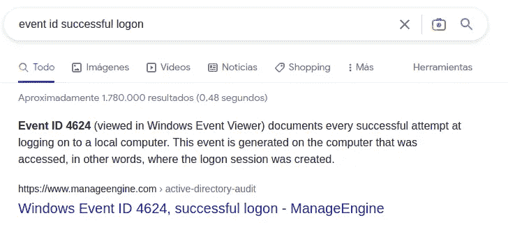
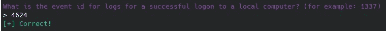
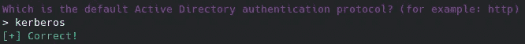
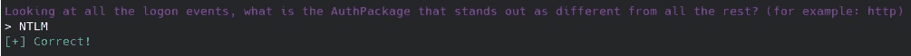
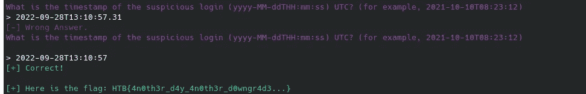

# 黑客嘘声:降级

> 原文：<https://medium.com/codex/hack-the-boo-downgrade-34590cb026d5?source=collection_archive---------26----------------------->


这是我写的关于破解 CTF 降级法庭挑战的文章。在这项挑战中，我们需要分析 Windows 系统事件日志来回答几个问题。



首先，我们下载文件并查看内容，我们可以在上面看到许多 evtx 文件。为了处理这种类型的文件，我们将使用 [evtx_dump](https://github.com/omerbenamram/evtx) 和 JSON 过滤工具 jq。让我们来回答这些问题:

1.  **哪个事件日志包含登录和注销事件的信息？**

这个答案很快就可以从谷歌搜索中获得，尽管任何有一些审查这类文件经验的人都可以不用谷歌就能找到它。

```
Security
```



**2。成功登录到本地计算机的日志的事件 id 是什么？**

现在是时候做更多的研究了。首先，我们需要知道什么是事件 ID。事件 ID 是系统注册的每种类型事件的唯一数字标识符。一旦我们弄清楚了这一点，我们就可以查找与成功登录到本地计算机相对应的事件 ID。在谷歌的帮助下，我们可以很容易地知道答案并输入它。



在谷歌的帮助下，我们可以很容易地知道答案并输入它。



**3。哪个是默认的 Active Directory 身份验证协议？**

答案是 Kerberos，您可以通过 googling 找到它，或者如果您以前使用过 Active Directory，您可能已经知道它了。



**4。纵观所有登录事件，有什么 AuthPackage 与众不同？**

首先，让我们将 evtx 转换成一种我们可以更容易处理的 XML 格式。

```
evtx_dump Security.evtx --threads 1 -o json --dont-show-record-number > Sec.json
```

现在是时候为我们寻找的值过滤事件了。

```
jq ".Event | select (.System.EventID == 4624) | .EventData | {AuthenticationPackageName}" Sec.json | grep ":" | sort | uniq -c
```

jq 语法有点复杂，但是我们选择 ID 为 4624(成功登录)的事件，并选择 AuthenticationPackageName 字段。然后我们清理输出，只包含我们想要的值，并计算出现的次数。

这样，我们将检测到已经使用 NTLM 进行了几次认证。



**5。可疑登录的时间戳是什么(yyyy-MM-ddTHH:mm:ss) UTC？**

是时候使用 jqmagic 了，我们必须编写一个更复杂的过滤器，为我们提供系统的 NTLM 登录的时间戳，以便能够更好地分析它们，并在输出中应用替换。

```
jq ".Event | select (.System.EventID == 4624) | select (.EventData.AuthenticationPackageName == \"NTLM\") | {Domain: .EventData.TargetDomainName , Username: .Event
Data.TargetUserName, Time: .System.TimeCreated}" Sec.json
```

我们可以看到作为管理员在 BOOCORP 域中的单一登录。我们将使用时间戳作为最后一个问题的答案。



我希望你喜欢这篇文章，并了解一些新的:D