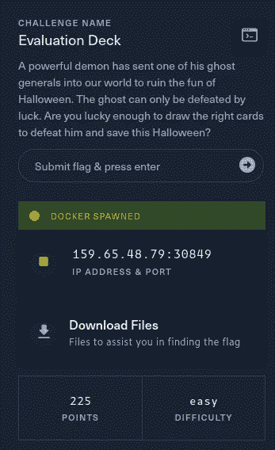
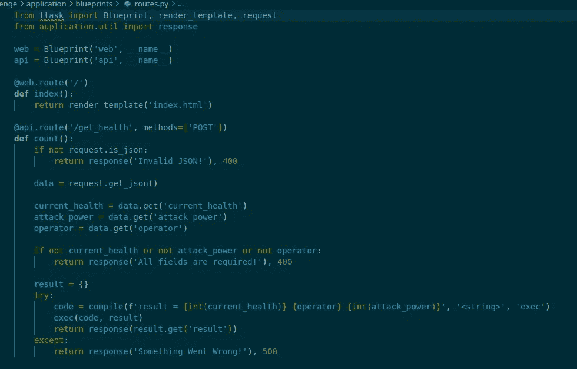
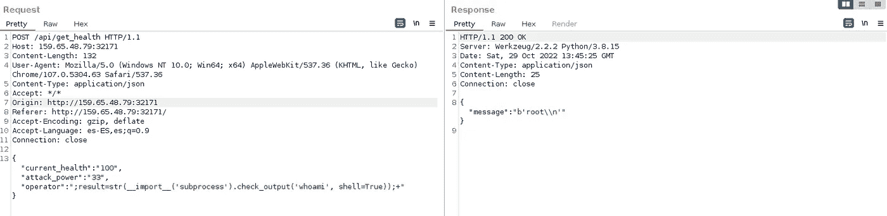
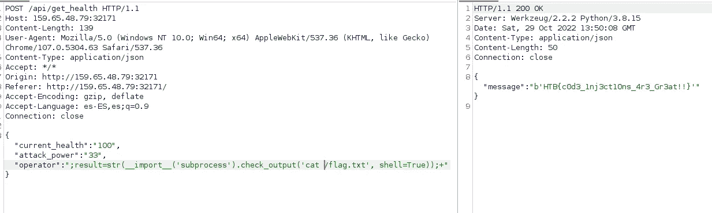

# 破解 Boo:评估版

> 原文：<https://medium.com/codex/hack-the-boo-evaluation-deck-2cb8fab1d3f7?source=collection_archive---------30----------------------->


这是我写的黑客布 CTF 的评估甲板网络开发挑战。在这个挑战中，我们需要利用纸牌游戏中的一个漏洞。



首先，我们下载文件并查看内容，我们可以看到 python 代码和一个 docker 文件来启动本地应用程序。首先，我们观察应用程序定义的路线。



我们可以看到有两条路径，一条是针对健康的 POST，另一条是针对主页面的 get。后一个更有趣，我们可以看到它如何从请求中提取一系列值，并通过 exec 参数将它们传递给编译函数。这看起来是个坏主意，因为他们在 exec 调用中直接使用用户输入，这可能会导致 RCE。

现在是时候尝试操纵请求来实现 RCE 了。要做到这一点，我们必须操作 operator 参数，因为其他两个参数在执行之前被转换为整数。

最终有效载荷如下:

```
;result=str(__import__('subprocess').check_output('whoami', shell=True));+
```

第一个分号是保存结果中的前一个值，以便在进行类型之间的转换时不会打扰我们，现在我们覆盖结果的值，并在其中保存对函数 check 输出调用的转换字符串，在本例中，我们传递的是 whoami 命令。最后，我们添加另一个分号来避免第二个整数的问题。我们可以看到应用程序告诉我们我们是 root 用户。



现在剩下的就是读旗子了:



我希望你喜欢这篇文章，并了解一些新的:D