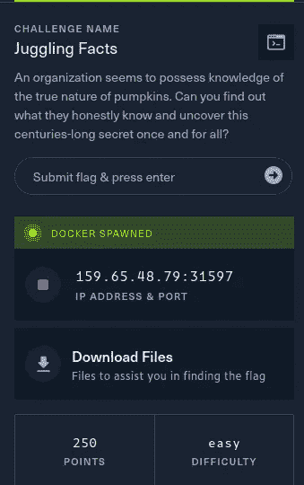
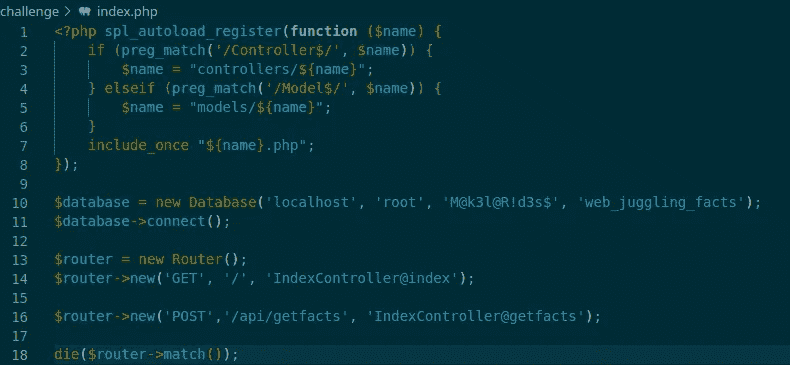
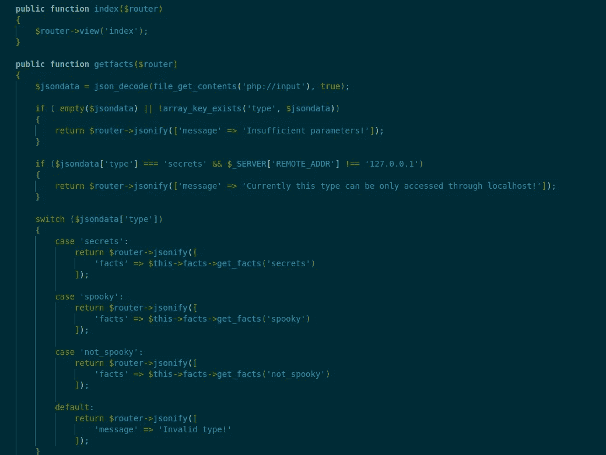
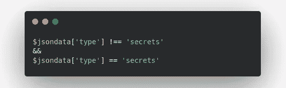
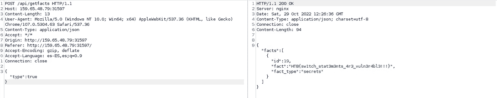

# 黑客嘘声:玩弄事实

> 原文：<https://medium.com/codex/hack-the-boo-juggling-facts-fb79f2224ec1?source=collection_archive---------23----------------------->

这是我写的关于黑客的嘘声 CTF 的杂耍事实网络开发挑战。在这个挑战中，我们需要从网页中恢复一个秘密，他们给我们源代码来分析它，寻找漏洞来利用。

首先，我们下载文件并查看内容；我们可以看到 PHP 代码和 docker 文件来在本地启动应用程序。现在，我们观察应用程序定义的路由。

我们可以看到有两条路径，一条用于 API 的 POST，一条用于主页面的 get 两者调用同一个控制器，让我们深入研究控制器的代码。

我们有两个函数，GET 请求的 index 和 POST 请求的 getfacts。GET 为我们提供了索引视图；POST 有一个更复杂的逻辑，它检查发送的 JSON。首先，它检查该类型是否在应用程序支持的类型中，如果该类型是 secret，它检查请求是否来自 localhost。然后，它使用一个开关来呈现所请求的内容。

这里的问题是 switch 函数使用弱(无类型)比较进行检查，而 secret 类型检查是使用严格的“===”比较来完成的。

在这种情况下，我们可以利用这些被称为类型杂耍的比较(这就是挑战的名称)，并传递一个满足以下条件的值:

这可以通过在类型值中发送一个布尔值(true)来实现，如下面的请求所示:

我希望你喜欢这篇文章，并了解一些新的:D