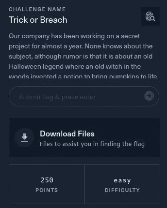
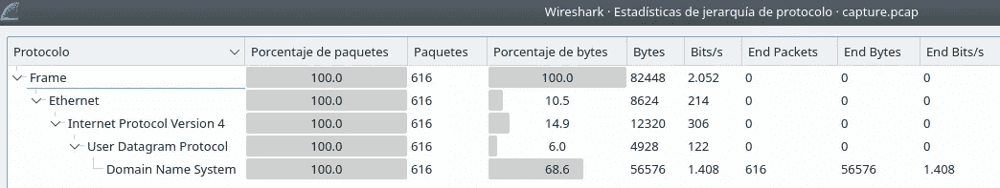
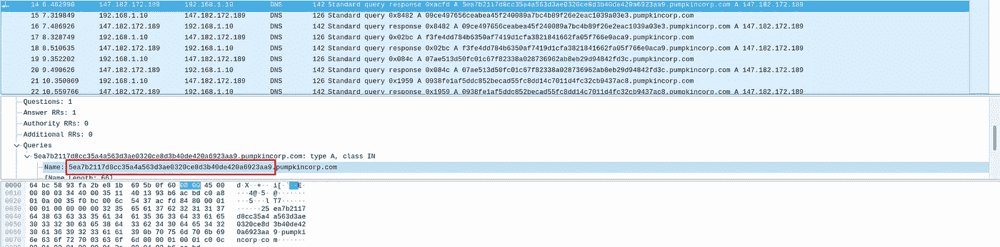
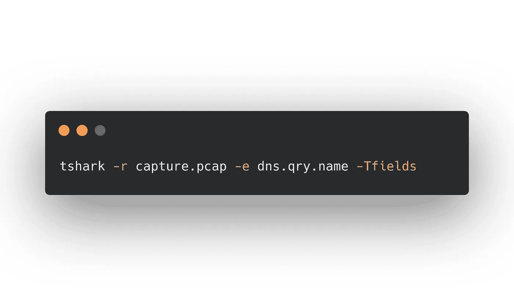
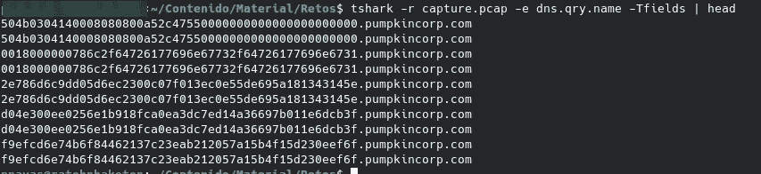
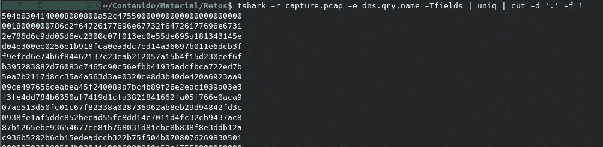
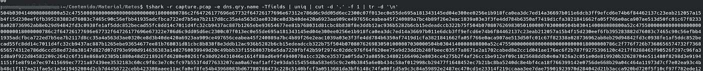
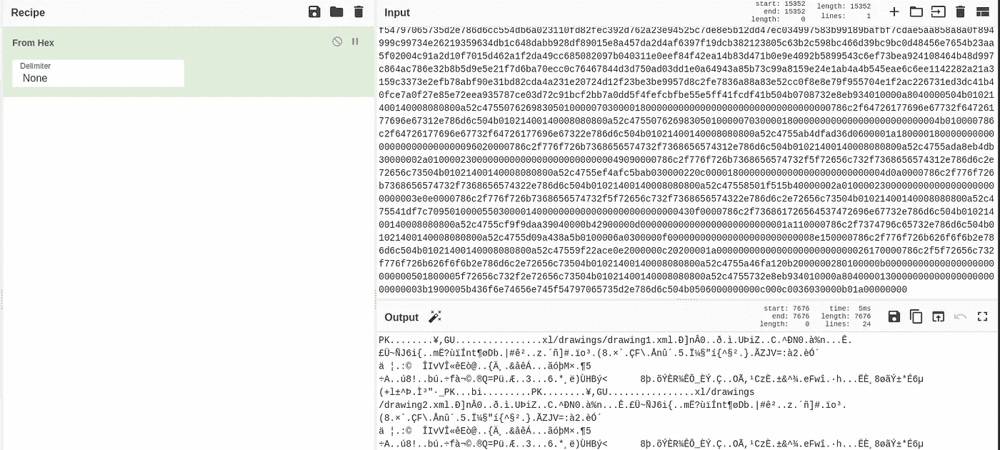
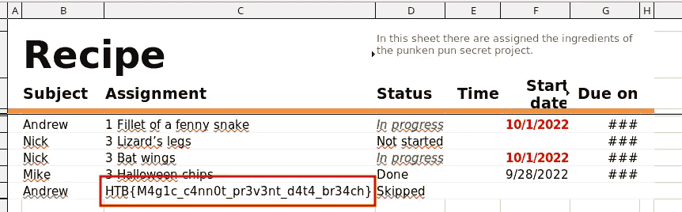

# 黑客攻击:诡计还是突破

> 原文：<https://medium.com/codex/hack-the-boo-trick-or-breach-77392678e7ea?source=collection_archive---------28----------------------->

这是我写的关于破解布·CTF 的“恶作剧还是违约”法庭挑战的文章。在这个挑战中，我们被要求分析一个 pcap 以检测任何方式的数据泄漏。

首先，我们下载文件并查看 pcap，观察协议层次结构，我们看到只有 DNS 流量。

如果我们分析这些包，我们可以看到我们正在为 pumpkincorp.com 的子域名发出 DNS 请求。如果我们看一下查询的子域，可以看到都是十六进制的，这是不正常的。

我们可以手动提取这些信息，但我们可以使用 tshark 自动提取，这样更好。

Tshark 是一个命令行工具，它允许我们以一种舒适的方式与 pcap 交互。使用-r 参数，我们指定要读取的文件，使用-e，我们要提取的字段。

我们可以看到，我们有重复的，我们必须停用域，只保留有效负载。为此，我们将使用以下命令:

现在我们必须处理换行符。为此，我们将使用命令 tr。

现在，使用 Cyberchef 我们可以解码文件，看看它是一个 zip 还是 doc 文件。

我们下载文件，我们可以看到旗帜。

我希望你喜欢这篇文章，并了解一些新的:D