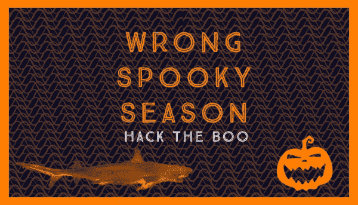
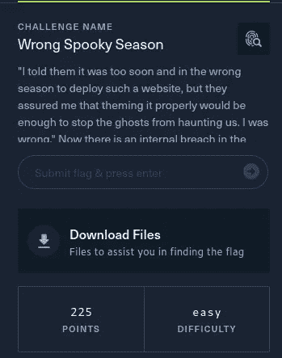
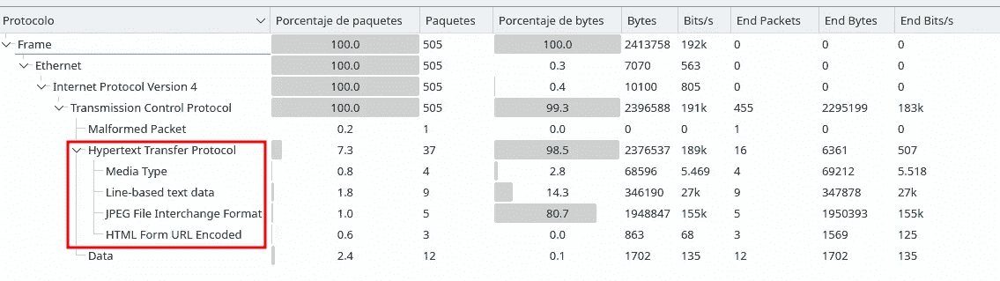
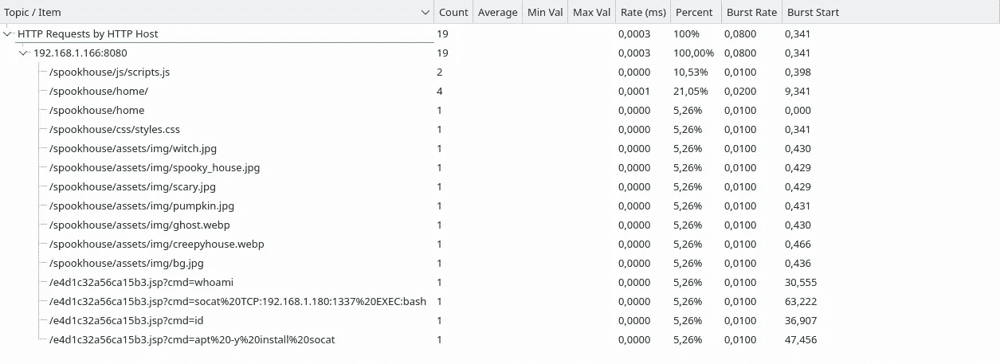
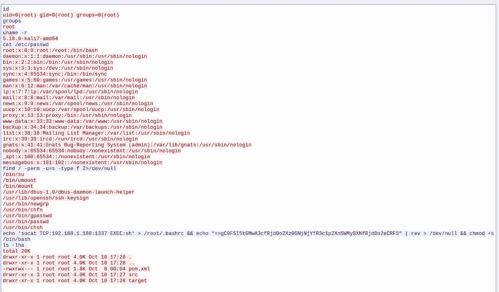
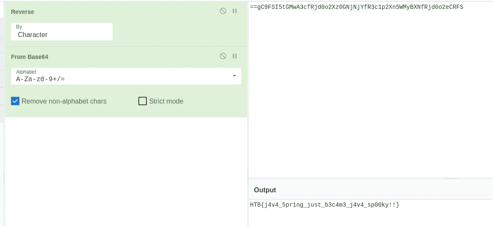

# 黑客嘘:错误的幽灵季节

> 原文：<https://medium.com/codex/hack-the-boo-wrong-spooky-season-3609cf3dc1fc?source=collection_archive---------24----------------------->

这是我写的黑客布 CTF 的错误幽灵季法医挑战。在这个挑战中，我们被要求分析 pcap 以检测任何入侵。

首先，我们下载文件并查看 pcap。观察协议层次结构，我们看到只有 TCP 流量，在它上面的更高层，我们可以看到 HTTP 流量，让我们检查一下。

让我们使用 HTTP statistics 选项来快速查看一下发出的请求。我们可以看到几个使用 cmd 参数将命令传递给端点的请求。

在其中一个请求中，我们可以看到攻击者如何试图用 socat 打开一个反向外壳。让我们更仔细地看看这个调用，然后跟踪 TCP 流。

通过查看这些命令，我们可以找到在将后门添加到。在/bin/bash 中的 SUID 之前，使用 Cyberchef 恢复它。

我希望你喜欢这篇文章，并了解一些新的:D