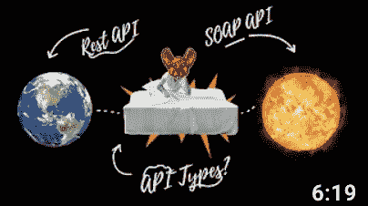

# 黑客 API:类型和架构

> 原文：<https://medium.com/codex/hacking-apis-types-and-architectures-e7f92e48924a?source=collection_archive---------1----------------------->

# 了解 API 及其弱点

https://www.youtube.com/watch?v=eiZ_hW6ERWM&ab _ channel = XSS rat

应用程序编程接口(API)正迅速成为网络安全专业人士关注的焦点。随着组织不断扩大相互间的互操作性和协作性，以及公司转向…