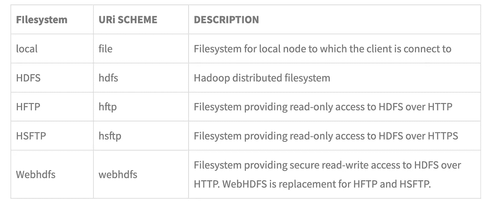

# Hadoop 分布式文件系统(HDFS)

> 原文：<https://medium.com/codex/hadoop-distributed-file-system-hdfs-4dec988b335c?source=collection_archive---------10----------------------->

当您的数据超出单台机器的容量时，就有必要将您的数据分割到不同的机器上。这导致了分布式文件系统的出现，并且由于这些都是基于网络的，网络编程的所有复杂性也随之而来，例如文件系统容忍节点故障(当支持分布式文件系统的系统之一变得无响应时)

Hadoop 包含一个分布式文件系统，叫做 HDFS，Hadoop 分布式文件系统；设计用于存储大型文件，在商用硬件(常见硬件)上进行流数据访问(一次写入，多次读取)。在处理 HDFS 时，必须熟悉一些基本概念

**块**

文件系统可以读写的最小数据量称为“块”。正常的文件系统通常是几千字节，但在 HDFS 是 128MB。文件被分解成这样的 64MB 块，然后存储起来。为什么要用这么大的尺寸？HDFS 是分布式文件系统，所以要获得每个数据块，需要一个持久的 TCP 连接。由于块大小较大(128MB)，网络流量显著减少。另一个原因是块大小较大，意味着文件的元数据较少。这允许将元数据保存在内存中，从而加速其他进程。(更多详情[此处](https://stackoverflow.com/questions/19473772/data-block-size-in-hdfs-why-64mb))

“块”抽象有几个优点。

1.  文件可以大于网络中的任何单个磁盘，因为它可以作为块存储在网络中任何节点的任何磁盘上
2.  它简化了存储子系统并消除了元数据问题，因为文件元数据(如权限)不需要与块一起存储。另一个系统可以单独处理元数据。
3.  数据块非常适合复制，即拥有相同数据的多个拷贝。这进一步实现了容错和高可用性(因为有多个数据副本，所以更容易读取它们)

**Namenode 和 Datanode**

HDFS 集群有两种类型的节点以主-工作模式工作，即 Namenode(主)和 Datanode(工作)。Namenode 管理文件系统命名空间，即文件系统树、所有文件的元数据以及哪个 Datanode 拥有文件的哪些数据块。Datanode 包含实际数据，它们在 Namenode 请求时存储和检索数据块，并向 Namenode 报告它们存储的数据块列表。

如果没有 Namenode，文件系统就无法使用，因为我们无法知道文件的数据块分布在数据节点的哪个位置。为了防止出现 Namenode 被删除、数据丢失的情况，我们有两种选择。要么将文件系统元数据备份到另一个位置，要么让一个*辅助命名节点*定期与主命名节点同步，以获取文件系统的当前状态。

**HDFS 联合会**

HDFS 联盟允许集群通过添加 Namenodes 进行扩展。每个 Namenode 管理一个**命名空间卷**，由命名空间的元数据和包含命名空间中文件块的块池组成。命名空间卷相互独立，也就是说，它们不会相互通信，并且一个卷出现故障不会影响另一个卷。

然而，需要注意的是，HDFS 只是 Hadoop 使用的文件系统的一种实现。还有其他实现，例如允许它以不同的方式访问数据

**Hadoop 档案**

HDFS 存储小文件的效率很低，因为每个文件都存储在一个块中。块元数据由 Namenode 存储在内存中，因此许多小文件会占用 Namenode 的大量内存。Hadoop 归档，HAR 文件，更有效地打包文件，减少 Namenode 的使用。然而，它有一些限制，一个主要的是档案是不可变的，如果有变化，你需要重新创建档案。

然而，HDFS 并不是万能的。有些情况下它无法使用。有些是

*   **低延迟数据访问**:要求延迟在几十毫秒范围内的应用程序将无法很好地与 HDFS 一起工作，因为它针对高吞吐量进行了优化。
*   **大量小文件** : Namenode 保存文件系统元数据，因此文件系统中文件数量的限制由 Namenode 上的内存控制。因此，虽然 HDFS 可以处理数百万范围内的大量文件，但它不是为容纳数十亿范围内的多个小文件而设计的。
*   **多次写入，任意文件修改** : HDFS 由单个写入器写入，写入到文件末尾。不支持在文件中的任意位置对多个编写器进行修改。

演职员表| [Hadoop，汤姆·怀特的权威指南](https://www.amazon.in/Hadoop-Definitive-Guide-Tom-White/dp/1449311520)

如果你想看到更多这样的内容，请留下一些掌声(没有上限😁).

如果你正在寻找免费的一对一指导，请在 Medium 和 [LinkedIn](https://www.linkedin.com/in/karunt/) 上关注我并在 LinkedIn 上留言。