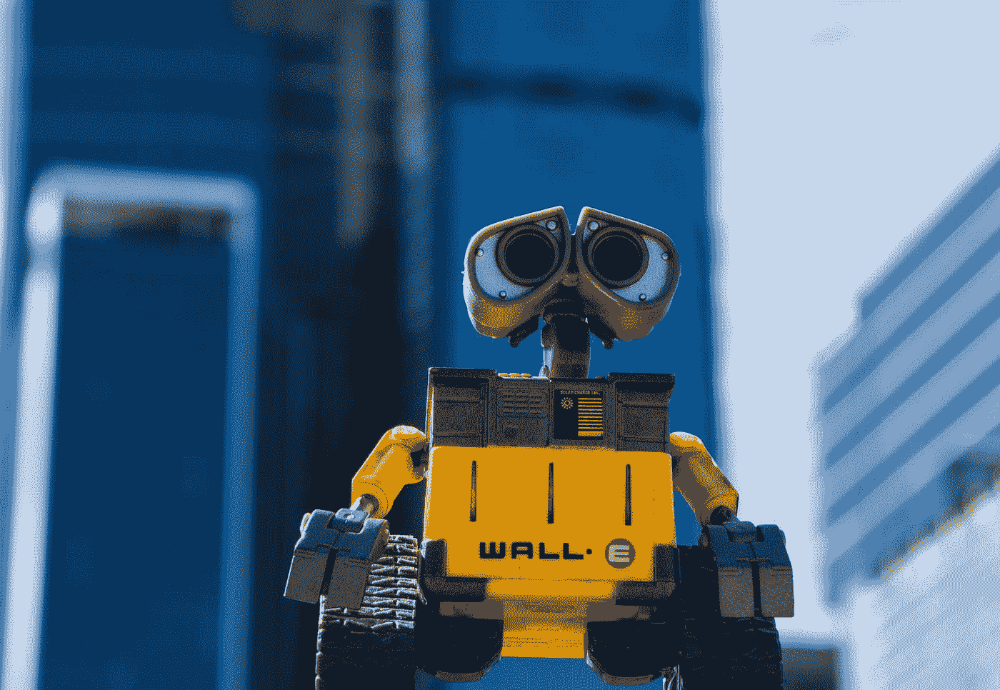

# 有意识的机器人哈尔

> 原文：<https://medium.com/codex/hal-the-conscious-robot-820fe347b607?source=collection_archive---------13----------------------->

## 机器人能拥有意识吗？

迈克尔·马莱在 [Unsplash](https://unsplash.com?utm_source=medium&utm_medium=referral) 上的照片

几十年来，科学家们一直在研究和讨论人工智能。虽然我们已经登上了月球，并取得了许多科学进步，但我们还没有创造出一个像我们一样思考的有意识的机器人。

即使我们设法做到了，我们怎么知道它是真正有意识的呢？

哲学家和科学家讨论这个话题之所以如此有趣，是因为意识本身很难定义和定位。

许多人相信有一种笛卡儿剧院，大脑中的一个特定位置是有意识体验的必要和充分条件。

但是，这种想法现在大多被否决了。在韦氏词典，意识被定义为“意识到的品质或状态，尤其是意识到自己内心的某种东西”。

人类不是唯一有意识的生物，其他动物如哺乳动物和鸟类也有意识。因此，为什么一个设计良好的机器人不可能表现出这种有意识的思维呢？

我将用一个名为 Hal 的机器人的例子来说明我的观点，这个机器人的电路在功能上相当于人脑。

人类和机器人的最大区别之一是，我们人类可以根据自己的愿望和需求采取行动，而机器人会做它们被编程要做的事情。

威廉·利坎预见到了这种反对，并断言“哈利的行为与我们的行为具有相同的意义”。哈利是莱肯描述的一个精密的机器人，类似于哈尔。

我们不知道哈尔是否进化到了有自己的信仰、欲望和意图的地步。然而，如果他确实有这些东西，那么我们可以肯定地说，他的行为是他自己的心理过程的结果，而不是程序指令。

当被问及哈尔是否有和我们人类一样的意识状态时，他解释说，和人类一样，我们无法确定，因为这不是我们可以测量或看到的，但是我们为什么要怀疑呢？我们不会质疑我们最好的朋友或姐妹是否有意识。(大部分时候。)

此外，人类有各种各样的信仰，其中许多都是世代相传的。年幼的孩子没有能力完全评估他们被告知的事情，他们也不能真正区分真理和谬误。

当孩子长到 12 岁时，他们开始抽象思维，并能想象假设的情景和世界，这一发展阶段被瑞士心理学家让·皮亚杰称为“正式操作阶段”。从这个阶段开始，我们通过经验改变我们的信念，通过理性化，我们可以接受或改变这些信念。

起初，我们的机器人哈尔几乎不会走路，也不会用完整的句子说话。听起来很像人类蹒跚学步的孩子。现在，他在游戏中比他的设计师更聪明，动作自信，说话流利。

如果你要与哈尔进行更深入的对话，询问他的信仰和目标，以及他是如何获得这些的，如果他能够证明他的信仰来自他自己的思想和逻辑(而不仅仅是他被编程去思考的东西，或者是通过模仿他从与他的设计师和其他人的互动中所看到的东西)，那么就可以安全地假设哈尔确实拥有意识。正如 Lycan 指出的，复杂的机器人有能力以不可预测的方式做出反应——就像我们一样。

约翰·塞尔向我们展示了一个名为“中国房间”的思维实验，以表明无论人工智能变得多么强大，它仍然只是一系列的输入和输出，只是一台对自己在做什么没有实际理解的计算机。

通过展示这个实验，塞尔很难想象一台计算机如何能像我们一样思考。然而，如果我们遵循丹尼尔·丹尼特的建议，将大脑视为“某种计算机”，那么就很容易想象，随着时间的推移，一些软件是如何让哈尔真正理解的。

二十年前，智能手机、脸书和谷歌甚至还不存在。目前，研究显示，美国 68%的成年人拥有智能手机，高于四年前的 35%。谷歌、脸书和苹果正在向人工智能公司投资数十亿美元，这些公司已经通过社交媒体地图工具和定向广告充分利用这种智能。

当我打开我的 Instagram 或 tiktok 应用程序时，看到我最近谈论或查看的东西出现在我的 feed 上，我不禁不寒而栗。仅仅通过使用我们的智能手机和社交媒体账户，我们就在帮助人工智能一天天变得越来越聪明。

虽然我们还没有达到人工智能的全部潜力，像哈尔这样有意识的机器人仍然是一个想法，但它在我们的未来是很好的。

哈尔的故事没有给出足够的细节来具体说明他是如何被建造的，但我相信他是有可能的，用威廉·利坎、约翰·塞尔和丹尼尔·丹尼特的论点来支持这个论点。

许多电视节目和电影，如《Ex 玛奇纳》和《黑镜》,都在玩有感知能力的机器的想法，几乎所有的节目都揭示了当机器人掌握这种程度的智能和意识时可能会发生的黑暗面。这些应该被视为一个警告，我们必须谨慎对待这些机器人的制造方式。

正如斯蒂芬·霍金(Stephen Hawking)所指出的，“全人工智能的发展可能意味着人类的终结”。尽管如此，我们不应该生活在恐惧中，在机器人达到这一点之前，科学家和哲学家只能继续实验和推测可能会发生什么。

**作品引用:**

丹尼尔·丹尼特(1991 年)。意识解释。106, 424.doi:10.2307/2185913

韦氏词典词典。(2004).马萨诸塞州斯普林菲尔德:韦氏词典。

狼人，威廉。(2015).理性与责任波士顿，马萨诸塞州:森盖奇学习

约翰·塞尔。(2015).理性与责任波士顿，马萨诸塞州:森盖奇学习丹尼特，丹尼尔。(1991)《意识的解释》，波士顿，麻省:小布朗公司

n . mediati(2015 年 11 月 1 日)。皮尤调查显示，68%的美国成年人现在拥有智能手机。检索于 2017 年 2 月 3 日，来自[http://www . PC world . com/article/2999631/phones/pew-survey-shows-68%的美国人现在拥有智能手机](http://www.pcworld.com/article/2999631/phones/pew-survey-shows-68-percent-of-americans-now-own-a-smartphone.html)

马文，R. (2016 年 06 月 07 日)。人工智能脑图:比你想象的更接近现实。检索于 2017 年 2 月 3 日，来自[http://www . pcmag . com/news/345049/ai-brain-mapping-closer-to-reality than-youd-think](http://www.pcmag.com/news/345049/ai-brain-mapping-closer-to-reality-than-youd-think)