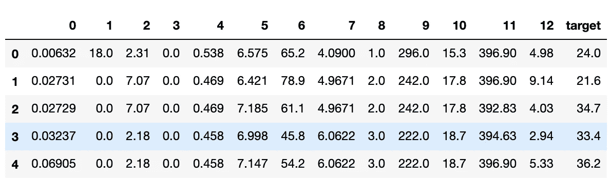
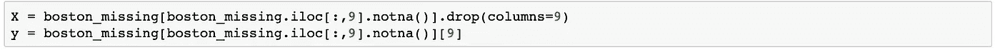
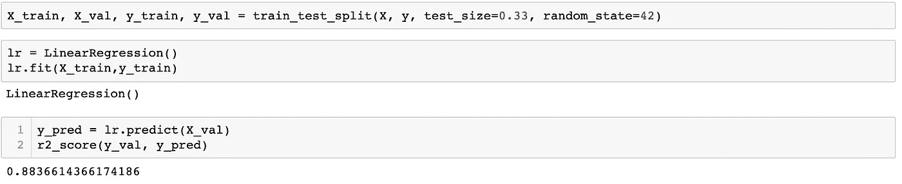
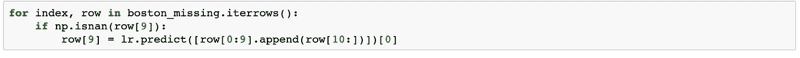
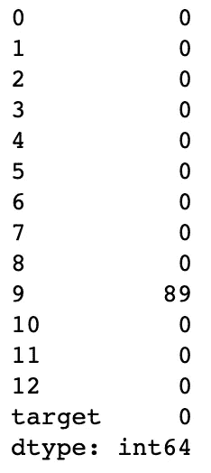
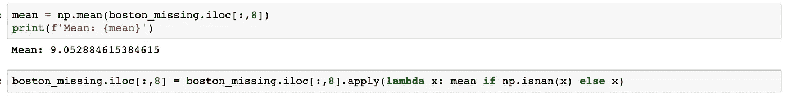
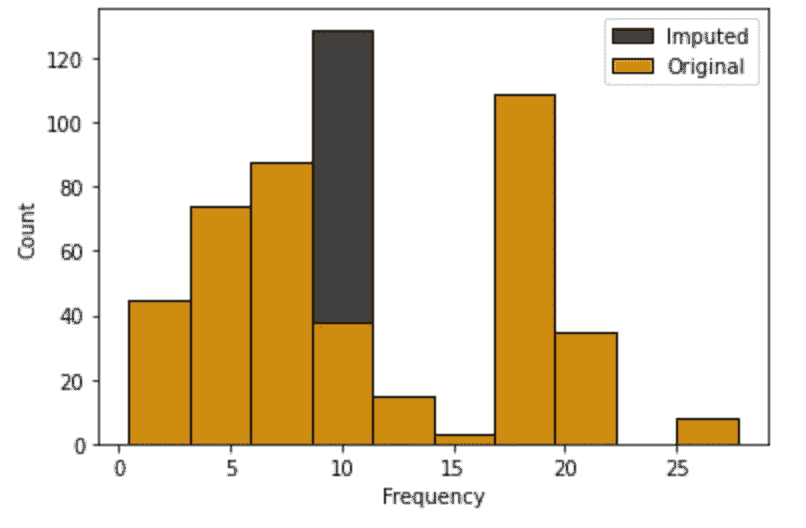

# 如何处理机器学习项目中的缺失数据

> 原文：<https://medium.com/codex/handle-missing-data-in-machine-learning-projects-8fcbe00d6b40?source=collection_archive---------5----------------------->

米利安·耶西耶在 [Unsplash](https://unsplash.com?utm_source=medium&utm_medium=referral) 上拍摄的照片

您收到了一个包含大量缺失数据的数据集，现在该怎么办呢？这正是我今天要帮你做的。在本文中，我将与您分享一些处理缺失功能的流行方法。

注意:这些方法侧重于数字数据，请继续关注处理分类数据。

# 删除缺少值的记录

处理缺失数据时要考虑的第一种方法是简单地从数据集中删除这些记录。但是，当您有一个较大的数据集时，通常应该采用这种方法。

假设您正在处理一个包含 1000 行的数据集，其中 300 行缺少一个值。删除这些记录可能会导致您丢失有价值的信息，并可能会损害您的模型。但是，假设您有一个包含 100 万条记录的数据集，其中 100 条记录包含一个缺失值，删除这些行不会造成这样的阻碍，因为您的模型仍然有大量信息要处理。

总的来说，这种方法非常简单，但应该在数据集较大时使用。最后，如果你使用这种方法，评估你是否能承受失去这些信息的代价是值得考虑的事情。

# 预测缺失值

处理缺失数据时要考虑的第二种方法是预测那些缺失值。我们将使用来自 sklearn 的波士顿数据集来说明这种方法。

如您所见，第 9 列有 40 个缺失值。我们可以使用的一种方法是使用机器学习用它们的预测值来填充这些缺失值。

首先，我们将在不丢失值的情况下隔离记录，这些值将用作模型的数据集。这个模型的特征将是所有的原始特征，不包括我们预测的特征列，在这个例子中是列#9。请注意，我们还在特性集中包含了我们的原始目标列。至于我们的目标列，我们将使用第 9 列，因为这是我们试图预测的。

接下来，我们将把数据集分成训练集和验证集。这将使我们对模型的准确性有所了解。然后，我们将使我们的训练集符合线性回归模型，并在我们的验证集上测试它。

如您所见，我们模型的 R2 分数很高，接近满分 1。

最后一步是在我们的实际数据集上使用这个模型，并填充缺失的值。我们可以通过遍历数据集，传入缺少值的记录，并使用预测来代替它。

现在，你们都完成了！当数据集较小时，这种方法非常有用。但是，当数据集很大时，它会变得复杂。

例如，假设您有一个包含 5 亿条记录的数据集，现在您必须为填充缺失值和原始问题创建一个模型。

此外，在很多情况下，您会遇到包含多个缺失值列的数据集。现在，您必须为每个缺失的特性列创建一个模型。

如果您还不知道，这种方法不是最有效的，因为似乎需要多个模型，但是，如果您有足够的时间和计算能力，这可能是适合您的方法。

# 统计插补

最后，也是最流行的方法是统计插补。这里的想法是用该特定特征的平均值、中值或众数来填充缺失值。

我们将使用不同版本的波士顿数据集作为示例。这里我们可以看到第 9 列有 89 个缺失值。在本例中，我们将使用平均值进行估算。

必要的步骤是计算列的平均值，然后用这个平均值估算缺失值。

现在，如果有必要，您可以对其他列重复此操作。

如下所述，这种方法也可以通过输入中值或众数来使用。模式不是一个非常常见的用例，但中位数是。当您处理有许多异常值的数据集时，平均值可能不总是列的准确反映。相反，中位数可以更好地反映数据。在考虑这种方法时，一定要充分利用您的数据。

在本例中，输入平均值大大增加了值在 11 范围内的频率计数。这是任何一种估算的问题，因为它可能会导致偏向某一特定值。如果您的模型严重依赖于该特性，这种偏差可能会损害它的准确性。

这种方法还有其他问题，我鼓励你去研究它们。首先，请查看:

 [## 为什么对缺失数据使用平均值是个坏主意。替代插补算法。

### 当我们想要用于机器学习的数据集包含缺失数据时，我们都知道这种痛苦。快速简单的…

towardsdatascience.com](https://towardsdatascience.com/why-using-a-mean-for-missing-data-is-a-bad-idea-alternative-imputation-algorithms-837c731c1008) 

总的来说，在处理缺失数据时，采取任何方法都要谨慎，每种方法都有自己的注意事项。在决定一种方法之前，一定要充分理解你的数据。

这就是处理缺失数字数据的方法。如果您有任何问题或批评，请随时评论。感谢您的阅读，敬请期待更多内容！