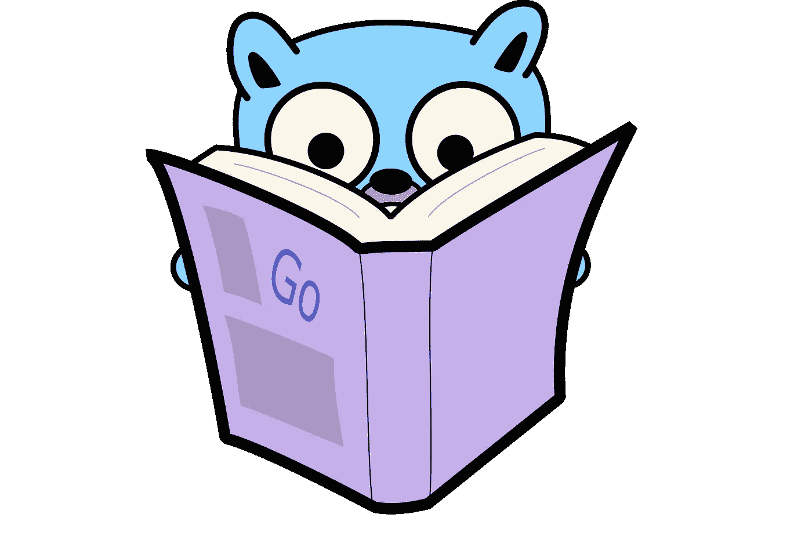

# Golang 中的处理程序和中间件设计模式

> 原文：<https://medium.com/codex/handler-and-middleware-design-pattern-in-golang-de23ec452fce?source=collection_archive---------1----------------------->

[https://github.com/egonelbre/gophers](https://github.com/egonelbre/gophers)

我最近开始使用 *Golang* 开发我自己的 SlackBot 项目。和你们中的任何人一样，我继续寻找一个能够简化我的生活并让我利用其他社区成员解决类似问题的库。

偶然发现了维护良好的 [slack-go](https://github.com/slack-go/slack) 图书馆；我开始使用提供的例子编写我的机器人。一切都很好…