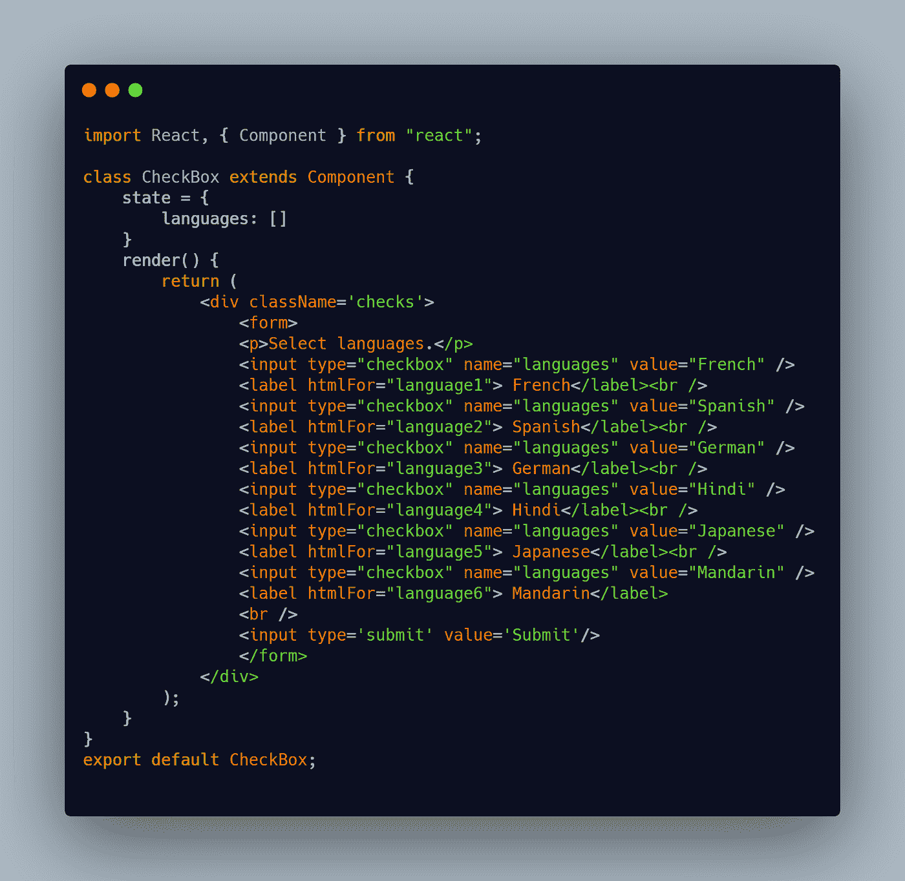
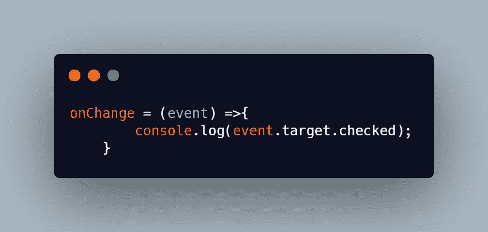
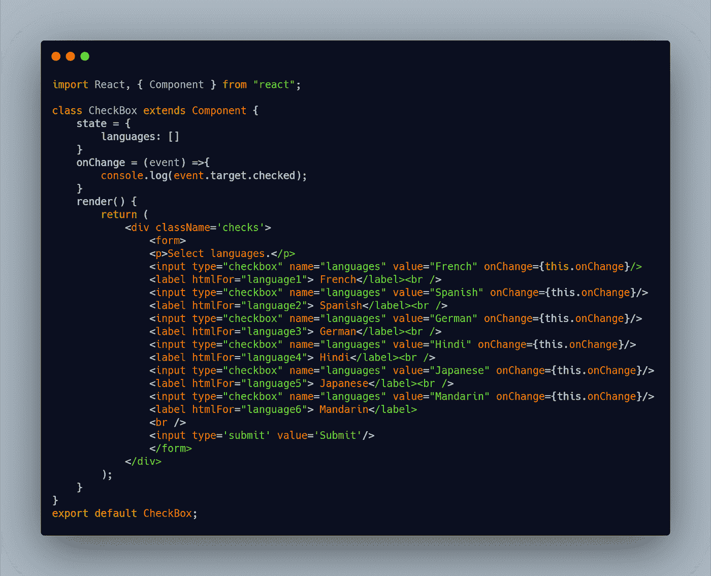
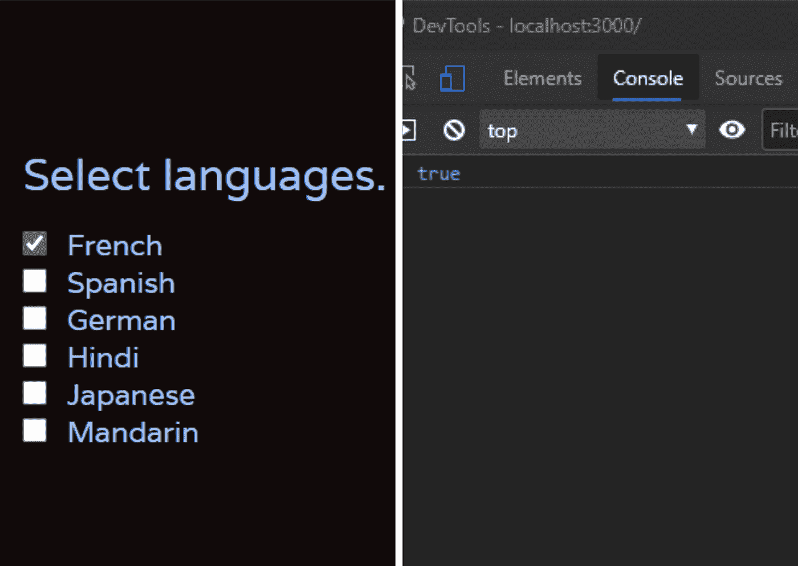
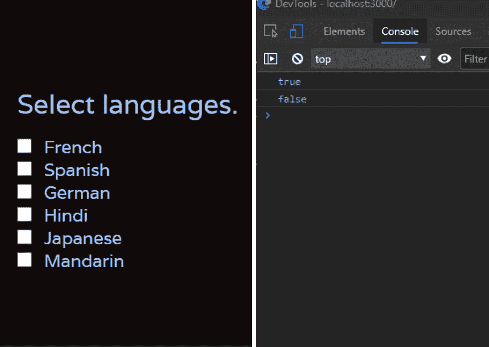
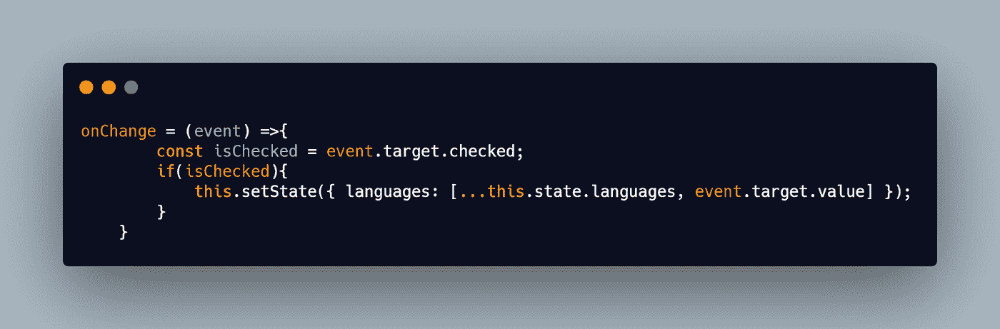
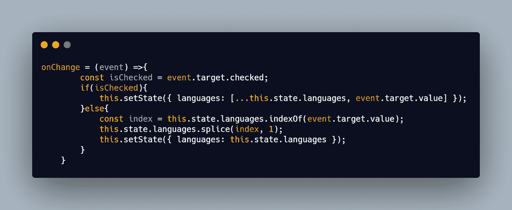
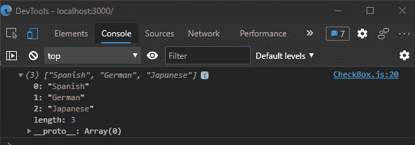

# 在 React 中处理多个复选框

> 原文：<https://medium.com/codex/handling-checkboxes-in-react-3a2514b140d2?source=collection_archive---------3----------------------->

在 React 中，当创建不同的表单时，开发人员经常需要处理多个复选框。在这样做的时候，他们可能需要动态地从状态中添加和删除数据。这可以通过多种方式实现。在这篇文章中，我将展示一种解决这个问题的简单方法。

我创建了一个简单的表单，有一些复选框用于演示。该表单包含几种语言，用户可以选择任何给定的语言。


React 中的复选框

有 6 个 checkbox 类型的输入标签，每个复选框都有一个与之关联的标签。

为了存储来自复选框的数据，我们需要一个状态变量。这里我使用了一个名为 languages 的数组来存储复选框数据。



选中任何复选框后，我们需要将相应框的值添加到数组中。

我们如何跟踪哪些框被选中或未被选中？

我们可以使用 onChange 方法做到这一点。onChange 方法将接受一个事件并使用“event.target.checked”。它将返回一个布尔值，这将有助于我们添加或删除数组状态中的元素。这样我们就可以知道复选框是选中的还是未选中的。



复选框的 onChange 方法

在图像中，我记录了“event.target.checked”。这个 onChange 方法将在每个输入标签上调用，如下所示。

```
onChange = {this.onChange}
```



选中其中一个复选框后，我们可以在控制台中看到它返回 true。



取消选中同一个框后，它返回 false。我们将利用这一点来推动我们的状态数组的值。



正如您在下面的代码片段中看到的，如果使用 isChecked 检查了语言数组中的值，我会添加这些值。这里，spread 运算符用于将值插入数组。最初，languages 数组是空的，当我们选中复选框时，值被添加到数组中。



***但是如何从数组中移除物品呢？***

当 isChecked 为 false 时，即在 else 块中，可以移除数组项。



要从数组中删除一个未选中的项，我们需要找到该项的索引。使用 indexOf 方法，我们可以找出未检查项目的索引。在下一行中，我使用了 splice 方法来删除未选中的元素。在第三行，我用数组更新状态。


最后，在提交时，我已经从浏览器控制台的状态中记录了数组。



你可以在这里找到 GitHub*上 [***处理复选框的源代码。***](https://github.com/AnaghaMK9/Handling-CheckBoxes-React)*