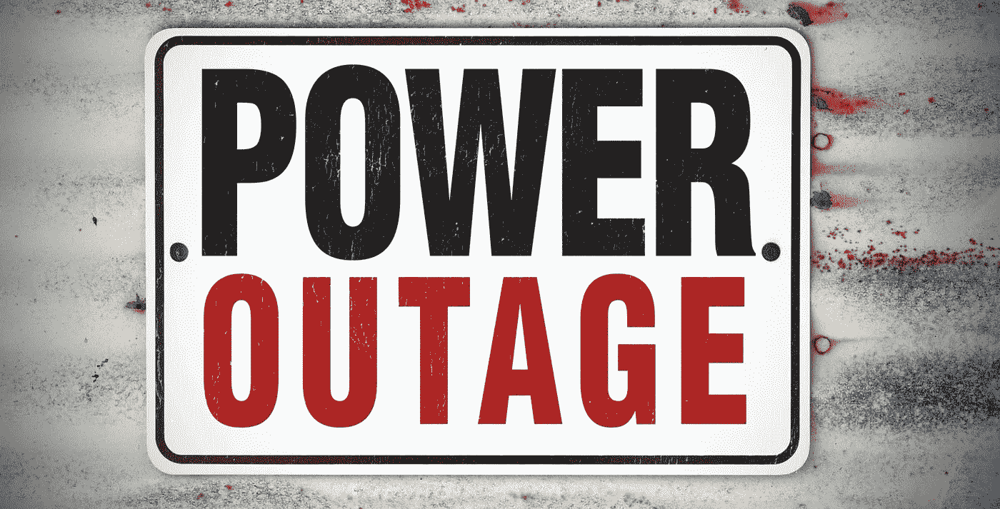
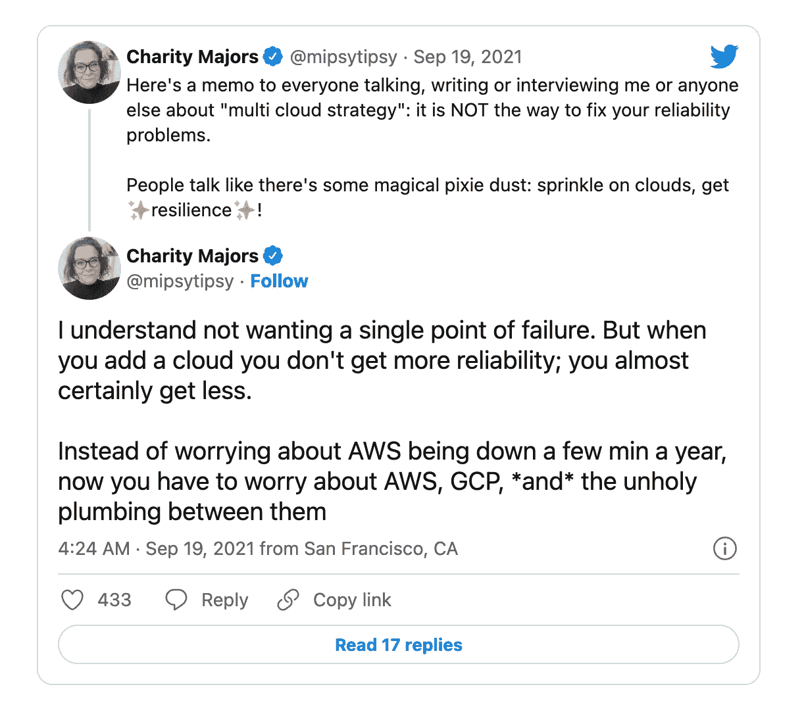

# 处理第三方提供商停机

> 原文：<https://medium.com/codex/handling-third-party-provider-outages-6ca0b61d2539?source=collection_archive---------18----------------------->

互联网的大部分依赖于少数几个提供商:谷歌、AWS、Fastly、Cloudflare。虽然这些提供商可以吹嘘他们的可用性达到 5 个 9 甚至 6 个 9，但他们并不完美，而且像所有人一样，他们偶尔会宕机。

# 思考可用性

为了让客户从你的产品或服务中获得价值，它必须*可用*。这意味着交付服务所需的所有系统都在工作，包括:

*   您的代码或您控制或运行的任何系统
*   您的系统所依赖的任何东西(即第三方提供商)
*   无论您的客户需要什么来访问您的服务(例如互联网连接或手机)

有一篇很棒的论文[服务可用性的计算](https://queue.acm.org/detail.cfm?id=3096459)试图将数学应用于人们如何解释可用性。它指出，为了让一个系统提供一定的可用性，为了让一个系统提供一定的可用性，它所依赖的任何第三方都需要有一个数量级更高的可用性(例如，为了让一个系统提供 99.99%，它的依赖关系需要有~99.999%)。

实际上，这意味着有些服务比其他服务需要更高的可用性。

作为消费级服务提供商(如电子商务网站)，99.99%的可用性可能就足够了。除此之外，消费者的依赖性(您无法控制)如他们的互联网连接或设备总体上不太可靠。这意味着在这一点上投资来显著提高可用性并不是特别有价值。

相比之下，如果你是一个云提供商，你的客户依赖于你有一个显著更高的可用性保证，以便他们可以在你的平台之上构建的同时服务于他们的客户。

# 可用性对你来说值多少钱？

一般来说，大多数用户系统可以承受少量的意外停机，而不会造成世界末日的后果:事实上，大多数客户不会注意到这一点，因为他们的连接和设备可能不太可靠。鉴于实现更高的可靠性极其昂贵，知道何时停止非常重要，因为您节省的时间可以投资于提供客户真正重视的产品功能。

多重云就是一个很好的例子。多重云是构建一个运行在多个云提供商(如 AWS、GCP、Azure 等)上的平台的简称。).这是应对云提供商全面宕机的唯一方法，您需要一个完整的第二个云提供商来替代。

这是一件非常昂贵的事情。这增加了系统的复杂性，意味着工程师在考虑基础设施时必须了解多个平台。您只能使用两家云提供商共享的特性集，这意味着您最终会错过任何一家的全部优势。

您还引入了一个新组件——在两个云提供商之间进行路由/负载平衡的组件。为了提高使用多云的可用性，这个新组件必须具有比底层云提供商高得多的可用性:否则，你只是用一个问题代替了另一个问题。

除非您有非常特殊的需求，否则您最好从一流的提供商那里购买高可用性产品，而不是自己构建。

[点击此处查看推文原文。](https://twitter.com/mipsytipsy/status/1439430232927182848?ref_src=twsrc%5Etfw%7Ctwcamp%5Etweetembed%7Ctwterm%5E1439430232927182848%7Ctwgr%5E%7Ctwcon%5Es1_c10&ref_url=https%3A%2F%2Fincident.io%2Fblog%2Fthird-party-outages)

如果你有兴趣阅读更多内容，Corey Quinn 的[专栏](https://www.lastweekinaws.com/blog/multi-cloud-is-the-worst-practice/)有一篇关于多重云利弊的精彩文章。

# 大型提供商停机压力很大

作为一个大的提供商中断的接收端是有压力的:除了“等到提供商修复它”之外，你可以完全停止使用非常有限的恢复选项。

此外，很可能您的一些工具也停机了，因为它们共享对第三方的依赖。当 Cloudflare 宕机时，它会占用很大一部分互联网。AWS 也一样。这会增加恐慌，使你的反应更加复杂。

那么，我们应该如何看待这类事件，以及如何管理好它们呢？

## 优先考虑你能控制的事情

你的网站关闭了。你不是绝望地试图修复东西来恢复你的网站，而是…在等待。你应该做什么？

## 选择高可用性产品

正如我们上面讨论的，可用性是云提供商非常擅长的事情。提高可用性最简单的方法就是使用云提供商为此开发的产品。

大多数云提供商都提供多区域或多地区功能，您可以选择加入(付费)，并极大地降低这些中断的可能性。

## 了解影响

与所有事件一样，了解停机对客户的影响非常重要。花点时间搞清楚什么是有效的，什么是无效的——也许这不是一次全面的停机，而是一次服务降级。或者你产品的某些部分没有受到影响。

## 与您的客户交谈

如果可以，想办法告诉你的客户发生了什么。理想的情况是通过你通常的渠道，但如果这些都不行，那就另寻他法:社交媒体，甚至老式的电子邮件。

将影响转化为客户容易理解的内容。他们能做什么，不能做什么。他们可以在哪里(也许是第三方的状态页面)找到更多信息。

# 你能减轻影响吗？

你能改变你的基础设施来绕过损坏的组件吗？为某人访问特定的关键服务提供临时网关？请人给你发一个可以手动处理的 CSV 文件？

这是你跳出框框思考的机会:这可能是一段很短的时间，所以你可以做一些无法扩展的事情。

# 接下来会发生什么？

第三方宕机结束后会发生什么:一切照常吗？您是否有大量需要完成的异步工作，这些工作可能需要进行速率限制？您是否会遇到需要协调的数据不一致？

理想情况下，您应该有一些团队已经熟悉并经常演练的经过试验和测试的灾难恢复方法(更多详细信息，请参见[练习或不算](https://incident.io/guide/learn-and-improve/practice-or-it-doesnt-count/))。

如果没有的话，试着尽可能多地预测，并采取措施减轻这些影响。也许扩大队列，为浩浩荡荡的人群做好准备，或者应用一些更激进的速率限制。保持沟通，为您的客户提供做出正确决策所需的所有信息。

事件结束后，我们能学到什么？

## 控制的谬误

在第三方中断后编写总结文档感觉并不好:

> **发生了什么？** Cloudflare 坠落
> T5【影响如何？没有人能访问我们的网站
> **我们学到了什么？当云闪消失时，情况很糟糕🤷‍♀️**

你能控制的事件通常比你不能控制结果的第三方事件感觉更好。事件发生后，你可以写一份事后总结，从中吸取教训，并获得一种温暖的模糊感觉，即你已经改进了你的产品。

然而，事实上，这些数字不太可能支持这一理论。除非你有世界上最好的 SRE 团队，否则你不会提供比云提供商更高可用性的基础设施产品。

相反，我们应该再次关注那些在我们控制范围内的事情。

> 在我们的[事故管理指南](https://incident.io/guide/learn-and-improve/post-mortems-and-debriefs)中了解更多有关事后鉴定和事故报告的信息。

# 我们如何最好地为这种停机做准备？

## 了解你的依赖

在事故发生过程中，试图找出第三方中断会造成什么影响是一件非常有压力的事情。为了避免这种情况，您需要提前理解各种依赖链。

这是一个棘手的纸笔练习:通常最可靠的方法是启动第二个环境(客户没有使用)，并开始关闭系统的一些部分。

一旦您理解了依赖关系，当事件发生时，您就能够将注意力集中在系统的相关部分。

作为其中的一部分，你也可以举办[比赛日](https://incident.io/guide/learn-and-improve/practice-or-it-doesnt-count/#game-day-(1-4pm))来帮助训练灾难恢复中的响应者。这些练习可以产生灾难恢复计划(和熟悉程度),当您的系统重新上线时，这些计划非常有价值。

## 避免不必要的组件

有时，通常由于历史原因，你会最终依赖多个第三方，而实际上，一个第三方就可以完成工作。每当您添加一个依赖项时，就会大大降低您的可用性。如果您能够整合更少的适当可靠的依赖项，将会显著提高您的总体可用性。

我们还可以在这里考虑爆炸半径:当某个提供商宕机时，有没有办法让你的一些产品正常工作。这并不意味着必须使用另一个提供者，但是即使服务[y]不可用，您也可以启动服务[x]。

减少组件的数量可能会减少这类停机的风险。

## 对可用性要诚实

您的可用性最多是所有关键提供商的可用性总和。对你自己和你的客户诚实，在这些限制下什么是现实的可用性目标，并确保你的合同反映了这一点。