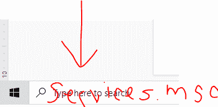
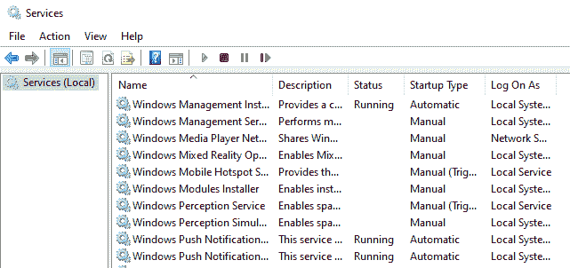
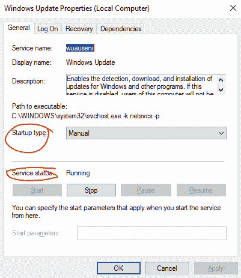

# 锻炼

> 原文：<https://medium.com/codex/hardening-6266cc223c7e?source=collection_archive---------26----------------------->

## 是的，我同意。这个术语听起来很有趣，但是不要再想歪了。这实际上与提高网络安全有关。

阿拉娜·哈里斯的照片

根据 CompTIA 的说法，更正式的定义是:

> 通过更新操作系统、创建管理操作系统的规则和策略以及删除不必要的应用程序和服务来安全配置操作系统的行为。

然而，重要的是要认识到这不是一蹴而就的过程。这是一个持续的过程，因为强化背后的一个基本理解是风险永远无法消除！我们永远不能保证安全，但我们可以把风险降到最低！…通过最大限度地减少漏洞来降低威胁，从而降低风险。

所以请不要走开，因为下面的段落将会详细介绍降低网络风险的方法。

# 不必要的应用

这是你问自己，“我有多少应用程序？”

从你的设备中删除你不再使用的应用或程序是一个很好的习惯。原因是那些未使用的应用或程序可能有漏洞，使设备不太安全。在一些公司里，他们实行最少功能的政策。为此，服务器或工作站被配置为仅提供必要的应用程序和服务。要将其扩展到多台机器，请利用安全的基准映像，以这种最少功能的策略添加新机器。微软的系统中心配置管理(SCCM)。

如果不对此进行监控，随着时间的推移，个人计算机通常会积累不必要的程序。对于组织来说，实现这种安全措施有许多解决方案。然而，在个人层面上，更简单的是关注我们设备上的应用程序。

# 限制应用程序

另一种类似于最小功能的方法是应用程序白名单/黑名单。这基本上是办公室里的 IT 人员自问的地方，

"我如何防止会计加里下载未经授权的软件？"

我并不是说 Gary 在做任何恶意的事情，但是 Gary 可能对一些网络威胁视而不见，所以他可能会不经意地点击一些下载了恶意内容的东西。所以白名单和黑名单被创建，所以我们不必担心加里搞砸了！(无意冒犯任何叫加里的人。我在这个例子中随意使用了这个名字。)

应用程序白名单仅允许操作系统运行列表上的应用程序，而所有其他应用程序都被阻止。想象一个俱乐部的保镖拿着一张清单。

应用程序黑名单允许除列表中的应用程序之外的所有应用程序运行。想象一下机场的“禁飞”名单。

这些列表可以使用类似微软的 Active Directory 域控制器的东西来集中管理计算机网络。有了这样的软件，管理员可以集中管理列表，并通过组策略部署它们。

# 不必要的服务

服务是一种在操作系统后台运行并执行各种功能的应用程序，如打印假脱机程序。任何不需要的服务都应该在操作系统中禁用。

这可以在 Mac 和 Windows 上轻松完成。

对于 Windows，请转到屏幕左下角的 Windows 图标旁边的搜索栏。键入“services.msc”并按回车键。

这将打开服务本地连接窗口，如下所示:

此窗口为您提供了 Windows 计算机上所有可用服务的列表。

要启动或停止服务，右键单击服务名称，然后单击“属性”

之后，会弹出另一个窗口，如下所示:

在此窗口，您可以随意启动/停止服务。

了解这一点很有用，因为如果你发现恶意软件已经将自己安装为服务，你可以去*找到它*，*禁用它*并*删除它*。

您还可以在命令提示符下使用以下命令之一停止这些服务

`sc stop NameOfService`

`net stop NameOfService`

对于 Mac 电脑，抱歉我现在没有任何截图可以分享…

但我会尽我所能用我的话来引导你完成这个过程。

好吧，先造个东西杀！—打开一个文本板，键入您想要的任何内容。接下来，打开活动监视器，它在您的应用程序下→然后转到实用程序并找到活动监视器。“活动监视器”窗口将会打开，并显示正在运行的所有服务的列表。

现在在列表中找到文本编辑。双击它。然后会打开另一个窗口，提供服务运行时的所有数据。要停止它，只需点击“退出”按钮。然后会弹出一个窗口，让你确认你的决定，并询问“取消”、“强制退出”或“退出”如果你知道该服务是恶意软件，你会点击“强制退出”，但在这种情况下，你只需点击“退出”

要从命令行做到这一点，实际上对于 Mac 和 Linux 操作系统是一样的，打开一个终端。键入并运行:`top`

该命令将显示当前正在运行的所有进程(服务的另一种说法)。列表中每个进程名称的旁边是一个进程 id，标记为`pid`。要停止该过程，您可以键入

`kill pid xxxx`其中 xxxx 是进程 id 号

# 可信操作系统(TOS)

这基本上是对操作系统的一种分类。这意味着操作系统满足政府规定的要求，并具有多级安全性。为了获得这种分类，软件制造商必须定期为软件提供补丁和更新以维护安全性。

我很确定你可以在 a.gov 网站上找到一个官方列表，但基本上只要你运行的是新版 Windows 或 Mac，你就没问题。其他操作系统包括 FreeBSD(可信 BSD)或 Red Hat Enterprise Server，以及其他一些不太受欢迎的操作系统。

在更新系统之前，最好确定当前版本和内部版本。要在 Windows 中获取该信息，请在命令行或 Windows 搜索栏中键入:

`msinfo32.exe`

# 更新和补丁

补丁是操作系统或应用程序的单个问题修复软件，就像发现并修复 bug 一样。此外，术语“热修复程序”也与修补程序互换使用。

更新可以分为几个不同的类别。这些是:

*   安全更新—针对特定于产品的安全相关漏洞发布的软件代码
*   关键更新—针对特定问题的软件代码，用于解决软件中的关键、非安全性缺陷
*   服务包——一组经过测试的累积修补程序、热修复程序、安全更新、关键更新，可能还有一些功能或设计更改。常见于操作系统更新
*   Windows Update —建议的更新，用于修复一些用户发现的非关键问题，并提供附加功能
*   驱动程序更新—更新设备驱动程序，以修复安全问题或向受支持的硬件添加功能

在 Windows 10 中，使用 Windows Update 程序(`wuapp.exe`)直接从微软管理更新。它也可以配置为自动更新。这是家庭用户可以做的另一件事来增加他们的安全性。

# 补丁管理

这就是软件补丁的*策划*、*测试*、*实施*、*审核*的过程。作为 IT 或网络安全专业人员，工作的一部分是跟踪所有各种更新，并确保它们在您组织的整个环境中正确安装。这包括验证补丁程序与您的系统的兼容性，并计划如何测试和部署它们。对于一个组织来说，在自动部署之前测试一个补丁是非常重要的，因为有时候一个补丁可能会在其他地方产生一个 bug。

测试后，您应该知道该修补程序是否适合部署到网络上的所有客户端，以便实现它。这一阶段可以通过修补程序管理工具进行管理，大型组织将通过更新服务器集中管理更新。为了确保组织内不会发生意外，最好禁用`wuauserv`服务以阻止 Windows Update 自动运行。

实施补丁后，下一个阶段是审计。为此，只需在补丁部署后监控客户端的状态，以确保正确安装。

Linux 和 MacOS 也有内置的补丁管理系统。

# 组策略

这些是一组规则或策略，可以应用于操作系统中的一组用户或计算机帐户。利用这些规则，可以制定用户规范来要求特定级别的密码复杂性、创建锁定策略以及设置软件/应用程序限制。

对于更高级的使用组策略，请使用 Active Directory 域控制器。这是大型组织管理其网络策略的方式。他们将创建一个安全模板，这是一组可以通过一个过程加载的策略，然后在客户机上实现它。

此外，实施这些组策略目标(GPO)有助于强化过程中的基线，因为基线将有助于识别网络上的“正常”活动。当出现偏离标准的情况时，人们可以根据基线轻松地识别出这种情况，并检查恶意活动。

# 文件系统和硬盘

系统的安全级别受其文件系统类型的影响。以下是文件系统类型的列表:

*   Windows NT 文件系统(NT File System)
*   FAT32
*   ext4
*   HFS+
*   APFS

Windows 系统可以使用 NTFS 或 FAT32。然而，NTFS ( **N** ew **T** 技术 **F** 文件 **S** 系统)是 Windows 的默认文件系统格式，并且更安全，因为它支持日志记录、加密、更大的分区大小以及比 FAT32 更大的文件大小。

Linux 系统应该使用 ext4，MacOS 应该使用 APFS。

最后，重要的是要知道所有硬盘最终都会出现故障，因此为此做好准备也很重要。请按照下列步骤操作:

1.使用“光盘清理”删除临时文件

2.定期系统文件检查

*   Windows:运行检查光盘或系统文件检查器
*   MacOS:从光盘实用程序中运行急救
*   Linux:通过在终端中键入`fsck`来检查文件系统

3.整理你的磁盘驱动器

4.备份数据→测试您的备份！

5.使用和练习修复技术

# 零日漏洞

还记得我在开头提到安全是如何无法保证的吗？这是一个重要的原因。这些是那些应该对减轻漏洞感兴趣的人(包括软件供应商)所不知道的或者没有解决的软件漏洞。零日不为任何人所知，直到黑客第一次发现它，并根据他们的个人道德报告或利用它。不过，这种风险是众所周知的，可以通过参与 bug 奖励计划来解决。

强化=通过减少攻击面来保护系统

# 感谢阅读！