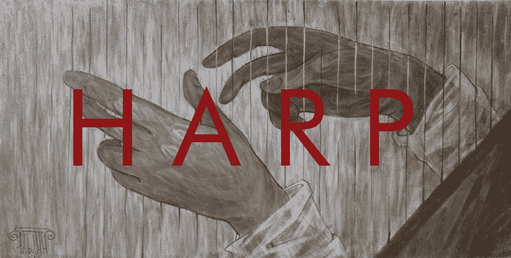

# harp——高度可用的可靠持久文件系统

> 原文：<https://medium.com/codex/harp-the-highly-available-reliable-persistent-file-system-8406b19c1fe3?source=collection_archive---------0----------------------->

## [法典](http://medium.com/codex)

HARP——高度可用的可靠持久文件系统。玛丽亚·埃尔丁的作品

谈到文件系统，本地文件共享协议总是更好。分布式系统中的文件系统怎么样？答案是: **NFS** (网络文件系统)。Windows 本身不支持 NFS。然而，如果您的网络只包含 Linux，那么 NFS 是您的选择。