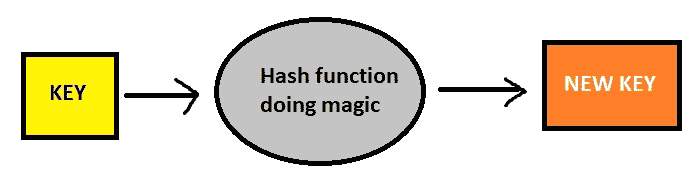

# 哈希表、哈希和冲突处理

> 原文：<https://medium.com/codex/hash-tables-hashing-and-collision-handling-8e4629506572?source=collection_archive---------0----------------------->


标题图片

作为我的数据结构系列的延续，本文将涵盖数据结构中的哈希表、哈希表的**基本操作**、它们的**复杂性**、哈希的**应用**、各种类型的**冲突**以及如何处理它们。您可以阅读本系列的其他主题:

*   [堆栈数据结构](https://tawhidshahrior.medium.com/stack-data-structure-c6427daf39fa)
*   [队列数据结构](https://tawhidshahrior.medium.com/queue-data-structure-42be46a7276b)

在进入哈希表之前，我们需要理解哈希和哈希函数的概念。

## 那么什么是哈希呢？

它是在哈希函数的帮助下，将给定的键转换成另一个值的过程。散列函数只不过是一种数学算法，它帮助为给定的输入生成一个新值。哈希函数的结果称为哈希或哈希值。

让我们快速了解一下一个散列函数应该具有哪些属性，才能被称为一个好的散列函数:

1.  高效可计算
2.  应该统一分发密钥

我们总是可以编写自己的哈希函数，但建议不要这样做，因为已经有非常好的哈希函数了。



可视化散列过程

## 哈希表

> 哈希表是一种实现关联数组抽象数据类型的数据结构，这种结构可以将键映射到值。哈希表使用哈希函数来计算桶或槽数组的索引，也称为哈希代码，从中可以找到所需的值。—维基百科

在哈希表中，每个键都是唯一的。当不需要对数据进行排序和分类时，我们应该使用这种数据结构，因为这里不保留数据的顺序。

哈希表必须支持 3 种基本操作:

1.  **Insert** (key，value) - >向哈希表添加一个条目。
2.  **获取**(键)- >在给定键的帮助下获取数值。
3.  **删除**(键)- >在给定键的帮助下删除一个值。

理想情况下，这些操作应该在 O(1)时间内执行。通过非常快速地计算给定键的索引，平均散列确保了在散列表中从何处插入或删除/提取的恒定时间决定。然而，在最坏的情况下，这些操作可能是 O(n ),但我们将在稍后讨论。

## 哈希是如何帮助实现如此快速的数据存储、删除和搜索的？

哈希表以键值形式存储数据。在插入所提供的关键字的过程中，哈希函数将该关键字转换为哈希表的索引。然后，该值存储在该索引处。哈希函数会产生一个已经在表中使用过的索引，这称为冲突。我们将很快讨论如何处理冲突。正是由于这个散列函数，我们直接计算数据在表中的位置，这确保了该数据结构的快速操作时间。

## 哈希的应用

*   实现哈希表，哈希映射，python 的字典，无序集
*   加密:加密散列函数产生的输出几乎不可能到达输入。哈希函数的这个性质叫做*不可逆性*。加密散列函数的一个例子是流行的 SHA256 算法。
*   密码验证
*   编译器操作
*   模式搜索算法，如 Robin Carp 算法

## 冲突以及如何处理它们

两个或多个键有时会生成相同的哈希值。这叫做碰撞。可以使用各种技术来处理冲突。

**分离链接技术**

其思想是让哈希表的每个单元格指向一个具有相同散列函数值的记录链表。这很简单，但是需要表外的额外内存。在这种技术中，最坏的情况发生在所有的值都在同一个索引或链表中，使得搜索复杂度成线性(n =链表的长度)。*当我们不知道有多少个键或者插入/删除操作发生的频率时，应该使用这种方法。*

为了保持 O(1)的插入时间，我们将新值作为特定索引的链表的头。


处理冲突的独立链接技术

我提供了一个普通哈希表实现的代码，使用了单独的链接技术，使用了一个链表的数组列表。

```
// this is the custom generic node class
public class HashNode<K,V> {

    K key;
    V value;
    HashNode<K,V> next;

    public HashNode(K key,V value){
        this.key = key;
        this.value = value;
    }
}
```

```
public class CustomHashMap<K,V> {
    private ArrayList<HashNode<K,V>> bucketArray;
    private int numBucket; //current capacity of list
    private int size; // current size of list

    public CustomHashMap(){
        bucketArray = new ArrayList<>();
        size = 0;
        numBucket = 10;

        //we create empty chains
        for(int i=0;i<numBucket;i++){
            bucketArray.add(null);
        }
    }

    public int getSize(){
        return size;
    }

    public boolean isEmpty(){
        return size==0; 
    }

    private int getBucketIndex(K key){
        int hashCode = key.hashCode(); //built in java hash func
        int index = hashCode%numBucket;//mod to traverse circularly
        return Math.abs(index); // since the key could be negative 
    }

    public V remove(K key){
        //we find the required index
        int bucketIndex = getBucketIndex(key);
        HashNode<K,V> head = bucketArray.get(bucketIndex);
        HashNode<K,V> prev = null;
        while(head!=null){
            if(head.key.equals(key)){
                break;
            }
            prev = head;
            head = head.next;
        }
        if(head==null){
            return null;
        }
        size--;
        if(prev!=null){
            prev.next = head.next;
        }
//here we are handling if key is first element when prev WILL be null 
        else{
            bucketArray.set(bucketIndex,head.next);
        }
        return head.value;
    }

    public V get(K key){
        int bucketIndex = getBucketIndex(key);
        HashNode<K,V> head = bucketArray.get(bucketIndex);
        while(head!=null){
            if(head.key.equals(key)){
                break;
            }
            head = head.next;
        }
        if(head==null){
            return null;
        }
        return head.value;
    }

    //add key value pair to hash table
    public void add(K key, V value){
        int bucketIndex = getBucketIndex(key);
        HashNode<K,V> head = bucketArray.get(bucketIndex);

        //if key already exists, we update the value
        while(head!=null){
            if(head.key.equals(key)){
                head.value = value;
                return;
            }
            head = head.next;
        }
        //insertion at head for o(1)
        size++;
        HashNode<K,V> newNode = new HashNode<>(key,value);
        head = bucketArray.get(bucketIndex);
        newNode.next = head;
        bucketArray.set(bucketIndex, newNode);

        //now to check for the load factor
        if((1.0*size)/numBucket>=.7){
            size = 0;
            ArrayList<HashNode<K,V>> temp = bucketArray;
            bucketArray = new ArrayList<>();
            numBucket = 2*numBucket;

            //we create the chains again first
            for(int i=0;i<numBucket;i++){
                bucketArray.add(null);
            }

            //finally we copy from old to new
            for(HashNode<K,V> node:temp){
                while(node!=null){
                    //recursively
                    add(node.key,node.value);
                    node = node.next;
                }
            }
        }
    }
}
```

Load Factor = *哈希表* / *槽中的项数*。这是在增加容量之前允许哈希表达到多满的度量。对于哈希表的动态数组实现，我们需要在达到加载因子阈值时调整大小，理想情况下≤0.7。

**开放式寻址技术**

在这种方法中，所有值都存储在哈希表本身中。如果发生冲突，我们会在算法生成的下一个点中寻找可用性。表的大小应该始终大于键的数量。*当有空间限制时使用，如在嵌入式处理器中。*

在删除操作中需要注意的是，被删除的槽需要以某种方式进行标记，以便在搜索过程中，我们不会在空槽处停止探测。

开放式寻址的类型:

1.  线性探测:我们线性探测/寻找下一个时隙。如果槽[hash(x)%size]已满，我们尝试[hash(x)%size+1]。如果也是满的，我们尝试[hash(x)% size+2]…直到找到可用空间。线性探测具有最佳的缓存性能，但缺点包括[主集群和辅助集群](https://stackoverflow.com/questions/27742285/what-is-primary-and-secondary-clustering-in-hash)。
2.  二次探测:我们寻找第 I 次迭代。如果槽[hash(x)%size]已满，我们尝试[(hash(x)+1*1)%size]。如果也是满的，我们尝试[(hash(x)+2 * 2)% size]…直到找到可用空间。这里可能会出现二次聚类，并且在这种方法中不能保证找到一个槽。
3.  双重散列:我们使用第二个散列函数 hash2(x)并寻找 i*hash2(x)槽。如果 slot [hash(x)%size]已满，我们尝试[(hash(x)+1*hash2(x))%size]。如果空间也已满，我们会尝试[(hash(x)+2 * hash 2(x))% size]…直到找到可用空间。没有主要或次要的聚类，但这里有更多的计算。

如果数学符号让你困惑，不要担心。让我们看一个例子。对于大小为 10 的哈希表，假设我们的哈希函数 hash(x)计算索引 3 来存储数据。所以在这里，[hash(x)%10]=3。如果索引 3 已经满了，**线性探测**给出[3%10+1]=4，并且如果还没有被填充，我们在第 4 个索引存储数据。类似地，**二次探测**给我们[(3+1*1)%size]=4。让我们在这里更进一步，假设第 4 个索引现在也被填充。**二次探测**然后将计算[(3+2*2)%10]=用于存储数据的第 7 个索引。试着找出双重散列法会计算出什么指数**。**

我提供了使用线性探测技术的哈希表实现的代码，使用了两个数组。这个实现可以调整为使用二次探测或双重散列，我会留给你的好奇心。

```
public class LinearProbing{
    private String [] keys;
    private String [] values;
    private int size;
    private int capacity;

    public LinearProbing(int capacity){
        keys = new String[capacity];
        values = new String[capacity];
        this.size = 0;
        this.capacity = capacity;
    }

    public void makeEmpty(){
        size = 0;
        keys = new String[capacity];
        values = new String[capacity];
    }

    public int getSize(){
        return size;
    }

    public int getCapacity(){
        return capacity;
    }

    public boolean isFull(){
        return size==capacity;
    }

    public boolean isEmpty(){
        return size==0;
    }

    private int getHash(String key){
        return Math.abs(key.hashCode()%capacity);
    }

    public void insert(String key,String value){
        if(isFull()){
            System.out.println("No room to insert");
            return;
        }
        int temp = getHash(key);
        int i = temp;
        do{
            if(keys[i]==null || keys[i].equals("DELETED")){
                keys[i] = key;
                values[i] = value;
                size++;
                return;
            }
            if(keys[i].equals(key)){
                values[i] = value;
                return;
            }
            i = (i+1)%capacity;
        }while(i!=temp);
    }

    public String get(String key){
        int i = getHash(key);
        while(keys[i]!=null){
            if(keys[i].equals(key)){
                return values[i];
            }
            i = (i+1)%capacity;
        }
        return "not found";
    }

    public boolean contains(String key){
        return get(key)!=null;
    }

    public void remove(String key){
        if(!contains(key)){
            return;
        }
        int i = getHash(key);
        while(!keys[i].equals(key)){
            i = (i+1)%capacity;
        }
        keys[i] = values[i] = "DELETED";
        size--;
    }     
}
```

如果它是一个动态数组实现，我们将不得不在移除或插入的某个点检查加载因子，并采取必要的步骤。然而，为了便于理解，我在这里使用了普通数组。不要担心“已删除”标志，因为如果仔细观察，它们会在插入过程中被覆盖。请注意，还有其他方法可以用线性探测来实现哈希表，请随意探索！这只会加深你的理解。

## 附加哈希知识

**完美散列**:一个散列函数，将每个不同的键映射到一个不同的整数值或表的索引。通常，所有可能的*键都必须事先知道* **。**使用完美哈希的哈希表没有冲突。它也被称为最佳散列法。

**分布式哈希:**用于在多台电脑上存储大数据。一致性哈希用于确定哪些计算机存储哪些数据。点击阅读更多关于一致性哈希[的内容。](https://www.toptal.com/big-data/consistent-hashing)

## 结论

在本文中，我试图让读者了解散列和散列表数据结构的基本方面。就像我在每篇文章中重复的那样，要掌握任何数据结构，我们都需要用它来解决问题。去 LeetCode、HackerRank 和 GeekForGeeks 上找许多关于这个话题的问题，并开始解决它们以获得精通。另外，请注意，上面提供的代码总是可以优化的，并且是基于某些假设编写的。我希望你从这篇文章中学到了一些东西。感谢阅读！