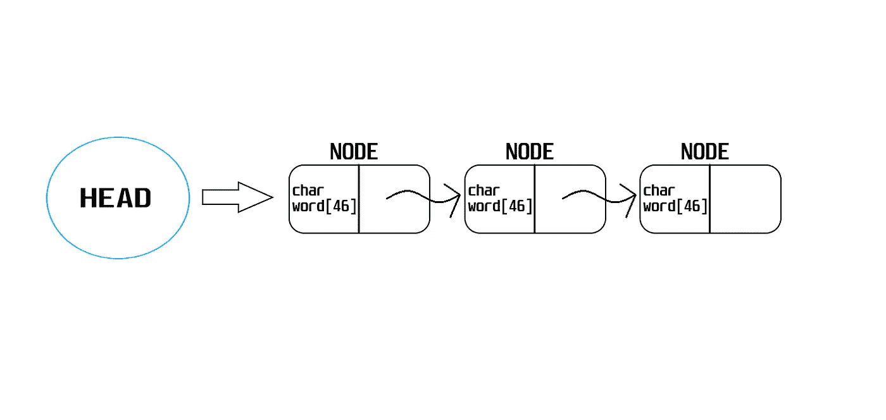
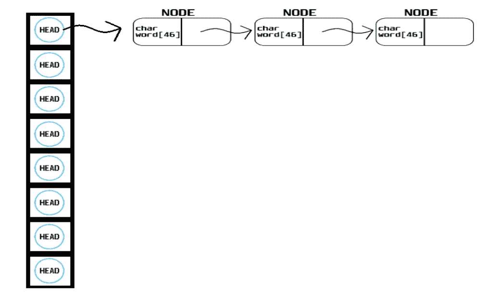

# C 语言中带单链表的哈希表

> 原文：<https://medium.com/codex/hash-tables-with-singly-linked-lists-in-c-efc3c0166065?source=collection_archive---------2----------------------->

哈希表是一种将键映射到值的数据结构。我们来看看 Wiki 是怎么定义的。

> 在计算中，**哈希表** ( **哈希映射**)是一种实现关联数组抽象数据类型的数据结构，这种结构可以将键映射到值。哈希表使用哈希函数将*索引*，也称为*哈希代码*，计算到*桶*或*槽*的数组中，从中可以找到所需的值。在查找过程中，对键进行哈希运算，得到的哈希表示相应值的存储位置。

实际上，哈希表是带有哈希函数的数组，假设我们想在哈希表中存储“foo”。我们将把它传递给哈希函数，它将为我们生成一个数字。我们将使用这个数字作为索引，将“foo”存储在哈希表中。一个好的散列函数每次必须为相同的输入返回相同的数字，否则我们将访问散列表的随机部分。

所以，我们有一个哈希表和一个哈希函数。假设我们想要存储“海格”,我们的哈希函数返回 5，这意味着“海格”将被存储在哈希表的第 5 个索引中。现在，如果我们还想存储“赫敏”，假设我们的哈希函数也为“赫敏”返回 5。
这称为冲突，有几种方法可以防止冲突发生。其中一种叫做线性探测。

如果我们试图在哈希表中插入一个项目，并且我们得到一个已经有内容的索引，我们简单地移动到下一个槽，直到有一个空的索引，这种方法被称为线性探测。但是如果没有空的索引呢？好吧，你可以分配一个更大的数组，然后把元素移动到那里，或者你可以完全避免这种情况，不需要从一开始就处理它:使用一个带有单链表的散列表。我们使用单链表的原因是因为我们可以按照自己的意愿来收缩和扩展一个链表，而不是数组，在数组中，即使调整大小也会很麻烦。

由于编程的本质，使用单链表会消耗你的内存，同时让你不用担心冲突。如果你想要某样东西，你必须牺牲其他东西。当然，使用单链表理论上意味着 O(n)的查找时间。在我们声明了一个单链表并在我们的哈希表中使用它之后，我们将会看到在现实世界中我们如何比 O(n)有更好的查找时间。

让我们来看看什么是单链表，它是如何工作的。单链表也是数据结构，你可以这样声明:

```
// A singly linked list node with a word and a pointer of type node
typedef struct node
{
    char word[46];
    struct node *next;
}
node;
```

因此，我们声明了一个数据结构，并将其命名为 node。请注意，我们使用了 node 两次，通常您不必使用第一个，但是因为我们的数据结构有一个指向自身的指针，所以我们也必须使用第一个，您可以将它视为一个函数声明，我们事先让编译器知道我们将像这样使用它。现在，我们的数据结构中有两个元素，一个是长度为 46 的字符，恰好比英语中最长的单词多一个，另一个是指向一个节点的指针。最后一句真的很重要，因为我真的很难理解一个数据结构如何有一个指向自己的元素。让我们用一个例子来理解它。



单向链表

如你所见，我们有 3 个节点，其中 2 个有一个指向下一个节点本身的指针，即*struct node * next；*我们代码的一部分。我们还有一个头部指针，稍后会讲到。最后一个节点没有指向任何东西，和说它指向 NULL 是一回事。现在，我们已经看到了单链表是如何声明的。让我们看看我们将如何在散列表中使用单链表，这也将清除什么是*头*。



哈希表

正如你所看到的，这是一种想象我们的哈希表的方式，它实际上是一个节点类型指针(head)的数组，如果我们的哈希函数哈希一个单词并返回一个索引，它就指向某个节点。在上面的图像中，我们的哈希函数哈希了 3 个单词并返回 0，所以我们将它们存储在哈希表的第 0 个索引中。注意 head 是一个指针，我们可以把它声明为:

```
node *head = hash_table[hash_value];
```

其中 hash_table 声明为:

```
node *hash_table[N]
```

其中 N 是我们的桶(头)大小。现在我们已经看到了什么是单链表，以及我们如何在哈希表中使用它们，让我们学习如何插入和释放一个节点。我们将从在链表的开头插入一个新的节点开始，这是事情变得有点棘手的地方，你应该小心，因为你可能会丢失整个单链表。这样做的基本思想如下:

```
// Create a new node
// Make the new node point to the node that head points to
// Make head point to our new node
```

我说你应该小心，因为如果你直接把 head 指向我们的新节点，那么我们就会丢失列表的另一部分。你也许应该试着像我一样用一些概念画出草图，因为这会给你很大的帮助。让我们看看这在代码方面是怎样的。

```
newnode->next = hash_table[hash_value];
hash_table[hash_value] = newnode;
```

如果你想释放一个节点，而它指向另一个节点，你应该再次小心，因为释放那个节点将意味着你失去对那个节点之后的列表部分的访问。您应该做一些类似于我们之前所做的事情，在释放该节点之前，您应该使之前的节点指向之后的节点，然后您可以安全地释放该节点。

在结束本文之前，让我们看看应该如何释放整个哈希表。

```
node *tmp;
node *cursor;for (int i = 0; i < N; i++)
    {
        if (table[i] != NULL)
        {
            cursor = table[i];
            while (cursor != NULL)
            {
                tmp = cursor;
                cursor = cursor->next;
                free(tmp);
            }}}
```

代码基本上意味着我们有两个节点类型指针。对于每一个桶(头)，只要它不指向 NULL 游标指向一个节点，tmp 指向游标。我们将光标移动一个节点，如果它不指向 NULL，那么我们就释放 tmp，我们一遍又一遍地这样做，直到我们释放完整个哈希表。

因此，在这篇文章中，我们已经看到了什么是哈希表，什么是单链表，我们如何插入和释放节点，最后我们如何释放整个哈希表。感谢你阅读所有这些，希望这对你有所帮助！