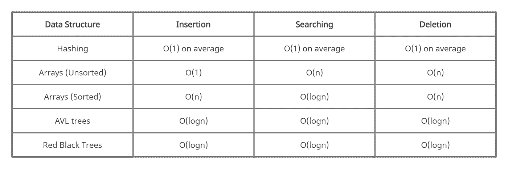
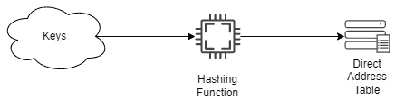
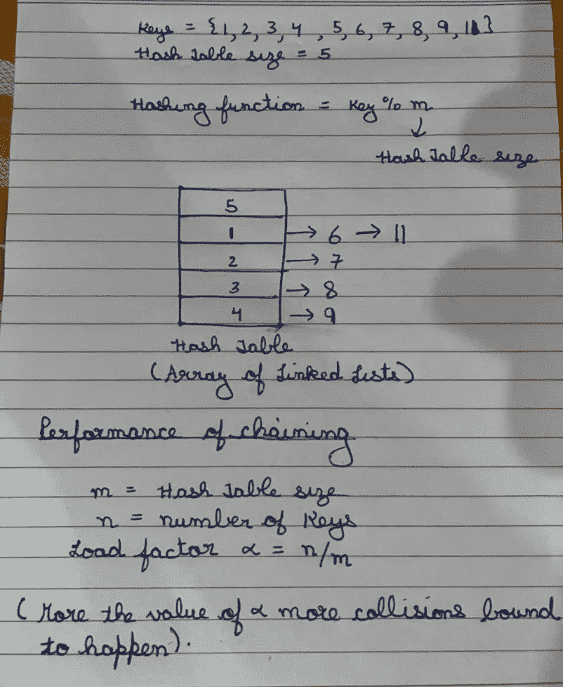
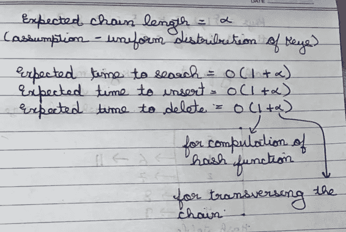
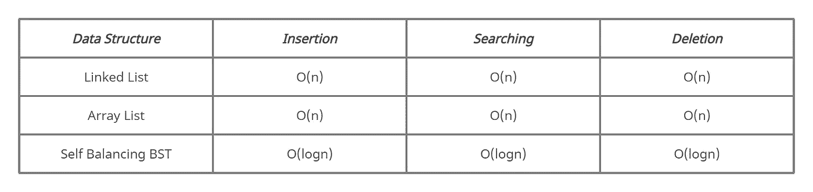
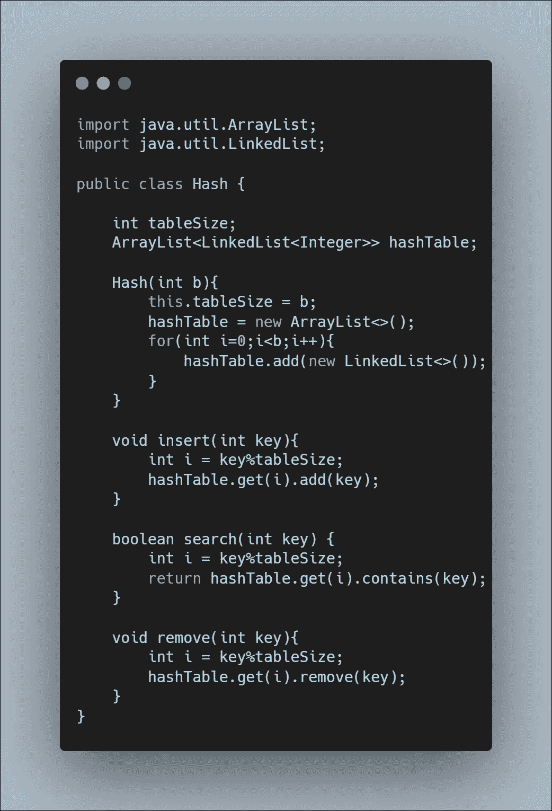
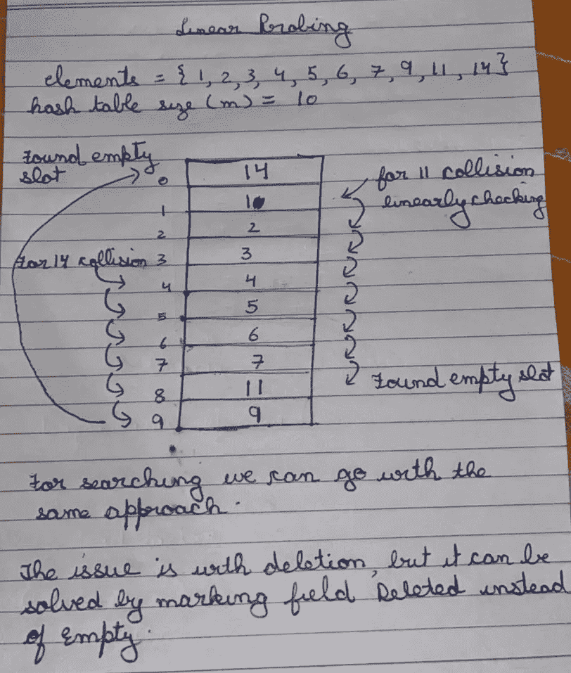
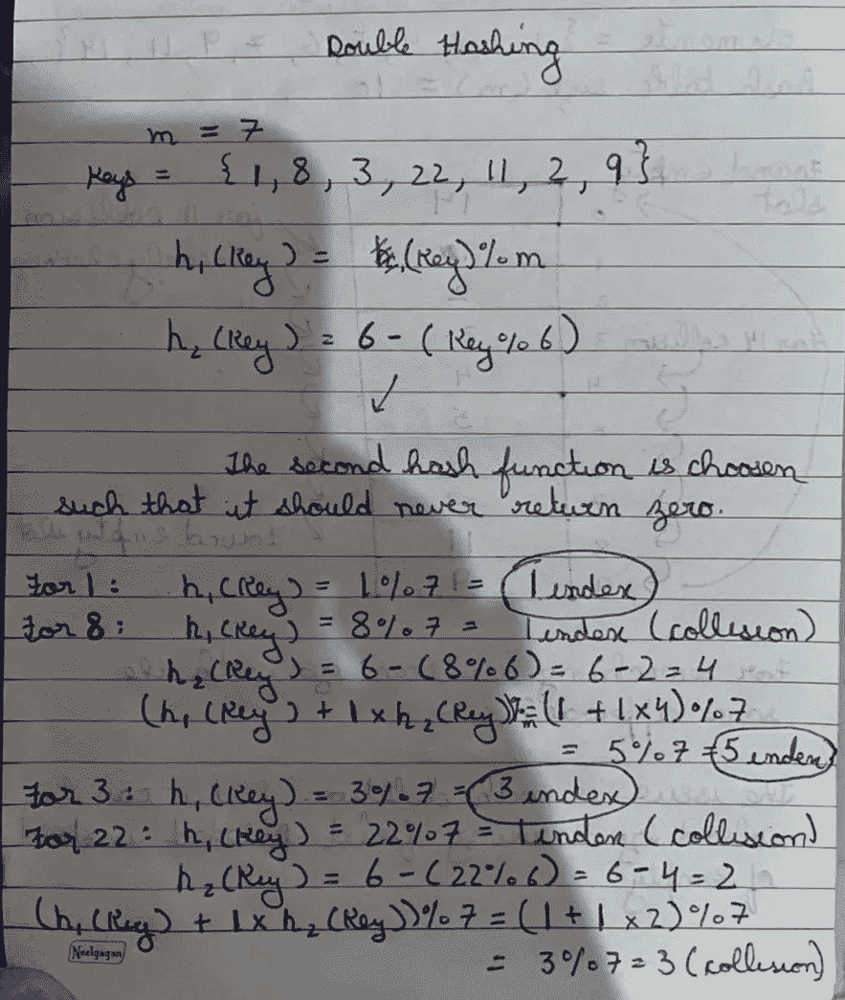
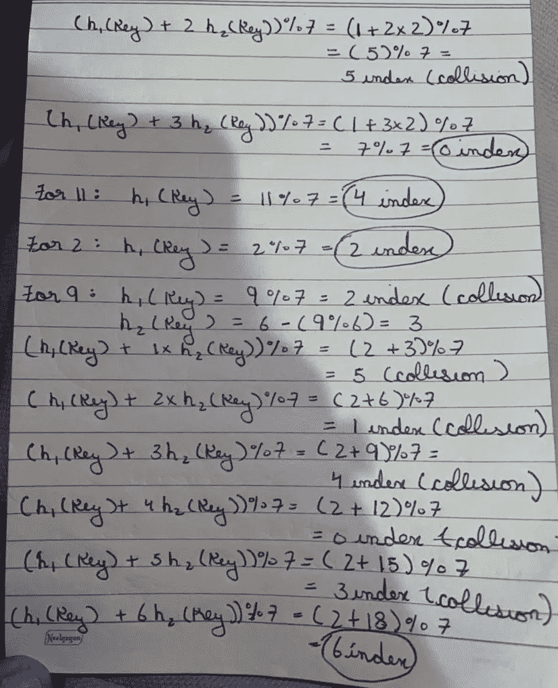
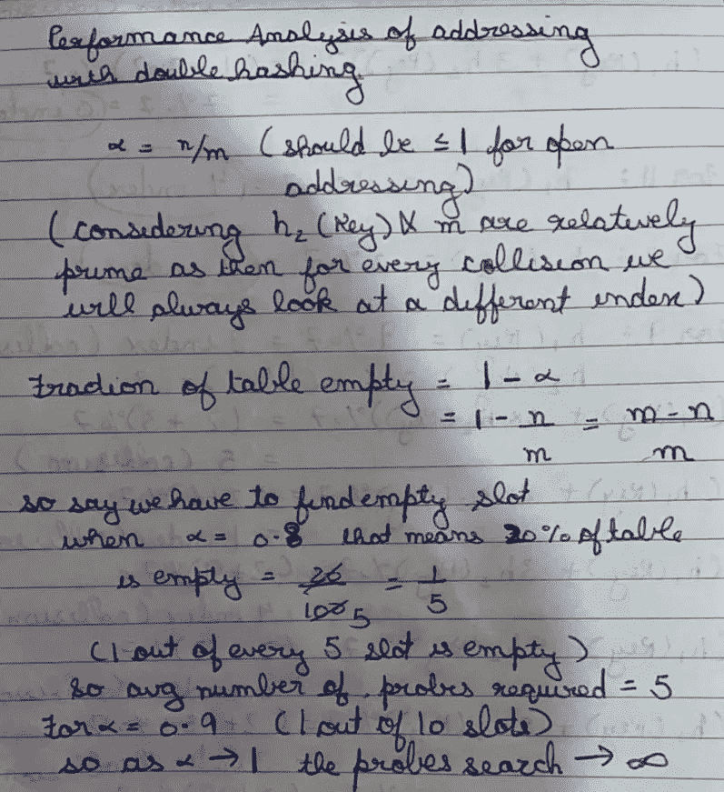

# 散列法

> 原文：<https://medium.com/codex/hashing-8d6223821e34?source=collection_archive---------12----------------------->

哈希是编程语言中使用的一个概念，用于生成类似字典中的键-值对或集合中的键。与其他函数相比，散列的主要优点是它提供了平均 O(1)时间的插入、搜索和删除操作。

# 直接地址表

直接地址表是一个概念，可以用来更好地理解哈希以及为什么我们首先需要哈希。假设您必须插入 0 — > 999 范围内的元素，我们必须以 O(1)的时间复杂度插入、搜索和删除这些元素。我们想到的最简单的数据结构是数组。我们可以有一个大小为 1000 的布尔数组，然后在 O(1)时间内完成所有需要的操作。

## **使用直接地址表的挑战**

*   我们不能使用字符串、浮点数作为索引。
*   我们不能使用大值作为索引，因为通过这种方法我们的数组大小会太大。

# 哈希是如何解决这些问题的？

我们使用散列函数为每个相应的通用密钥集计算一个小值，该值可以是大整数、字符串或浮点数。现在我们可以有一个哈希表，假设大小为 m，我们想在哈希表中插入 n 个值，其中 n ≤ m，值的范围可以大于或小于 m。

## 哈希函数要解决的问题

*   哈希函数应该总是为给定的键生成相同的值。
*   对于整数，哈希函数的速度应该是 O(1 ),对于字符串，哈希函数的速度应该是 O(长度)。
*   哈希函数应该统一分配密钥。

# 通用散列法

通用散列法是大多数编程语言在散列过程中遵循的方法。有一个散列函数池，从中选择最适合的散列函数，然后应用散列。所选择的散列函数使得发生的冲突更少，并且密钥的分布是均匀的。冲突是必然会发生的，我们可以尝试的是努力减少冲突的数量，并处理发生的冲突。

# 碰撞处理

碰撞是必然会发生的，因为任何宇宙中的密钥集都非常大。如果我们预先知道了密钥，那么我们就可以使用完美散列法，这保证了不会有冲突。如果我们不知道密钥，那么我们使用以下方法之一:

*   链接
*   散列地址

## 链接

链接指的是在一些其他数据结构的帮助下将冲突的键存储在同一个位置。现在让我们考虑一下，我们使用一个链表数组来处理冲突。

**用于链接的数据结构的比较**

从 Java 8 开始，HashMap 已经开始使用自平衡二分搜索法树，比如 AVL 树和红黑树。

**使用链表数组实现链接**

# 散列地址

开放式寻址只使用哈希表来存储所有键，而不是以链的形式存储。开放式寻址使用线性探测、二次探测、双重散列等来填充哈希表中的所有关键字。这样做的条件是 ***哈希表大小≥元素个数。***

## 线性探测

***h(key，i) = (h(key) + i) % m***

线性探测意味着在发生冲突的情况下，在散列表中线性地搜索空槽。

线性探测的问题是开始形成集群，这会导致性能下降。

## 二次探测

***h(key，i) = (h(key) + i )%m***

在二次探测中，还有一个搜索命中失误的问题，为了解决这个问题，我们有一个用数学方法证明的条件，即负载因子应该≤ 0.5，m 应该是一个素数。Load factor ≤ 0.5 意味着我们的哈希表大小应该是元素数量的两倍。

聚类问题在二次探测中也很普遍。

## 双重散列法

***h(key，I)=(h1(Key)+I * H2(Key))% m***

首先我们计算 ***h1(Key)*** ，如果有碰撞，我们计算 ***i*h2(key)*** ，其中 ***i*** 可以理解为碰撞次数。如果 out ***h2(键)*** 和 ***m*** 互质，碰撞明显少。使用双重散列不存在聚类问题，因为它比线性或二次探测更均匀地分布关键字。

