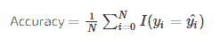

# 仇恨迷因检测

> 原文：<https://medium.com/codex/hateful-meme-detection-3c5a47097a08?source=collection_archive---------2----------------------->

## 仇恨模因的挑战:在多模态模因中检测仇恨言论。

我们都可能在社交媒体上看到过许多模因图片。迷因图像可以是信息丰富的、有趣的、可恨的，甚至是无意义的。但是，meme images 是一种非常有利可图的创新方式，可以向普通的社交媒体用户传播和传播想法。创造迷因并分享它可能是从娱乐休闲开始的。但是，现在这些迷因可以产生巨大的社会和政治影响，它可以被极端主义者和自由主义者用作媒体工具。社交媒体平台正在花费和创建模块和个人团队来过滤用户上传的图像和模因。这就是深度学习技术拯救人类的地方。为过滤社交媒体中的图像而构建的模块更快、更便宜。

由于模因图像的多模态性质，模因图像难以被用于过滤社交媒体图像的可用模块过滤。因为，模因通常有两个不同的特征。一个是图像特征，另一个是文本特征。而且，迷因需要多模态推理来区分它是可恨的还是不可恨的。为了创建深度学习模型来将模因分类为可恨或不可恨，可恨模因挑战是由[驱动的数据](https://www.drivendata.org/competitions/64/hateful-memes/)和脸书·艾提供的数据集[论文](https://arxiv.org/pdf/2005.04790v2.pdf)提出的多模态分类问题。

## **简介**

这篇论文的作者收集了数以千计的仇恨迷因，它们在本质上是多模态的。迷因遍布互联网。拍摄一张图片并添加一些文字，如果它传达了一个意思，那么它就是一个迷因。迷因通常是无害的，有时是有益的和有趣的。就像，在现代的所有艺术形式中，对个人或群体的仇恨或卑鄙可以通过这些模因表达出来。而且，随着世界角落数字化的到来。这给了一个机会，将这些仇恨的模因放在像社交媒体这样的公共平台上，这可能会对它所针对的人造成伤害。可用于仇恨迷因检测的模型本质上是单峰的。预测或者主要基于文本信号或者图像信号，但是不基于两者。现有的模型很难对多模态问题进行分类。这个由脸书·人工智能提出的挑战数据集是由注释者团队通过科学流程构建的，以某种方式解决了在数据集中用良性混杂因素检测仇恨迷因的问题，以迫使模型不仅仅偏向文本或图像信号，而是两者都偏向。

## 商业问题

据脸书首席技术官迈克·斯科洛普夫称，他们在 2020 年第一季度对 960 万条违反 HS 政策的内容采取了行动。如此大量的恶意内容无法通过人工检查每个样本来解决。因此，需要机器学习，特别是深度学习技术来缓解在线仇恨言论的广泛性。为了解决这个问题，脸书·艾发布了挑战集，鼓励研究人员和学者建立一个模型，将模因分为仇恨或不仇恨。由于模因(通常是图像和文本)的多模态性质，检测模因中的仇恨言论具有挑战性，并提出了一个有趣的多模态混合问题。

考虑一句话，比如“爱你今天身上的味道”或者“看看有多少人爱你”。从单个角度来看(分开来看)，这些句子是无害的，但是把它们和一个同样无害的臭鼬或风滚草的形象结合起来，它们突然变得卑鄙和有害。也就是说，模因通常很微妙，尽管它们真正的潜在含义可能很容易被人类发现，但它们对人工智能系统来说可能非常具有挑战性。

混杂因素的模因示例

大多数可用的人工智能系统不像人类那样擅长微妙的推理。人类正确预测迷因是否仇恨的准确率为 84.7%，而最先进的方法表现不佳，准确率为 64.7%。性能不佳的主要原因是模型不像人类那样善于进行微妙的推理。这些模型在预测类别时最具单峰偏差。迷因要么根据它们的文本信号分类，要么根据图像信号分类，而不是同时根据两种信号分类。大多数可用的人工智能系统不像人类那样擅长微妙的推理。人类正确预测迷因是否仇恨的准确率为 84.7%，而最先进的方法表现不佳，准确率为 64.7%。性能不佳的主要原因是模型不像人类那样善于进行微妙的推理。这些模型在预测类别时最具单峰偏差。迷因要么根据它们的文本信号分类，要么根据图像信号分类，而不是同时根据两种信号分类。

## DL 公式

我们面临的问题是，建立一个模型来检测一个迷因是否是可恨的？并且，该模型应该基于图像和文本特征进行预测，而不是偏向其中一个。换句话说，本质上是多模态的。因此，对于该任务，挑战集由[驱动的数据](https://www.drivendata.org/)提供。稍后在数据概述中可以看到关于所提供的数据集的更多探索。为了从包含多模态模因的图像数据集建立模型，我们需要从这些模因的像素和文本中提取特征，并使用这些特征来预测仇恨模因检测的二元分类问题。

## 数据概述

脸书人工智能提供了 10000 幅图像，分为训练集(8500 幅图像)、开发集(500 幅图像)和测试集(1000 幅图像)。在竞赛页面中，提供了一个可下载的 Zip 文件。

zip 文件由以下文件组成:

*   LICENSE.txt —数据集许可证
*   README.md —数据集自述文件
*   img/—PNG 图像的目录
*   train.jsonl(训练集)是一个不平衡的数据集，具有令人讨厌的比率(35/65)
*   dev_seen.jsonl —第一阶段排行榜的开发集，这是一个平衡的数据集，令人讨厌的比率为 50/50。
*   dev_unseen.jsonl —第二阶段排行榜的开发集
*   test_seen.jsonl —阶段 1 排行榜的测试集
*   test_unseen.jsonl —第二阶段排行榜的测试集

并且提供提交格式 CSV 文件用于提交给竞赛。

**img/** img 文件夹包含挑战数据集的所有图像，包括训练、开发和测试。图像文件夹中的图像总数为 12，140 幅图像。 **train.jsonl，dev_seen.jsonl，test_seen.jsonl** —这是一个 json 文件，其中每一行都有一个关于图像的键值对数据的字典。该词典包括

“id”——这是模因形象的唯一标识符。

“Img”——Meme 图片的文件夹路径。

“标签”——模因形象的标签 0:不可恨 1:不可恨

“文本”——模因中的文本。

一个例子:

{"id":42953，" img":"img/42953.png "，" label":0，" text ":"重要的是他们的性格而不是他们的肤色" }

除了标签之外， **test_seen.jsnol** 拥有上面提到的所有键值对。

## 绩效指标

由于案例研究是一项竞赛，脸书 AI 提供的性能或评估指标是受试者工作特征曲线下的面积(AUROC 或 AUC)。AUROC 的范围从 0 到 1。比赛的目标是最大化 AUROC。

另一个衡量性能的标准是准确性。准确性计算提交中的预测类与测试集中的实际类相匹配的行的百分比。最大值为 1，最小值为 0。目标也是最大化分类精度。

## 现有方法

*   视觉和语言 Bert 是一个现有的模型，用于学习与任务无关的图像内容和自然语言的联合表示。该模型将流行的 BERT 架构扩展为多模态双流模型，在通过共同注意变压器层交互的独立流中处理视觉和文本输入。该模型通过在自动收集的大型概念字幕数据集上执行两个代理任务，然后通过对基础架构进行少量添加，将其转移到多个已建立的视觉和语言任务-视觉问题回答、视觉常识推理、引用表达式和基于字幕的图像检索。该模型在仇恨模因挑战的测试数据上取得了 70.31 的 AUROC 分数。
*   **视觉 BERT-** 由一堆变形层组成，这些变形层隐式地将输入文本的元素和相关输入图像中的区域与自我关注对齐。该模型在 VQA、VCR、NLVR2 上进行了试验。该模型在仇恨模因挑战的测试数据上取得了 71.41 的 AUROC 分数。

## 探索性数据分析

由于数据集包含许多仇恨的模因，我个人想在我的博客上放更多的仇恨图片，因为它可能会伤害人们。我不想成为这种可恶的迷因的载体。

模因图像既有文字又有图像。仇恨迷因挑战数据集开发的团队在数据集中引入了混杂因素。文本和图像混淆词是指分别共享图像或文本但标签不同的模因。在上图中，两张图片都有相同的文字“喜欢你今天的味道”。如果文字出现在臭鼬图片上，那是可恶的。如果同样的文字出现在玫瑰的图像上，这个迷因就不是可恨的。对图像进行文本交换也可以改变标签。

**第一次切入方式**

第一种方法是使用预先训练的模型(如 ResNet-152)从图像中提取特征。并且，使用预先训练的 BERT 来嵌入文本。这些特征被简单地连接起来，并通过前馈网络分类器来训练数据。这种方法根本不会增加 AUROC 分数。训练根本没有提高 AUROC 分数，反而降低了。

另一种方法是在训练数据的同时也在连接模型中训练 resNet-152 和 BERT 编码器。连接模型中的这种变化也不会提高模型在训练和验证数据中的性能。串联模型性能的原因是特征串联导致特征向量失真，使得分类器深度神经网络无法学习。简单地说，垃圾进，垃圾出。

级联模型的体系结构

**自我关注模型**

自我关注模型是仇恨迷因分类的另一种方法。自我注意模型是基于图像字幕模型。该模型的基本架构有编码器和 RNN 解码器模型。编码器模型是分别使用 ResNet-152 和 BERT 从图像和文本中提取特征的模型。

CNN 编码器分别从图像和文本中提取特征。Bahdanau 注意力模块用于将注意力权重分配给图像特征。解码器输入是与来自 Bahdanau 注意力层的上下文向量连接的文本特征。RNN 层的输出被传递到深度神经网络分类器中。该模型从注意力和 RNN 层学习。

自我注意模型用损失分类交叉熵编译，用简单的 Adam 优化器训练。该模型在平衡的训练数据上训练 20 个时期。在 30 个时代结束时，它达到了 0.998 的 AUROC 分数。

培训期间的损失图

自我注意模型在验证数据上取得了 0.724 的 AUROC 分数。

**模型调查**

对自我注意模型的少量研究可以揭示其表现的原因。混淆矩阵图用于分析假阳性和假阴性。

在训练和测试数据中，假阳性的数量都较少。这是良好性能的标志。商业问题是过滤仇恨迷因，即使非仇恨迷因被识别为仇恨迷因(假阴性)，这可能不是问题，它不会影响用户的体验。

**最终模型部署**

自我注意模型是一个大模型，其内部聚集了三个模型(ResNet-152、Bert 和自我注意)。为了在云平台 Heroku 或本地虚拟机中部署该模型，我们需要量化该模型以减少其部署规模。这里使用 tensorflow-lite 对模型进行量化。通过保存权重并使用 tensorflow-lite 加载权重。仇恨迷因检测的应用程序在本地虚拟机上完成。下面是部署模型的演示视频。

**结论**

自我关注模型更擅长预测仇恨迷因。这是我为仇恨迷因分类开发的最终模型。该模型在验证数据上实现了 0.729 AUROC 分数的验证分数。整个项目的完整代码在 [Github repo](https://github.com/praveen-jalaja/streamlit-hatefulmemedection) 中。

**未来工作**

1.  使用更多的注意力来学习文本和图像之间的关系，以提高模型的性能。
2.  共同注意力可以代替自我注意力来获得从图像和文本中学习到的权重。
3.  像 VQA 一样用代理任务训练网络可以帮助提高性能。
4.  并且，找到更好地适应图像和文本混淆的方法。

**参考文献**

1.  [仇恨模因挑战:检测多模态模因中的仇恨言论](https://arxiv.org/abs/2005.04790)
2.  [使用多模态深度学习方法检测模因中的仇恨言论:针对仇恨模因挑战的获奖解决方案](https://arxiv.org/abs/2012.12975)
3.  [使用多模态深度集成检测仇恨迷因](https://arxiv.org/abs/2012.13235)
4.  [用于仇恨模因检测的多模态学习](https://arxiv.org/abs/2011.12870)
5.  [一个检测仇恨迷因的多模态框架](https://arxiv.org/abs/2012.12871)
6.  [维尔伯特](https://arxiv.org/abs/1908.02265)
7.  [https://www.appliedaicourse.com/](https://www.appliedaicourse.com/)

GitHub 回购:

 [## 普拉文-贾拉拉巴德/斯特拉利特-哈特富尔梅德凯

### 仇恨迷因检测的网络应用。通过创造……为 praveen-jalaja/streamlit-hate fulmemedection 的发展做出贡献

github.com](https://github.com/praveen-jalaja/streamlit-hatefulmemedection) 

**LinkedIn 个人资料** : [Praveen Jalaja](https://www.linkedin.com/in/praveen-jalaja/)