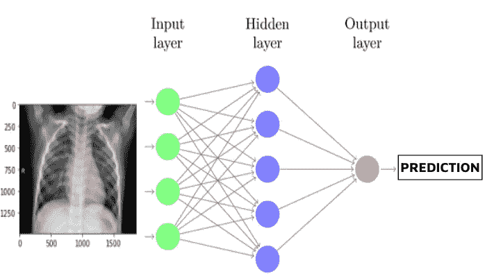
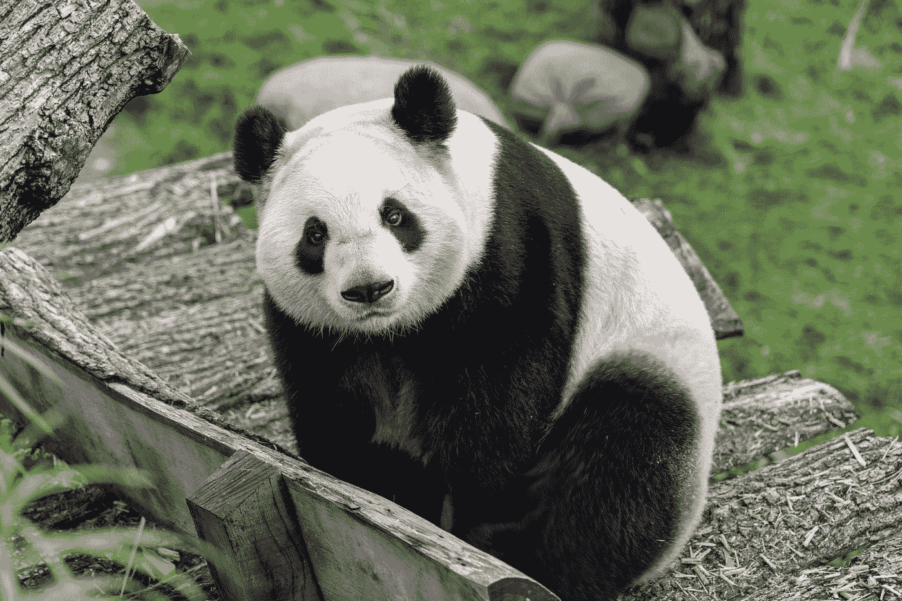
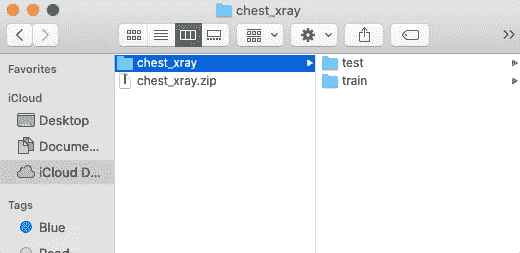
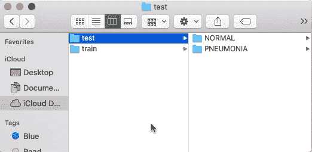

# 有照片，会模特

> 原文：<https://medium.com/codex/have-photos-will-model-af804573cfe6?source=collection_archive---------1----------------------->

## 使用 Keras ImageDataGenerator 将您的图像输入您的神经网络



这些图像应该如何适应所有这些小圆圈？？？

理论上，数据科学很容易吧？

> 第一步:获取数据
> 
> 步骤 2:清理和预处理数据
> 
> 步骤 3:将干净的数据插入到模型中
> 
> 步骤 4:反复调整模型以提高其性能
> 
> 第五步:部署模型，展示你的作品，并获得赞誉

当然，事情很少会如此顺利。但是在几轮对回归和分类模型的修补之后，我觉得我开始看到一些大的部分是如何组合在一起的。这很有意义。但是最近我尝试了一个使用神经网络的图像分类项目，好家伙，游戏怎么改变了。



突然，我的 Jupyter 笔记本上出现了一个罕见的景象|照片由 [Lukas W.](https://unsplash.com/@muffinwiz?utm_source=medium&utm_medium=referral) 在 [Unsplash](https://unsplash.com?utm_source=medium&utm_medium=referral) 拍摄

# 等等，你说我不需要熊猫是什么意思？

尝试新事物最难的部分往往是第一步，那时一切都是陌生的。我常用的工具不见了。我甚至没有`import pandas as pd`，更不用说`pd.read_csv()`投入到一个温暖、充满爱、整齐有序的数据框的怀抱中。我甚至告别了 Scikit-Learn 模型令人欣慰的、重复的`.fit_transform()`和它们清晰的书面文档。

相反，我将图像转换成数字数组，并将 Numpy 张量转换成 Tensorflow/Keras 模型的节点。[项目](https://github.com/ericdnbn/nn_image_classifier_pneumonia)的目标是训练一个模型，将胸部 x 光图像分类为肺炎正常与阳性。我从 [Kaggle](https://www.kaggle.com/paultimothymooney/chest-xray-pneumonia) 那里准备了一个数据集，但是我有一些主要的问题:

*   数据去哪了？
*   我该如何在 Jupyter Notebook 的代码中加入图像呢？
*   这些图像是如何进入我的模型的？

我的问题感觉太宽泛太基础，甚至无法放入谷歌的搜索栏或在 Stack Overflow 上找到。虽然网上有很多有用的资源可以提供给那些正忙于培训和改进模型的人，但是要迈出第一步却很难找到帮助。所以这里有一点帮助，我在这个过程中学到了一些我很难发现的东西。

也就是说，这篇文章绝不是一个全面的指南——我相信不仅有不同的方法来处理图像数据，而且还有更好的方法。(请在评论里说说他们吧！)这是为那些想尝试图像分类项目的人，那些甚至已经在网上找到数据集的人，以及那些不知道下一步该做什么的人准备的。


我，很困惑，希望我不会打破我的代码。| Photo by [你好我是 Nik](https://unsplash.com/@helloimnik?utm_source=medium&utm_medium=referral) 上 [Unsplash](https://unsplash.com?utm_source=medium&utm_medium=referral)

# 数据去哪里了？

第一个问题的答案出乎意料的简单:把图片下载到你的电脑上。当然，还有其他方法可以将图像输入到您的代码中，但是我们现在只保持事情简单。

下载完数据集后，我们需要将图像组织成一个训练和测试(维持)集。没错，没有`train_test_split()`！我们不是从电子表格中随机选取行；我们把图片放在不同的文件夹里。下面是我上面提到的 X 射线图像数据的最高水平:



`train`文件夹有几千张图片，而`test`有几百张。这些文件夹中的每一个都被拆分到数据集中每个类的单独文件夹中，在我的例子中是`NORMAL`和`PNEUMONIA`:



*注意:我上面链接的 Kaggle 数据集带有一个验证文件夹，但它只有 16 张图像，所以我将它们移到了 train 文件夹中。下面我们将看到如何用程序创建一个验证集。*

下面是整个文件结构:

```
└── chest_xray
    ├── train
    │    ├──NORMAL
    │    └──PNEUMONIA
    └── test
         ├──NORMAL
         └──PNEUMONIA
```

一旦我们的数据被组织到一个表示训练/测试分割的文件结构中，并且考虑到了您希望您的模型识别的类，我们就可以开始下一个问题了。

# 图像是如何进入代码的？

我们将使用 Keras 的`[ImageDataGenerator](https://www.tensorflow.org/api_docs/python/tf/keras/preprocessing/image/ImageDataGenerator)`类及其方法`flow_from_directory()`来让我们的神经网络模型访问图像。首先我们将导入类:`from keras.preprocessing.image import ImageDataGenerator`。然后，我们将把每个 train 和 test 文件夹的文件路径保存为字符串，这样我们就可以告诉 Keras 从哪里获取图像。我是这样做的:

```
*# Filepaths*
train_dir = 'chest_xray/train'
test_dir = 'chest_xray/test/'
```

接下来，我们将为我们的训练图像制作一个*生成器*。它被称为生成器，因为它可以生成一批图像供模型使用。它一次从我们组织的文件夹中提取一定数量的图像，为每个图像附加正确的类标签，并可以执行其他预处理功能。现在，让我们使用`rescale`参数对像素数据进行归一化，并告诉 Keras 我们希望将 20%的训练数据分成一个验证集:

```
# Normalize and val split           
datagen = ImageDataGenerator(rescale=1./255, 
                             validation_split=0.2)
```

接下来，我们将在生成器上调用`[flow_from_directory](https://www.tensorflow.org/api_docs/python/tf/keras/preprocessing/image/ImageDataGenerator#flow_from_directory)`方法。这个方法需要几个参数，但是现在最重要的参数是:

*   图像所来自的`directory`(我们刚刚在上面定义了它！)
*   图像的`color_mode`(`'grayscale'`或`'rgb'`)；我的是 x 光片，所以没有颜色)
*   图像的`class_mode`(`'binary’`=两个类；`'categorical’` =多类)
*   `subset`图像应分割成(`'training'`或`'validation'`)
*   无论`shuffle`图像是否进来(将此`True`设为您的训练集，`False`设为您的验证集)

这是我的 x 光图像的编码结果:

```
# Training data
train_generator = datagen.flow_from_directory(train_dir, 
                                color_mode='grayscale',
                                class_mode='binary',
                                subset='training',
                                shuffle=True)# Validation data
val_generator = datagen.flow_from_directory(train_dir, 
                              color_mode='grayscale',
                              class_mode='binary',
                              subset='validation',
                              shuffle=False)
```

这段代码允许我们从单个文件夹中提取图像，执行验证分割。注意两者的目录`train_dir`是一样的——那只是包含所有训练数据的文件夹的文件路径。`subset`和`shuffle`参数是创建一个验证集的关键，当你还在改进它的时候，它可以评估你的模型。以同样的方式使用`test_dir`文件路径，使用全新的`ImageDataGenerator`、*而不使用* a `validation_split`，以便使用您的测试/保持集进行最终模型评估。


数据是怎么进来的？？？

# 图像是如何进入模型的？

一旦我们创建了这些生成器来将图像放入我们的代码，我们所要做的就是将生成器放入我们的模型中进行训练和拟合！通过添加层和编译建立一个神经网络模型(我知道，这是一个巨大的步骤，但有足够的资源[用于](https://machinelearningmastery.com/tutorial-first-neural-network-python-keras/)[在线](https://keras.io/guides/sequential_model/)的[资源](https://towardsdatascience.com/building-a-deep-learning-model-using-keras-1548ca149d37)，使用你的生成器设置你的模型进行训练。这是我的代码中的样子:

```
*# Train the model*
history = model.fit(train_generator,
                    epochs=30, 
                    validation_data=val_generator)
```

当模型训练时，它将从`train`文件夹中提取图像(将其中的 20%放在一边进行验证),并在这些图像上训练 30 个时期。在训练的每个时期结束时，模型将在开始下一个时期之前对验证集进行评估。

以这种方式训练模型还允许我们运行`model.evaluate(val_generator)`来查看您在编译期间声明的指标的最终评估分数。我们也可以使用`model.predict(val_generator)`来获得创建混淆矩阵的预测。


搞定了。

# 让我们回顾一下:

这绝不是触及到所有参数、超参数、类、层和方法的表面，这些参数、超参数、类、层和方法用于创建用于图像分类的神经网络模型。浏览 Keras 的文档可以让你忙上好几天，当然网上也不乏项目和例子。这篇文章的目的只是提供一些最基本的问题的答案，这些问题是你自己尝试这些项目所必须回答的。要查看:

1.  将图像存储在嵌套的文件结构中，该文件结构将数据分成训练集和测试集，然后按类分隔图像。
2.  使用 Keras 的`ImageDataGenerator`和`flow_from_directory()`来告诉你的模型从哪里获取图像以及如何处理它们。
3.  在训练期间(在`.fit()`内)将你的生成器交给你的神经网络，以便从文件夹中提取图像并显示给你的模型。

如果你觉得辣，为什么不试试这些？

*   使用`ImageDataGenerator`的参数来人为扩大数据集的大小，并通过随机改变图像来防止过度拟合(这被称为“图像扩充”或“数据扩充”)。
*   在 Google Colab 中运行所有这些，并从您的 Google Drive 而不是本地文件夹中访问数据。
*   调用`flow_from_dataframe()`从熊猫数据帧中提取数据。

我希望这能帮助你把你的 Keras 图像分类项目放到你的代码中。祝好运，造型愉快！


我的模型预测这张图片的类别为“蓝钢”