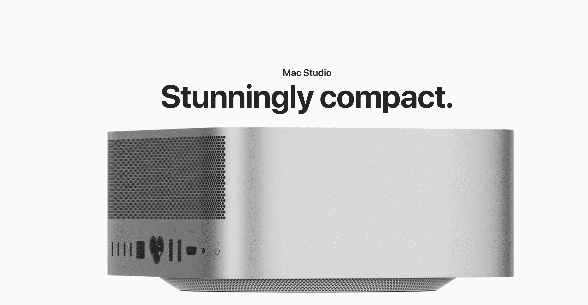
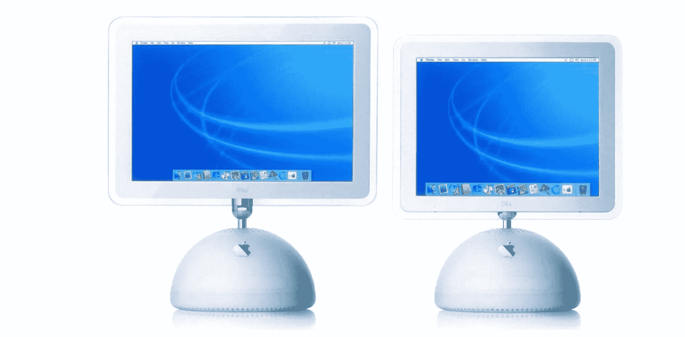
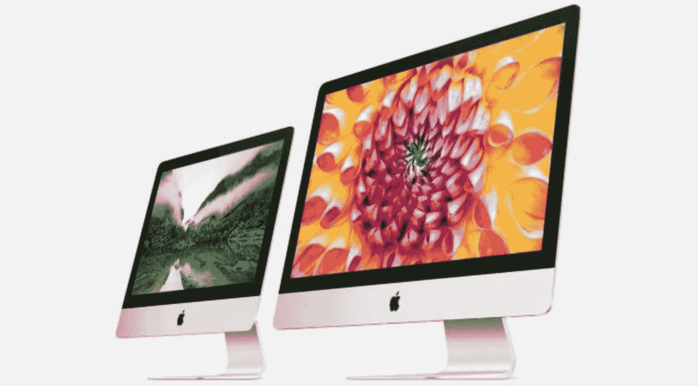
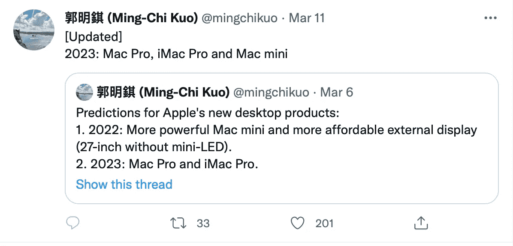
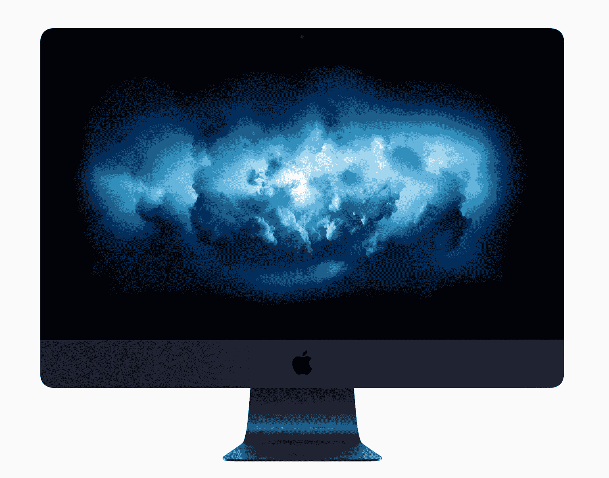

# 我们看到了最后一台大型 iMac 了吗？

> 原文：<https://medium.com/codex/have-we-seen-the-last-of-the-big-imacs-5d63bb4bf839?source=collection_archive---------6----------------------->

## 这些伟大的机器现在已经成为历史了吗？

大约一周前，苹果公司发布了他们全新的电脑系列。Mac Studio，上周在 Peek Performance 上推出，看起来它将会带来一些冲击。当我们等待第一批审查单位到达并通过他们的步伐，我们知道的是他们会很快。非常快！

通常情况下，当融合两个芯片时，速度会有相当大的损失。但随着苹果公司最新的粘合技术称为超级融合，似乎几乎没有妥协发生。从本质上来说，两个 M1 Max 芯片粘在一起，性能数字看起来很高。事实上，以至于我最近写道他们几乎太快了。我们正迅速接近拥有几乎任何人都不需要的更大力量和速度的临界点。这还是在我们看到 Mac Pro 和他们放在那里的任何疯狂的芯片组之前。

但是，随着这些新机器的出现，它也可能给备受喜爱的 27 英寸大 iMac 带来问题。

 [## 拜拜 iMac 和免费 Mac 壁纸！

### 苹果观点综述

medium.com](/codex/bye-bye-imac-and-free-mac-wallpaper-6998c73769bc) 

## 我们所知道的

上周，苹果硬件工程的 SVP 约翰·特尔纳斯(John Ternus)结束了他那部分的工作，他告诉我们“我们几乎完成了向苹果芯片的过渡”。他提到我们只有“Mac Pro 来完成切换”。这让我们很多人想知道这对 iMac 意味着什么。根本没有提到是震耳欲聋的，但我可能能够解释，可能，在短短的一会儿。

不过，首先让我们简单回顾一下 iMac 多年来的历史。

 [## 他们确实泄露了秘密

### 苹果的活动邀请，以及他们实际上意味着什么

medium.com](/codex/they-do-give-the-game-away-38cd06fad3b7) 

## 一切开始的地方

第一台 iMac 于 1998 年 8 月 15 日上市。在其生命周期中，它经历了无数的设计变化和迭代，并成为许多家庭和办公室中的常见位置。它被视为消费者和专业人士的不二之选，一眼就能认出它是 Mac。史蒂夫·乔布斯宣布了 iMac，说它是为*设计的。“消费者告诉我们，他们想要一台电脑的首要用途是简单快捷地上网。”那年圣诞节，iMac 成为最畅销的电脑。*

由乔纳森·伊夫爵士设计，它最初被命名为麦克曼。*幸运的是*，史蒂夫和广告人肯·西格尔一起工作，他想出了我们现在知道的计算机的绰号。最初的电视广告，不是别人，正是杰夫·高布伦甜美的声音，完美地搭建了舞台。这是第一个在现在漫长而杰出的“我”产品系列中的产品(“我”代表互联网)。iMac 负责杀软驱，还买了 USB 给群众。它也是第一台“有趣”的电脑，有多种颜色可供选择，包括邦迪蓝、莱姆&草莓色。

多年来，一些标志性的设计为 iMac 增光添彩，但直到 2007 年，第一台阳极氧化铝机身的 iMac 才首次问世。最终推出 21.5 英寸或 27 英寸，专业版是 2017 年最后一个加入这一行列的，其独特的色调名为太空灰。

去年，iMac 获得了新生，获得了 M1 苹果硅芯片，并再次以多种颜色发货。最新的 iMac 被认为是一款有趣的消费设备，非常适合这个角色。

 [## 它已经准备好了——苹果的全新外部显示器

### 甚至有可能在本周宣布！

medium.com](/codex/and-it-could-even-be-announced-this-week-fb801693a773) 

## 接下来呢？

所以，当特努斯说他的阵容中只剩下一台 Mac 时，从技术上来说，他是正确的，正如你所料！作为一个品牌，iMac 确实已经有了苹果硅芯片，前面提到的 24 英寸型号。因此，虽然是的，只有 Mac Pro 仍然完全不受苹果硅的影响，但上周，在 Studio Mac 隆重亮相的同一天，苹果从网站上删除了 27 英寸的机器。你再也买不到它了。在 Mac Studio 发布会期间，Ternus 还告诉我们，Mac Studio“被视为更大 iMac 的绝佳替代品”。

直到上周，没有人看到大型 iMac 的潜在消亡。屏幕分析师罗斯·杨(Ross Young)坚持认为，新款 iMac 确实正在向我们走来。现在，杨从供应链中获取信息，很少出错。我猜他收到的供应链中一款新的 27 英寸显示器的信息，他曾以为会是 iMac。然而，正如我们现在所知，那个屏幕实际上是演播室的显示屏，也是上周宣布的。有传言称，7K 面板，可能还有迷你 LED 版本的新 27 英寸显示器今年也将加入苹果的显示器行列。

苹果似乎热衷于在他们的产品系列中保持独特的定位。从现在开始，iMac 将被视为一种消费设备，只配有基本的 M1 或 M2 芯片，没有 Pro、Max 或 Ultra 等时髦的衍生品。即使备受哀叹的 27 英寸真的回归，也可能是内置基本芯片的消费级 iMac。虽然消费者用户将拥有 Mac Mini 和 iMac，但专业用户现在将被 Mac Studio 和 Mac Pro 所吸引。

与此同时，M2 芯片的工作已经开始，该芯片将首先用于 MacBook Air、Mac Mini 和 MacBook Pro。9–5 Mac 报道称，苹果没有重新推出 27 英寸 iMac 的计划。有趣的是，彭博的马克·古尔曼和郭明志不同意这种观点，他们都认为虽然不会很快出现，但一款新的专业级别的大型 iMac 将会在某个时候再次出现。

## 悲伤的时光

27 英寸的 iMac 是我迄今为止买过的最好的苹果电脑。这是我花了大部分时间呆在后面的机器，这是我挣钱的机器，也是我写这篇博客的机器。一台 2015 年的机器，以 IT 标准来看很古老，直到现在，它仍然很好地为我服务，从未让我失望过(我真的只是在冒险写下这些吗)?多年前，我被大尺寸、速度，当然还有 5K 视网膜显示屏所吸引，直到今天，使用它仍然是一种纯粹的乐趣。

我一直认为我的下一个巨无霸购买品，会是，嗯，另一个大的 iMac。然而，现在看来，情况并非如此。我想，我的钱将要花在一台 M1 Max MacBook Pro 上了。我确信它将会是一只野兽，并被赐予我从未用过的速度。

也就是说，我会哀叹并怀念我那可敬的 27 英寸。我们一起度过了许多日子。许多令人担忧的客户会议，甚至疫情。的确，我的设计公司就是用这台机器建立起来的。即使它不再是我的日常司机，我也无法让自己放下它。我想我会把它放在办公室或家里，就像一件艺术品一样。

乔尼·艾夫，我欠你一份情，感谢你让这么长时间的工作变得如此有创意和愉快。如果我们再也不会有 27 英寸的大尺寸 iMac，我的朋友，请安息吧。

## 在你走之前

## *你订阅《灵媒》了吗？*

我只是高端博客网站 Medium 的众多作者之一。这是如此好的价值，你可以在这里加入 https://medium.com/membership

[**加入我的幕后邮件列表**](https://www.talkingtechandaudio.com)

**原载于 2022 年 3 月 14 日 https://www.talkingtechandaudio.com/blog******。****