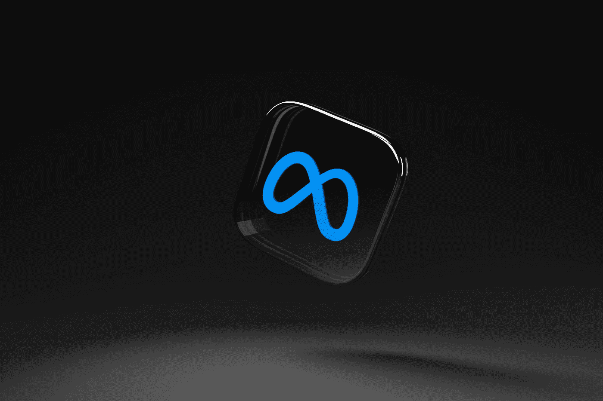

# 你想象过自己在元宇宙的现实吗？

> 原文：<https://medium.com/codex/have-you-ever-imagined-yourself-in-the-metaverse-reality-89e457e16167?source=collection_archive---------14----------------------->

你曾经想象过一个你可以在太空中漂浮，或者和同事在海边开会的世界吗？在空间站漂浮的时候记会议笔记怎么样？或者从伦敦瞬移到纽约怎么样？这些都是元宇宙现实世界中的可能性。可能性是无限的。以下是一些自己体验的方法:

马頔·索罗明在 [Unsplash](https://unsplash.com?utm_source=medium&utm_medium=referral) 上拍摄的照片