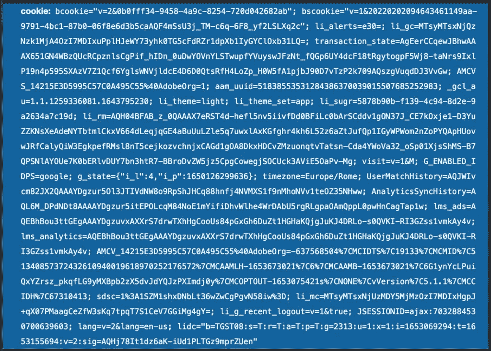
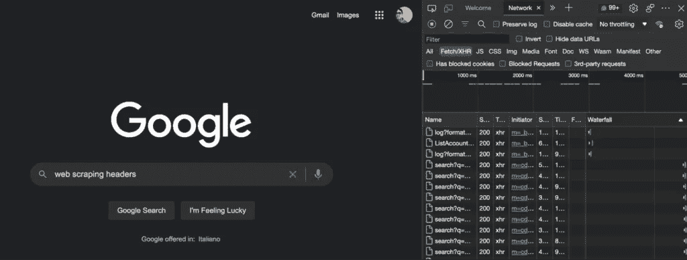
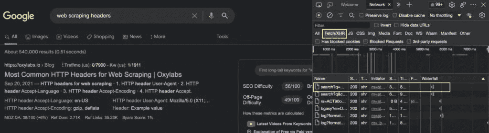
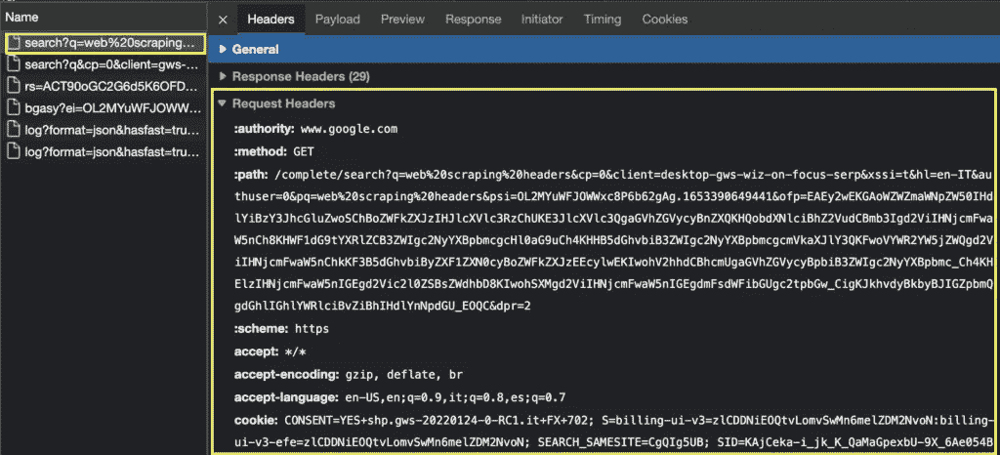
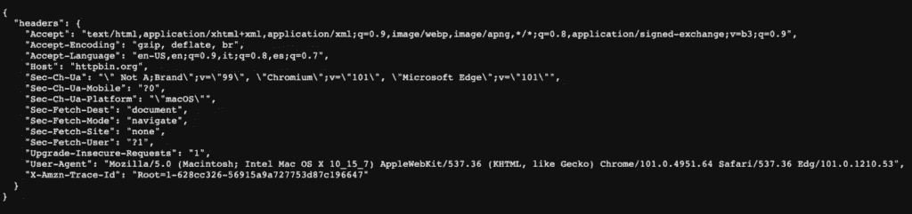
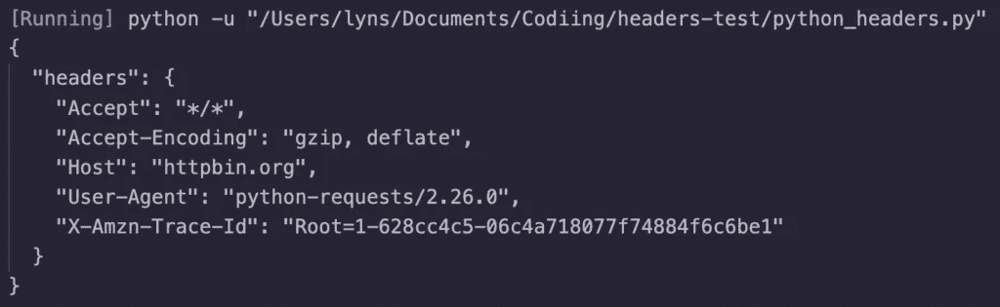
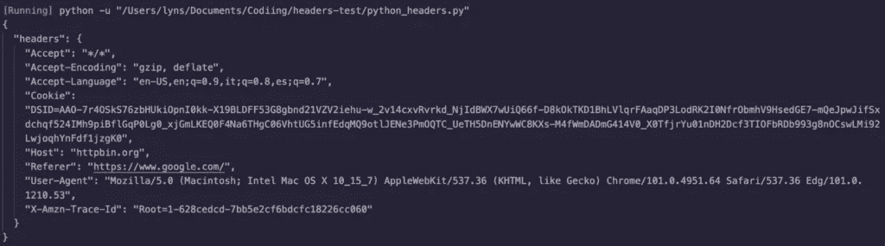
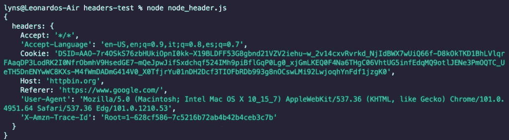

# 用于网页抓取的标题和 Cookies

> 原文：<https://medium.com/codex/headers-and-cookies-for-web-scraping-b91bd99a33a5?source=collection_archive---------8----------------------->

关于 Web 抓取的标题和 Cookies 的文章最初发表在 Scraper API 上。

随着技术的进步，web 服务器在区分用户流量和 web 抓取器方面变得越来越好，这使得我们所有人都更难访问我们需要的数据。

尽管我们可以使用许多方法来规避许多安全措施，但是有一种方法特别没有得到足够的重视:自定义 HTTP 头。

在今天的文章中，我们将深入探讨什么是 HTTP 头，为什么它们对 web 抓取很重要，以及我们如何在代码中获取和使用它们。

# 什么是 HTTP 头？

根据[MDN](https://developer.mozilla.org/en-US/docs/Glossary/HTTP_header)“HTTP 头是 HTTP 请求或响应的一个字段，它传递关于请求或响应的附加上下文和元数据”，由区分大小写的名称(如年龄、缓存控制、日期、cookie 等)后跟冒号(:)及其值组成。

简而言之，用户/客户机发送一个包含请求头的请求，向服务器提供更多的细节。然后，服务器用符合请求头中包含的规范的结构中请求的数据进行响应。

为了清楚起见，下面是我们的浏览器在撰写本文时发送给 [Prerender](https://prerender.io/) 的请求头:

`1 authority: **in**.hotjar.com`

`2 :method: POST`

`3 :path: **/**api**/**v2**/**client**/**sites**/**2829708**/**visit**-**data?sv**=**7`

`4 :scheme: https`

`5 accept: ***/***`

`6 accept**-**encoding: gzip, deflate, br`

`7 accept**-**language: en**-**US,en;q**=**0.9,it;q**=**0.8,es;q**=**0.7`

`8 content**-**length: 112`

`9 content**-**type: text**/**plain; charset**=**UTF**-**8`

`10 origin: [https:**//**prerender.io](https://prerender.io)`

`11 referer: [https:**//**prerender.io**/**](https://prerender.io/)`

`12 sec**-**ch**-**ua: " Not A;Brand";v**=**"99", "Chromium";v**=**"101", "Microsoft Edge";v**=**"101"`

`13 sec**-**ch**-**ua**-**mobile: ?0`

`14 sec**-**ch**-**ua**-**platform: "macOS"`

`15 sec**-**fetch**-**dest: empty`

`16 sec**-**fetch**-**mode: cors`

`17 sec**-**fetch**-**site: cross**-**site`

`18 user**-**agent: Mozilla**/**5.0` `(Macintosh; Intel Mac OS X 10_15_7) AppleWebKit**/**537.36` `(KHTML, like Gecko) Chrome**/**101.0.4951.64` `Safari**/**537.36` `Edg**/**101.0.1210.47`

# 什么是网络 Cookies？

Web cookies，也称为 HTTP cookies 或浏览器 cookie，是由服务器(HTTP 响应头)发送到用户浏览器的一段数据，用于以后识别。在后面的请求(HTTP header 请求)中，浏览器会将 cookie 发送回服务器，使服务器能够识别浏览器。

网站和 web 应用程序使用 cookies 进行会话管理(比如让您保持登录)、个性化(保存设置和首选项)、跟踪，在某些情况下还用于安全性。

让我们看看 LinkedIn 的请求头中的 cookie 是什么样的:

# 为什么标题对网页抓取很重要？

许多网站所有者知道他们的数据会以某种方式被窃取，所以他们使用许多不同的工具和策略来识别机器人并阻止它们进入他们的网站。他们这样做有很多正当理由，因为优化不好的机器人会降低网站速度，甚至破坏网站。

**注意:**遵循这些[网络抓取最佳实践](https://www.scraperapi.com/blog/web-scraping-best-practices/)，你可以避免网络服务器不堪重负，并降低被阻塞的几率。

然而，不太受关注的一种方法是使用 HTTP 头和 cookies。因为您的浏览器/客户端在其请求中发送 HTTP 标头，所以服务器可以使用此信息来检测虚假用户，从而阻止他们访问网站或提供虚假/不良信息。

但是反过来也是一样的。通过优化通过我们的机器人请求发送的头，我们可以模仿有机用户的行为，减少我们被列入黑名单的机会，在某些情况下，提高我们收集的数据的质量。

# 最常见的网页抓取 HTTP 头

我们可以在请求中学习和使用大量的 HTTP 头[列表，但是在大多数情况下，我们真正关心的 web 抓取只有几个:](https://developer.mozilla.org/en-US/docs/Web/HTTP/Headers)

# 1.用户代理

这可能是最重要的标题，因为它标识了“请求软件用户代理的应用程序类型、操作系统、软件供应商或软件版本”，使其成为大多数服务器将运行的第一个检查。

例如，使用请求 Python 库发送请求时，用户代理字段将显示以下信息，具体取决于您的 Python 版本:

`1 user**-**agent: python**-**requests**/**2.22.0`

很容易被服务器发现和阻止。

相反，我们希望我们的用户代理头看起来更像我们的第一个例子中所示的:

`1 user**-**agent: Mozilla**/**5.0``(Macintosh; Intel Mac OS X 10_15_7) AppleWebKit**/**537.36``(KHTML, like Gecko) Chrome**/**101.0.4951.64``Safari**/**537.36`

# 2.接受语言

虽然并不总是必要的，但它告诉服务器应该提供哪种语言版本的数据。从语言的角度来看，当每个请求之间有很大的差异时，它可以告诉服务器有一个机器人参与其中。

然而，从技术上来说，“服务器应该始终注意不要覆盖明确的用户选择”，因此，如果您抓取的 URL 已经有特定的语言，它仍然可以被视为有机用户。

下面是它在我们的示例请求中的显示方式:

`1 accept**-**language: en**-**US,en;q**=**0.9,it;q**=**0.8,es;q**=**0.7`

# 3.接受编码

顾名思义，它告诉服务器哪种[压缩算法](https://developer.mozilla.org/en-US/docs/Web/HTTP/Compression)可以用于发回的资源，“节省某些文档所需带宽的 70%，从而减轻我们的脚本给服务器带来的压力。

`1 accept**-**encoding: gzip, deflate, br`

# 4.推荐人

Referer HTTP 头告诉服务器用户来自哪个页面。虽然它主要用于跟踪，但它也可以帮助我们模仿有机用户的行为，例如，告诉服务器我们来自谷歌这样的搜索引擎。

`1 referer: [https:**//**prerender.io**/**](https://prerender.io/)`

# 5.饼干

我们已经讨论了什么是 cookie，但是，我们可能没有清楚地说明为什么 cookie 对网络抓取很重要。

cookie 允许服务器使用一小块数据进行通信，但是当服务器发送了一个 cookie，但浏览器没有存储并在下一个请求中发回它时会发生什么呢？Cookies 还可以用来识别请求是来自真实用户还是机器人。

反之亦然，我们可以使用网络 cookie 来模仿用户浏览网站时的有机行为，方法是在每次交互后将 cookie 发送回服务器，并通过更改 cookie 本身，我们可以告诉服务器我们是新用户，使我们的抓取脚本更容易避免被阻止。

# 如何查看 HTTP 头？[包括饼干]

在我们可以在代码中使用头文件之前，我们需要能够从某个地方获取它们。为此，让我们使用自己的浏览器，并转到目标网站。对于我们的示例，让我们转到*google.com>右键单击>检查*以打开开发者工具。

从那里，我们将导航到网络选项卡，回到谷歌，搜索查询“网页抓取标题”。

随着页面的加载，我们将看到 network 选项卡被填充。我们将仔细查看 Fetch/XHR 选项卡，在这里我们可以找到浏览器正在获取的文档，当然还有请求中使用的 HTTP 头。

虽然我们要找的文件没有一个标准的名字，但它通常是一个与我们在页面上要做的事情相关的名字，或者是提供要呈现的数据的文件。

单击该文件，我们将默认打开“Headers”选项卡，向下滚动，我们将看到“Request Headers”部分。

现在，我们可以将标题字段及其值复制并粘贴到代码中。

# 如何使用自定义标题进行网页抓取

您使用自定义标题的方式将取决于您正在使用的编程语言，但是，我们将尝试添加尽可能多的示例。

你会注意到的一件事是:是的，每个方法是不同的，但它们共享相同的逻辑，所以无论你使用什么代码库，都很容易翻译。

对于我们所有的例子，我们将把我们的请求发送到[https://httpbin.org/headers](https://httpbin.org/headers)，这是一个旨在展示从服务器的角度看响应和请求的网站。

如果我们在浏览器上打开上面的链接，会出现以下内容:

网站用浏览器发送的标题进行响应，现在我们可以在通过代码发送请求时使用相同的标题。

# 在 Python 中使用自定义头

在使用我们的自定义头之前，让我们先发送一个测试请求，看看它返回什么:

`**1 import**` `requests`

`2`

`3`

`4`

`5 url **=**` `'[https://httpbin.org/headers](https://httpbin.org/headers)'`

`6`

`7`

`8`

`9 response **=**`

`10`

`11`

`12`

`13 print(response.text)`

正如您所看到的，使用的用户代理是默认的 python-requests/2.26.0，这将使服务器非常容易识别我们的 bot。

了解了这一点，让我们进入下一步，向我们的请求添加我们的自定义标题:

`**1 import**` `requests`

`2`

`3 url **=**` `'[https://httpbin.org/headers](https://httpbin.org/headers)'`

`4`

`5 headers **=**` `{`

`6 'accept': '*/*',`

`7 'User-Agent': 'Mozilla/5.0 (Macintosh; Intel Mac OS X 10_15_7) AppleWebKit/537.36 (KHTML, like Gecko) Chrome/101.0.4951.64 Safari/537.36 Edg/101.0.1210.53',`

`8 'Accept-Language': 'en-US,en;q=0.9,it;q=0.8,es;q=0.7',`

`9 'referer': '[https://www.google.com/](https://www.google.com/)',`

`10 'cookie': 'DSID=AAO-7r4OSkS76zbHUkiOpnI0kk-X19BLDFF53G8gbnd21VZV2iehu-w_2v14cxvRvrkd_NjIdBWX7wUiQ66f-D8kOkTKD1BhLVlqrFAaqDP3LodRK2I0NfrObmhV9HsedGE7-mQeJpwJifSxdchqf524IMh9piBflGqP0Lg0_xjGmLKEQ0F4Na6THgC06VhtUG5infEdqMQ9otlJENe3PmOQTC_UeTH5DnENYwWC8KXs-M4fWmDADmG414V0_X0TfjrYu01nDH2Dcf3TIOFbRDb993g8nOCswLMi92LwjoqhYnFdf1jzgK0'`

`11 }`

`12`

`13 response **=**` `requests.get(url, headers**=**headers)`

`14`

`15 print(response.text)`

首先，我们用我们的头创建一个字典。其中一些是我们从 HTTPbin 获得的，但 cookies 来自 MDN 文档，我们将 Google 添加为 referer，因为在大多数情况下，用户将通过单击来自 Google 的链接来访问网站。

结果如下:

理论上，你可以使用自定义的任意组合作为你的自定义头的值。但是，如果不发送一组特定的标题，有些网站不允许您访问它们。当你试图在抓取时使用自定义标题时，最好在浏览目标网站时查看你的浏览器已经发送了什么标题。

# 在节点中使用自定义标题。射流研究…

我们要做同样的事情，但是使用节点。JS Axios 包发送我们的请求:

`1 const axios **=**`

`2`

`3 const url **=**` `'[https://httpbin.org/headers](https://httpbin.org/headers)';`

`4`

`5 const headers **=**` `{`

`6 'accept': '*/*',`

`7 'User-Agent': 'Mozilla/5.0 (Macintosh; Intel Mac OS X 10_15_7) AppleWebKit/537.36 (KHTML, like Gecko) Chrome/101.0.4951.64 Safari/537.36 Edg/101.0.1210.53',`

`8 'Accept-Language': 'en-US,en;q=0.9,it;q=0.8,es;q=0.7',`

`9 'referer': '[https://www.google.com/](https://www.google.com/)',`

`10 'cookie': 'DSID=AAO-7r4OSkS76zbHUkiOpnI0kk-X19BLDFF53G8gbnd21VZV2iehu-w_2v14cxvRvrkd_NjIdBWX7wUiQ66f-D8kOkTKD1BhLVlqrFAaqDP3LodRK2I0NfrObmhV9HsedGE7-mQeJpwJifSxdchqf524IMh9piBflGqP0Lg0_xjGmLKEQ0F4Na6THgC06VhtUG5infEdqMQ9otlJENe3PmOQTC_UeTH5DnENYwWC8KXs-M4fWmDADmG414V0_X0TfjrYu01nDH2Dcf3TIOFbRDb993g8nOCswLMi92LwjoqhYnFdf1jzgK0',`

`11 };`

`12`

`13 axios.get(url, Headers**=**{headers})`

`14 .then((response) **=**> {`

`15 console.log(response.data);`

`16 }, (error) **=**> {`

`17 console.log(error);`

`18 });`

结果如下:

# 在 ScraperAPI 中使用自定义标题

ScraperAPI 的一个很棒的特性是，它使用机器学习和多年的统计分析来确定我们发送的每个请求的最佳头组合。

然而，最近，我们看到越来越多的小网站改善他们的安全措施，但没有足够的数据让 API 自动确定最佳组合。因此，如果您注意到高失败率，就值得尝试使用我们上面展示的定制头。

在[我们的文档](https://www.scraperapi.com/documentation/#curl-CustomHeaders)中，您将能够找到 Node 编码示例的完整列表。JS、PHP、Ruby 和 Java，但为了节省时间，这里有一个完整的 Python 示例，用于使用带有自定义头的 ScraperAPI:

`**1 import**`

`2`

`3 headers **=**` `{`

`4 'accept': '*/*',`

`5 'User-Agent': 'Mozilla/5.0 (Macintosh; Intel Mac OS X 10_15_7) AppleWebKit/537.36 (KHTML, like Gecko) Chrome/101.0.4951.64 Safari/537.36 Edg/101.0.1210.53',`

`6 'Accept-Language': 'en-US,en;q=0.9,it;q=0.8,es;q=0.7',`

`7 'referer': '[https://www.google.com/](https://www.google.com/)',`

`8 'cookie': 'DSID=AAO-7r4OSkS76zbHUkiOpnI0kk-X19BLDFF53G8gbnd21VZV2iehu-w_2v14cxvRvrkd_NjIdBWX7wUiQ66f-D8kOkTKD1BhLVlqrFAaqDP3LodRK2I0NfrObmhV9HsedGE7-mQeJpwJifSxdchqf524IMh9piBflGqP0Lg0_xjGmLKEQ0F4Na6THgC06VhtUG5infEdqMQ9otlJENe3PmOQTC_UeTH5DnENYwWC8KXs-M4fWmDADmG414V0_X0TfjrYu01nDH2Dcf3TIOFbRDb993g8nOCswLMi92LwjoqhYnFdf1jzgK0'`

`9 }`

`10`

`11 payload **=**` `{`

`12 'api_key': '51e43be283e4db2a5afb62660xxxxxxx',`

`13 'url': '[https://httpbin.org/headers](https://httpbin.org/headers)',`

`14 'keep_headers': 'true',`

`15 }`

`16`

`17 response **=**`

`18`

`19 print(response.text)`

所以在 Python 中使用定制头非常简单:

*   我们需要在创建有效载荷之前和之后创建头部字典
*   我们将添加到有效负载的第一个元素是我们的 API 密钥，我们可以通过[创建一个免费的 ScraperAPI 帐户](https://www.scraperapi.com/signup)来生成它
*   接下来，我们将添加我们的目标 URL——在本例中是[https://httpbin.org/headers](https://httpbin.org/headers)
*   最后一个参数将是 keep_headers，并将其设置为 true，以告诉 ScraperAPI 保留我们的自定义标题
*   最后，我们将所有元素一起添加到 requests.get()方法中

综合所有这些，我们将得到这样一个 URL:

`1 [http:**//**api.scraperapi.com**/**?api_key**=**51e43be283e4db2a5afb62660xxxxxxx&amp;url**=**http:**//**httpbin.org**/**headers&amp;keep_headers**=**true](http://api.scraperapi.com/?api_key=51e43be283e4db2a5afb62660xxxxxxx&amp;url=http://httpbin.org/headers&amp;keep_headers=true)`

# 包扎

网络抓取既是一门艺术也是一门科学。因为每个网站都是不同的，没有唯一的做事方法，所以拥有尽可能多的工具对我们的项目成功至关重要。

以正确的格式访问页面内容是这个过程的一个关键部分，在请求中使用正确的 HTTP 头会带来很大的不同。

使用 ScraperAPI 时，您可以放心，在 99%的情况下，我们的 API 会为您选择并发送正确的标题，让您从任务中解放出来。然而，在那些失败率很高的罕见情况下，尝试提取并使用浏览器发送到目标页面的标题。根据我们的经验，这就是诀窍。

尽管如此，如果你在保证成功请求方面有困难，请不要犹豫[联系我们](https://www.scraperapi.com/blog/#)。

下次见，刮刮快乐！