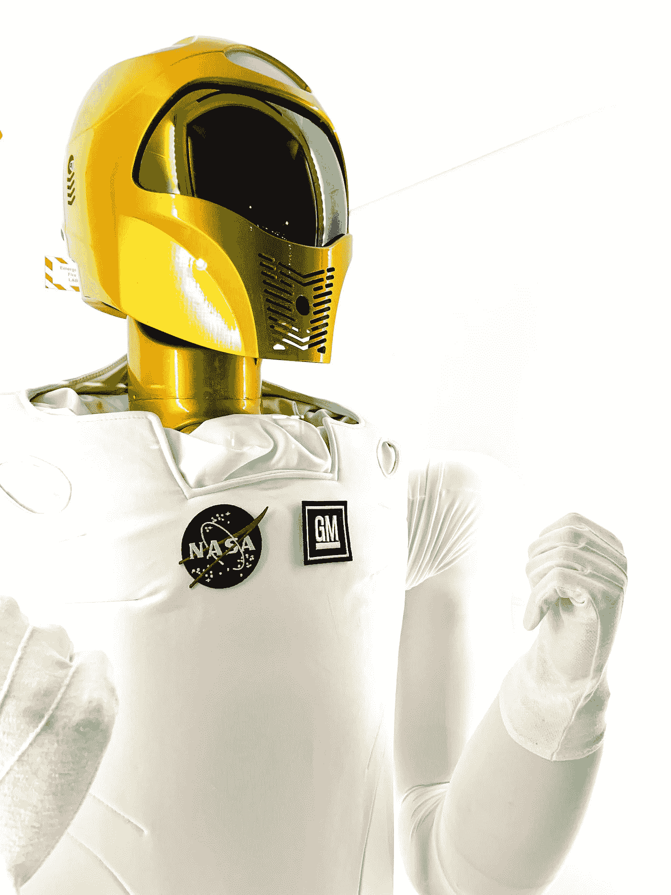

# 听说过 Pyscript 吗？—你会的！

> 原文：<https://medium.com/codex/heard-of-pyscript-you-will-b26516f46e7?source=collection_archive---------12----------------------->

未来就在我们面前！Pyscript 是新的，还不是黄金时间，但它有望成为游戏规则的改变者。这里有一个示例程序，可以帮助您提前开始。

由[阿德莱米·马尔](https://unsplash.com/@adleemi?utm_source=medium&utm_medium=referral)在 [Unsplash](https://unsplash.com?utm_source=medium&utm_medium=referral) 拍摄的照片

多年来，我一直希望有一种方法可以使用世界上最流行的编程语言 Python，这样我创建的程序可以在任何地方、任何设备上运行，就像 HTML/CSS/Javascript 网页可以在任何地方运行一样。嗯，那个…