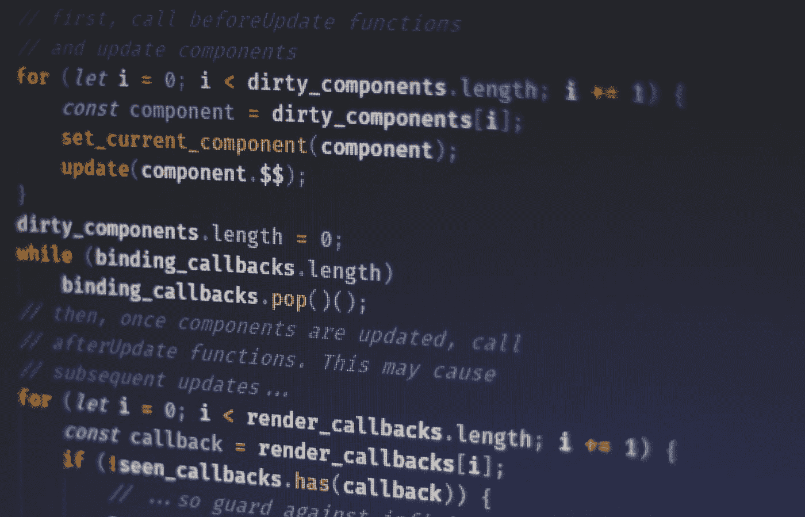
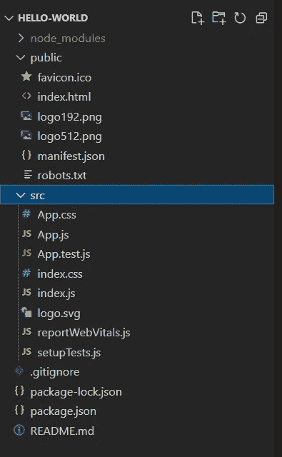
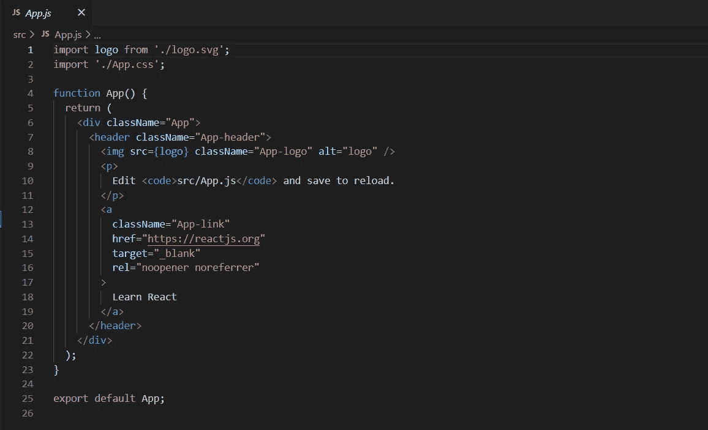
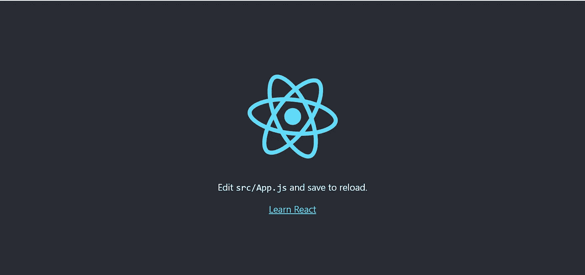
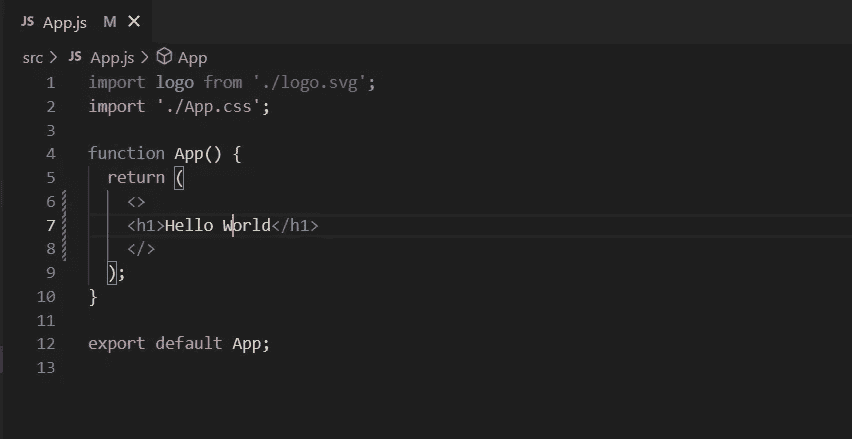

# React 中的“Hello World”

> 原文：<https://medium.com/codex/hello-world-in-react-1bef47234f4c?source=collection_archive---------25----------------------->



费伦茨·阿尔马西在 [Unsplash](https://unsplash.com?utm_source=medium&utm_medium=referral) 上的照片

## 什么是反应？

**React** 是一个免费开源的前端 JavaScript 库，用于构建基于 UI 组件的用户界面。它用于创建单页 web 应用程序，允许我们创建可重用的组件。

## react 的先决条件

*   [**HTML**](https://www.geeksforgeeks.org/html/)
*   [**CSS**](https://www.geeksforgeeks.org/css-tutorials/)
*   [J**SX**](https://www.geeksforgeeks.org/reactjs-introduction-jsx/)**(Javascript XML)&**[**巴别**](https://babeljs.io/)
*   [**ES6**](https://www.w3schools.com/js/js_es6.asp)**s**
*   [**节点& NPM**](https://www.w3schools.com/nodejs/)

当我们开始时，我们需要一个代码编辑器，例如我正在使用 VS Code，并且我会向其他人推荐它，因为它具有易于使用的特性和大量的扩展。

要启动 react 应用程序，我们需要在 terminal/CMD 上运行以下命令。

```
npx create-react-app app-name
```

运行上述命令后，将在目录下创建一些文件和文件夹，如下所示



react 项目的文件结构

打开 App.js，您将在其中找到渲染 index.html 的主要代码



App.js

因此，是时候运行我们的 react 应用程序了，我们将使用以下命令

这将在 web 浏览器上打开一个选项卡。

```
npm start
```

运行此命令后，您将在 web 浏览器中看到以下输出



我们还可以更改 app.js 文件中的内容，比如在浏览器中打印 hello world



输出将是


你好，世界输出

所以，这都是关于“你好，世界”的反应。

谢谢大家！