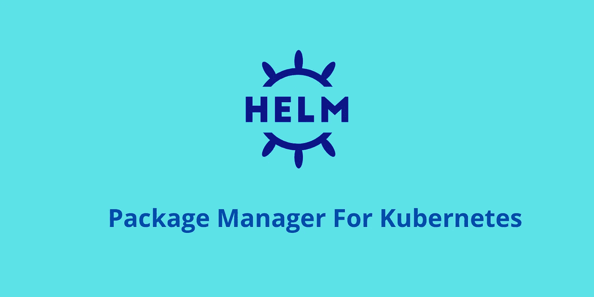

# Kubernetes 开发者掌舵图

> 原文：<https://medium.com/codex/helm-charts-for-kubernetes-developers-dce5719d4c8c?source=collection_archive---------1----------------------->

了解什么是舵图以及如何使用它们。

Kubernetes 的头盔字符

Kubernetes 是一个非常流行的容器编排工具。通过使用 Kubernetes，您可以轻松地部署多个容器化的应用程序。Kubernetes 使用 YAML 文件格式来部署应用程序。Kubernetes 拥有用于部署应用程序的各种组件，如 **Pod、配置图、秘密、服务、持久卷**和**持久卷** …