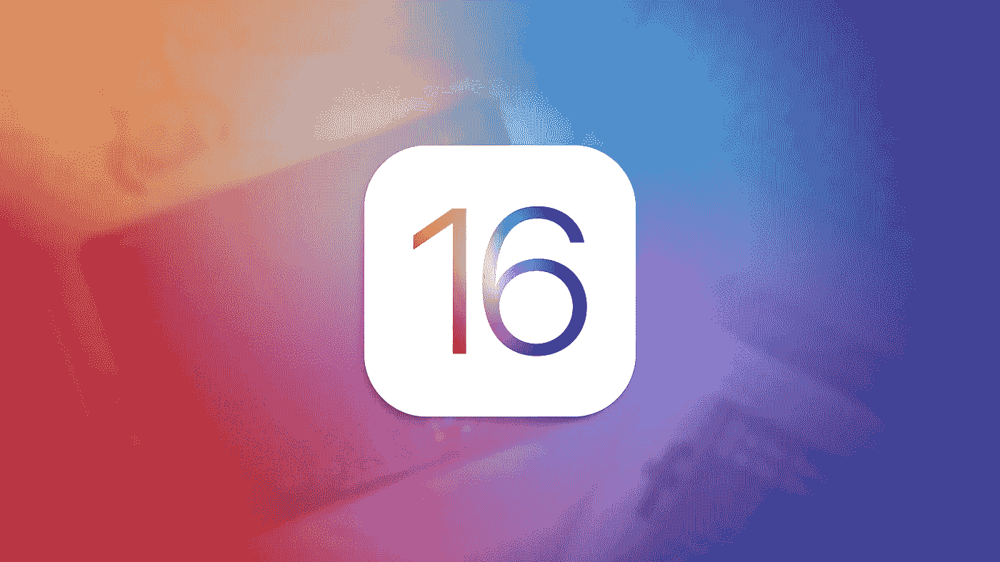
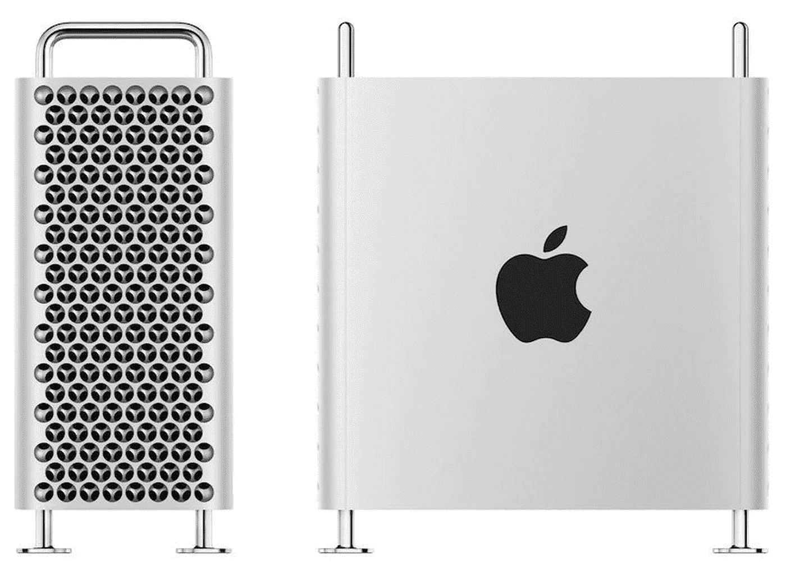

# 太阳出来了！

> 原文：<https://medium.com/codex/here-comes-the-sun-9fe01350de9c?source=collection_archive---------19----------------------->

随着今年 WWDC 预产期的泄露，我们还能期待什么呢？

## 何时何地？

上周末，我们听到了今年“dub-dub”或 WWDC 的第一个建议日期。6 月 6 日星期一目前看来是受欢迎的，它当然符合历史。去年，开发商在 3 月 30 日收到邀请，第 32 次活动实际上是在 6 月 7 日举行的。这项活动过去常常在 McEnery 会议中心举行，当时有公众参加。然而今年，这项活动似乎不太可能在现场观众面前举行，所以我们可以期待 Apple Park 的另一场紧张的预录活动。那么，请柬极有可能在本周发出，我们能期待什么呢？

 [## iPhone 支付计划即将到来，iPhone 15 新闻，更大的 Mac 电脑&重返路由器市场

### 苹果视图综述 2022 年 3 月 21 日至 3 月 25 日

medium.com](/codex/an-iphone-payment-plan-is-coming-iphone-15-news-bigger-macs-back-in-the-router-market-77f68eaa1860) 

## **开发商第一**

这个名字暗示了这个事件的真实意义。这是全球开发者大会。从历史上看，这是苹果召集开发人员，与他们一起进一步开发他们希望推出的软件的地方。与此相一致，几乎可以肯定的是，我们将推出大量新的操作系统。我们可以期待 iOS & iPadOS 16，macOS 13，watchOS 9，tvOS 16。当然，我们刚刚发布了带有新功能的 iOS 15.4，所以最新的迭代将从那里继续。

虽然我们不太了解软件更新，但我们看到了大量关于 iPhone14 的传言，如果这些传言可信，这意味着将会有一些令人兴奋的修改。在 Pro 和 Pro Max 手机上，我们希望有一个打孔设计，而不是凹口。如果是这样的话，那么它将需要界面的变化和更新。这些将包括状态栏和前置摄像头的变化。可能还包括汽车碰撞技术和讨论很多的紧急卫星功能。这最后一个功能将使 iPhone 14 用户能够在没有手机覆盖的紧急情况下发送短信。它还将使用户能够报告重大事故和紧急情况。

## 五金器具

如前所述，WWDC 的核心是软件，但至少可以讨论一些硬件，这并非史无前例。有人猜测，这份名单上可能会有三款期待已久的产品。我说的是 AR/VR 耳机，MacBook Air，Mac Pro。我不指望苹果会发布这两款产品，而是展示它们，让开发者为它们开发应用，尤其是耳机。

 [## 苹果公司将会推出什么产品？

### 今年有这么多传言，让我们看看营销计划

medium.com](/codex/whats-coming-down-the-apple-pipeline-cb95005e0563) 

## 耳机

正如我们所知，苹果已经在“混合现实”耳机上工作了相当长一段时间。最新泄露的消息表明，这将是一款环绕式耳机，带有 Apple Watch 风格的头带和新的柔软的眼睛周围的网格。整体外观可能类似于 Oculus Quest，优先考虑轻量级。到那时，芯片可能是 M2 或 M1 超。这将需要很快，这是肯定的。屏幕的数量也还不确定。它们将是迷你有机发光二极管，高分辨率显示器，至少有两个屏幕，第三个可能用于周边视觉。该耳机将配备多达 12 个摄像头，记录大量的手和身体运动，还可以观看外部世界。将会有成熟的眼球追踪和基于手势的控制。我们期待一个专门的应用程序商店，这将解释为什么需要在 6 月的 WWDC 上向开发者展示它，价格标签将至少为 3000 美元。

## 苹果笔记本电脑

这款入门级 Mac 承诺提供各种功能，我们甚至有可能在今年 6 月看到它。MacBook Pro 的方形机身设计即将推出，颜色也是如此。除了新机身，显示器供应链顾问公司的 MacRumours 和 Ross Young 都告诉我们，更大或至少新的屏幕尺寸也有望出现。最新消息是，我们正在寻找 13.6 英寸和更大的 15 英寸机器。尽管《电子时报》曾报道称，推广技术和迷你 LED 都将出现在 MacBook Air 上，但杨暗示，苹果更倾向于紧缩预算。这也可能是第一台内置 M2 芯片的机器。如果事实证明是这样，那么这将是 MacBook Air 有史以来最大的升级。

## Mac Pro

如果这款高端机器将在夏季首次亮相，这将结束向苹果硅的过渡。这里似乎发生了很多事情。首先，他们似乎正在开发 Mac Pro 和 Mac mini 的混合体。这将是对 Mac Pro 和当前 Mac mini 的补充，但非常倾向于 mini 的 Pro 设计。

早期传言 Mac Pro 的设计要小得多，现在看来是错误的，因为它原来是新发布的 Mac Studio。在最近的 Peak Performance 活动中，John Ternus 打消了任何关于专业人士即将到来的疑虑，明确告诉我们，*“那是改天的事”*。

目前，这种设计看起来很可能在外部尺寸上与现有的 Mac Pro 相似，具有相同的三维半球散热设计。就芯片而言，它显然必须比现有的 Mac Ultra 芯片更强大。它很可能拥有 40 个 CPU 核心和 128 个图形核心。同样，在 WWDC 的展示会给开发者一个提醒，让他们为更强大的软件做好准备。在显示器方面，Mac Pro 当然需要这一点，可能会对现有的，现已有两年历史的 Pro Display XDR 进行升级，该显示器在 2019 年 WWDC 发布。推广和 120 赫兹刷新率是预期的。

 [## 我们对修理权的理解是错误的吗？

### 四个月过去了，几个产品发布之后，它在哪里？

medium.com](/codex/are-we-wrong-about-right-to-repair-a2d8b71fb27e) 

***出发前***

*你订阅《灵媒》了吗？*

我只是高端博客网站 Medium 的众多作者之一。它是如此物有所值，你可以在这里加入[https://medium.com/membership](https://medium.com/membership)

最初发表于 2022 年 3 月 28 日[https://www.talkingtechandaudio.com/blog](https://www.talkingtechandaudio.com/blog)([https://www.talkingtechandaudio.com/blog](https://www.talkingtechandaudio.com))。