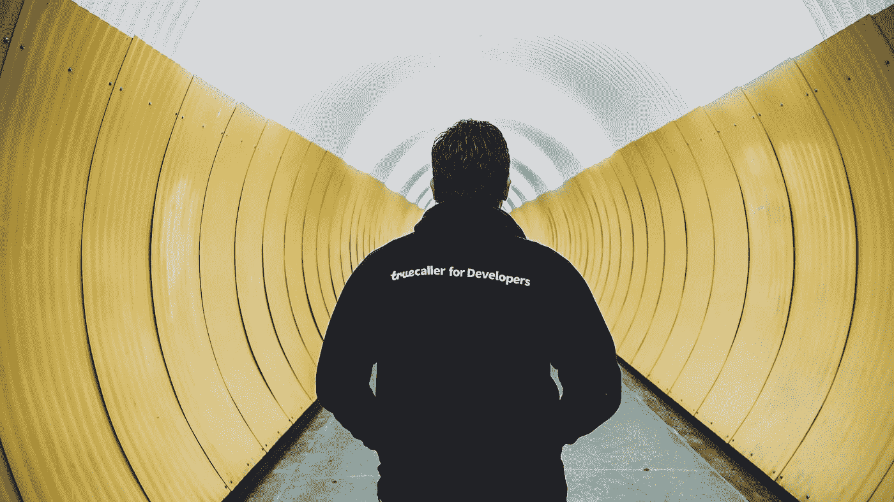

# 这是我列出的 2021 年要学习的技术

> 原文：<https://medium.com/codex/here-is-my-list-of-technologies-im-learning-in-2021-e1aa6041ceac?source=collection_archive---------5----------------------->

## 年度学习，[抄本](http://medium.com/codex)

## 从新的编程语言到云环境的创建

由[林赛·拉蒙特](https://unsplash.com/@travelpen?utm_source=medium&utm_medium=referral)在 [Unsplash](https://unsplash.com?utm_source=medium&utm_medium=referral) 上拍摄的照片

今年我想列出今年我想学习的主题。在年底，我会反思我完成了多少清单。

## 1.[功能编程](https://en.wikipedia.org/wiki/Functional_programming)

函数式编程的一个简单要点就是关于不可变变量的函数。与面向对象的语言相反，面向对象的语言更多的是关于一组固定的函数和修改或添加新的变量。

一年前，我第一次尝试使用灵药，但现在我不再使用它，它已经有点褪色了。因为函数式编程一直吸引着我。我想再捡起来。

今年我将尝试函数式编程的概念，它是什么，是什么使它函数化？像 Elixir 和 Haskell 这样的函数式编程语言是如何使用这些实践的呢？

我将回到 Elixir 学习函数式编程，但我也想在其他语言中使用这些实践，如 TypeScript、C#和 go。因为我每天都在使用它们。

## 2.[戈朗](https://golang.org)

Golang 是由 Google 创建的，它被越来越多的大公司和开源软件项目采用。想想 Docker 和 Kubernetes，它们因为其本身而非常受欢迎，但它们也是用 Go 编写的。

几个月前，Github 发布了他们的个人资料自述文件，一场热潮开始了，每个人都在创建和润色他们的个人资料自述文件。

我环顾四周，发现有一些人基于 cron 时间表创建自动生成的自述文件。我也想这样做，并开始考虑使用哪种语言来做这件事。我可以写 Python 或者 NodeJS，但是我想要完全新的东西，所以我选择了 Go。

从那以后我就用 Go 写了小的 CLI 程序。但我仍在摸索这门语言的皮毛，但今年我将在 Go 中编写我的大部分 API、Web Scrappers 和 CLI 工具。

## 3.[码头工人](https://www.docker.com)

Docker 是一套用于开发、运行和发布应用程序的工具。
它允许一个简单的命令行界面。它将您的应用程序运行时与其运行的基础设施分离开来。

我对 Docker 很熟悉，并且在 Docker 上运行我的个人网站已经有很长时间了。因为我还想教育 Docker 上的其他人，所以我必须深入一点。除此之外，我还想了解网络、路由和负载平衡。

今年我将编写 Go 程序，并在 Docker 中运行这些程序。那些节目会是什么，我还不知道。也许是一个 Slackbot 或者一个使用 Go 的简单网站。

## 4.[地形](https://www.terraform.io)

Terraform 是一个开源的基础设施代码工具，它通过将云定义为可读的配置文件来管理云。

我喜欢 Terraform 的一点是，你只需指定你的[云提供商](https://registry.terraform.io/browse/providers)，你就可以创建并以代码形式记录你的基础设施了。有了这些文档，您可以非常快速地搭建基础设施。

这次我只在一个工作项目和个人原型中使用了 Terraform。但是我得到的曝光率足以让我知道这是一个我可以使用的很棒的工具。

今年，我想通过 Terraform 在云中建立更多的项目，考虑虚拟机、 [AKS](https://docs.microsoft.com/en-us/azure/aks) 资源，以及在 Azure 中使用传统应用服务的完整 DTAP 街道。

## 5. [Kubernetes](https://kubernetes.io)

Kubernetes 是一个容器编排系统，用于管理、扩展和部署您的应用程序。

Kubernetes 对我来说仍然是一个新的话题，我仍然在用它做些什么。但我认为这是在云中管理应用程序的未来。

我想确保我交付的每个项目都是可靠的，能够处理黑色星期五或其他活动期间访问者可能扔给它的任何负载。

我目前正在家里的一套树莓 pi 上运行一个 [k3s](https://k3s.io) 集群。我正在[这个库](https://github.com/koenverburg/cloudfiles)中记录我的进度。*(小免责声明:我只是为自己记录，不要期望在这个时间点有文档级的阅读材料)*

今年，我将在虚拟机上从头开始安装 k8s，之后我想看看 [AKS (Azure Kubernetes 服务)](https://docs.microsoft.com/en-us/azure/aks)带来了什么。

清单就这些，感谢阅读！今年你在学什么？

一定要在 Medium、Instagram 和 Twitter 上关注我，在那里你可以了解整个过程。

我谈到的主题的链接

*   [功能编程](https://en.wikipedia.org/wiki/Functional_programming)
*   [戈朗](https://golang.org)
*   [码头工人](https://www.docker.com)
*   [地形](https://www.terraform.io)
*   [Kubernetes](https://kubernetes.io)