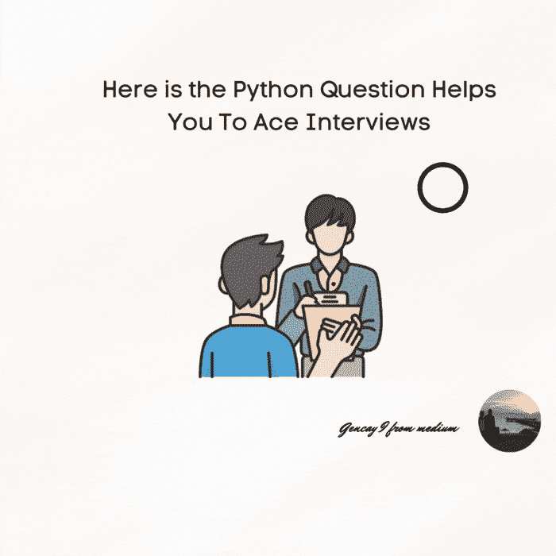

# 以下是帮助你赢得面试的 Python 问题

> 原文：<https://medium.com/codex/here-is-the-python-question-helps-you-to-ace-interviews-b4ae02d392fe?source=collection_archive---------6----------------------->

## 在这里，我将问题分成许多阶段，然后解决每个阶段，然后通过数学运算和操作将它们变成整洁的 Python 代码。

在坎瓦普罗设计

**内容表**