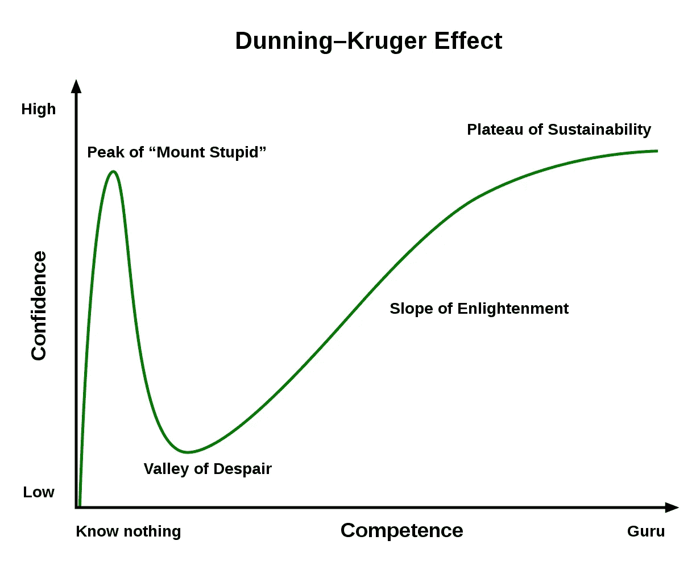

# 这是你的程序员故事

> 原文：<https://medium.com/codex/here-is-your-programmer-story-f81205a9bf58?source=collection_archive---------19----------------------->

## 如何拯救一个程序员的生命



你没看错标题。我将告诉你如何成为一名程序员。

在一个晴朗的日子里，你在网上看到了一本关于如何开始编码的书或资源。你对此很感兴趣，并决定了解更多。一种潜在的解决问题和编写软件的热情正在你的内心被唤醒。慢慢地，日复一日，你开始变得熟练。数小时的练习似乎得到了回报。你挑战了自己，优雅地解决了问题。

你的朋友来找你帮忙完成他们的任务。他们向你寻求编程问题的解决方案。你是你圈子里的计算天才——他们的明星程序员。生活进行得很顺利；你喜欢做你做过的事。

但是随后一些问题开始悄然出现。很快你就不知不觉地开始过度应对超出你能力范围的挑战和项目。你被困在别人灌输给你的错误信念中。不，你不是明星程序员。不，你不是天才。你只到了第一个悬崖，搭建了一个临时营地。你喜欢你短暂的停留，但是你猜怎么着——一场暴风雪就要来了。

那些你强加给自己的艰难挑战让你失去了信心。你没有意识到你的知识只是沧海一粟。你的信心如此之低，以至于你可能会决定放弃。从表面上看，形势对你不太有利。在某一点上，你觉得自己站在世界的顶端，而就在第二天，你却陷入了有史以来的最低谷。

然而，在你的内心深处，你不想放弃——不。相反，你在寻找答案。这可能花了你几周或几个月的时间，但是**你没有放弃**。你站了起来，一路奋斗回到了巅峰。你策略性的退了一步，在增加难度之前解决了一些比较简单的问题。不知不觉中，有一天你终于解决了最初导致你痛苦的那个问题。

你又开始相信自己了。你学会了新的语言，而且学得很好。你开始重温那些你的朋友和同事认为你最好的日子。你感觉到了稳定。现在，你访问了 Medium，看了这篇文章，心想，“这是一个独特的标题”。

# 邓宁-克鲁格效应

*“哇，这个故事描述了我作为程序员的历程。他怎么知道的？”*事实证明，这是所有学习领域中常见的现象，尤其是如果你学习计算机科学的话。

> 当一个人缺乏某个领域的知识和技能，导致他们高估自己的能力时，就会出现邓宁-克鲁格效应。

当你开始从事这个领域时，你对编程了解不多。尽管如此，你还是完成了一些让所有人惊叹的伟大作品。但是由于缺乏*完整的*知识，你无法发现自己的错误。这从长远来看影响了你的进步。

邓宁-克鲁格效应让你的缺点在当时看不见。你因知之甚少而增强的自信最终会导致你的失败。你应该选择上升还是保持下降——这是你需要做出的选择，决定你命运的选择。

# 结论

我已经度过了计算机科学的低谷；你也是。其他几个人要么正处于这个阶段，要么还没有经历这个阶段。然而，没有多少人知道这种影响，我们需要教育越来越多的程序员。通常，当编程开始变得复杂时，人们会放弃编程，而所需要的只是一点推动和鼓励。不要半途而废，也不要阻止别人这样做。

我希望你喜欢读我的文章。谢谢大家！✌️

```
**Want to connect?**My [GitHub](https://github.com/cybercoder-naj) Profile.
My [Portfolio](https://cybercoder-naj.github.io) Website.
```