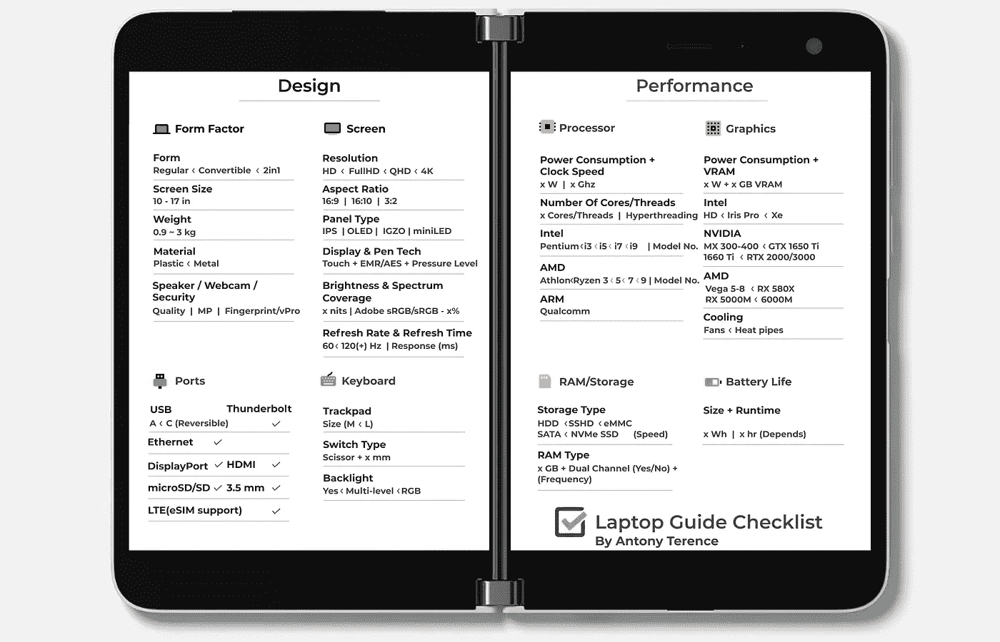

# 这里有一个免费的便携式电脑指南清单

> 原文：<https://medium.com/codex/heres-a-free-bite-sized-laptop-guide-checklist-5e2c16785402?source=collection_archive---------4----------------------->

## 使用这个方便的列表，让购买笔记本电脑变得更加容易

设计学分: [Komal Telagavi](https://www.instagram.com/komal_telagavi/) 。

需要一台笔记本电脑但不知道如何挑选合适的？

你来对地方了。

## 这就是我制作这个笔记本电脑指南清单的原因

我是安东尼，你友好的邻居极客，你向他寻求技术建议的家伙。

小时候我爸在我面前组装电脑。当我开始购买我的第一个显卡时，我选择了一个包装上有绿色龙的显卡。回想起来，我意识到无数其他人也在销售人员和技术朋友的支配下购买技术。

购买笔记本电脑并不一定是沮丧的练习。

这里先睹为快我的笔记本电脑指南的一部分——一个简单的清单，涵盖了基础知识。

该指南将您的决定分为:

*   **设计(窗体|端口|键盘|屏幕)**
*   **性能(处理器|显卡|存储|电池)**

黑暗模式爱好者的清单。作者和 [Komal Telagavi](https://www.instagram.com/komal_telagavi/) 创建的清单。

## 以下是您在购买笔记本电脑时需要注意的事项

## **外形尺寸-**

1.  决定**尺寸**和**重量**。(10-17 英寸)|(千克)
2.  选择其**形式**。(普通/敞篷/2in1)
3.  检查笔记本电脑的**扬声器**、**网络摄像头**和**生物特征。**(指纹/人脸解锁)

## **港口-**

1.  寻找您需要的端口:**USB A/C | Thunderbolt | HDMI | display port Ethernet | 3.5 毫米| SD | LTE** (eSIM 支持)

## **键盘-**

1.  检查按键开关**的感觉**。(行驶距离)
2.  注意**触控板**的**尺寸**。
3.  **背光** —检查多级或 RGB 照明。

## **屏幕-**

1.  查看它的**类型、分辨率、**和**纵横比**—
    (IPS/有机发光二极管)|(全高清/QHD/4K) | (16:9/16:10/3:2)
2.  寻找**触针**和**触针**支架。(灵敏度)
3.  记住这些令人讨厌的细节——亮度(尼特)|色彩准确度(sRGB %)
4.  要获得更灵敏的显示器，请注意它的**刷新率**。(60/120(+)赫兹)

## **RAM/存储器-**

1.  选择合适的存储**类型** —(硬盘/SSHD/eMMC/固态硬盘)
2.  决定**闸板**的数量。(8 GB 或更高)
3.  同时寻找**的可升级性**。

## **处理器-**

1.  选择处理器的**功耗**。(W)
2.  选择一款**英特尔**或 **AMD** 处理器。(奔腾→ i9)/(速龙/锐龙 3→9)

3.只需使用一个**性能图表**来显示您需要的应用/游戏。

## **图形-**

1.  决定显卡的**功率等级**和 **VRAM** 。(W) | (GB)
2.  如果你想运行高强度的应用程序，选择一台有合适冷却系统的笔记本电脑。(风扇/热管)
3.  在**集成**(电池续航时间更长)或**专用**(性能更高)显卡之间进行选择。
4.  在英特尔、英伟达、AMD 和 AMD 之间做出选择。
    (高清/虹膜 Pro/Xe)|(MX/GTX/RTX)|(Vega/RX 580 x/RX 6000m)
5.  同样，对您将要运行的应用程序使用**性能图表**。

## **电池-**

1.  决定电池的**尺寸**。(Wh)
2.  使用**电池寿命测试**了解笔记本电脑在您独特的使用情况下可以使用多长时间。

这里有一个轻模式的！由作者和 [Komal Telagavi](https://www.instagram.com/komal_telagavi/) 创建的清单。

虽然商店页面不一定包含所有这些细节，但一两条评论应该会给你提供你需要的信息。

设计致谢:[伦加·普拉萨德](https://www.artstation.com/renhunter)。

我希望这些能让你开始寻找笔记本电脑！如果你需要一些全面的东西，我正在写一本详细介绍这些观点的指南。敬请关注更多公告！

如果您在购买笔记本电脑(或任何消费电子产品)时需要帮助，请留言。

*如果你想知道是谁设计了那些华丽的插图，那就去见见设计师* [*伦加*](https://www.artstation.com/renhunter) *和* [*科马尔*](https://www.instagram.com/komal_telagavi/) *。*