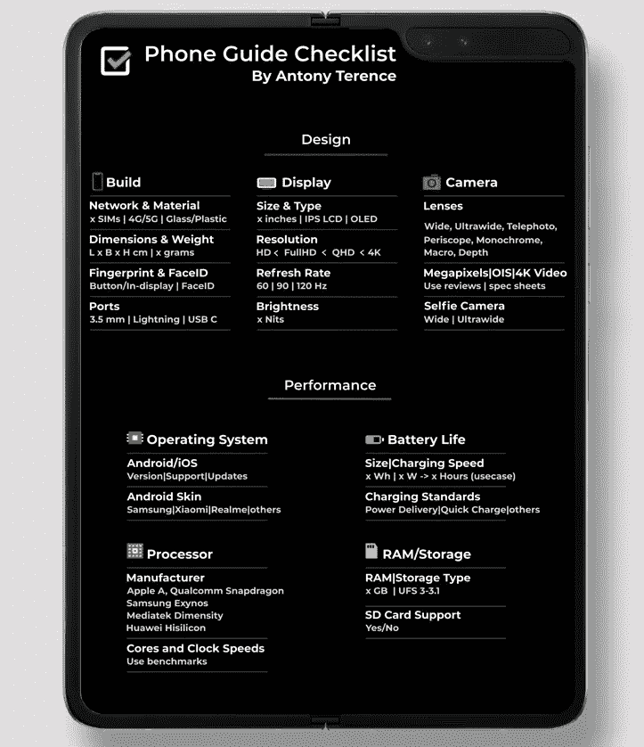

# 这里有一个免费的一口大小的电话指南清单

> 原文：<https://medium.com/codex/heres-a-free-bite-sized-phone-guide-checklist-aa667100301?source=collection_archive---------11----------------------->

## 购买智能手机不一定是一件苦差事

资料来源:Unsplash。

需要智能手机指南吗？我掩护你。

## 这就是我制作这个电话指南清单的原因

如果你不明白我的工作，这里有一个介绍。我是你向其寻求技术建议的人。

智能手机的购买并不局限于销售人员或技术爱好者的推荐。小时候我爸在我面前组装电脑。当我开始购买我的第一个显卡时，我选择了一个包装上有绿色龙的显卡。

我不希望任何人做出这样的决定。永远不会。

这里有一个简单的清单，涵盖了智能手机搜索的基本知识。该指南将您的决定分为:

1.  **设计(构建|显示|摄像机)**
2.  **性能(电池|操作系统|CPU|RAM &存储)**

来源:作者创作的指南。

## 以下是你需要在智能手机中寻找的东西

首先，挑选几款有潜力的手机，拿到它们的[规格表](https://www.gsmarena.com/oppo_reno8_pro-11542.php)。

## 构建-

1.  决定**尺寸**(尺寸)和**材料**。尺寸和**重量**主要取决于屏幕尺寸。大猩猩玻璃背面/正面进一步提高了耐用性。
2.  注意手机的**安全系统**。苹果的 Face ID 比大多数 Android 实现都要先进一步，但指纹传感器不会出错，无论是在屏幕下还是在电源按钮上。
3.  大多数安卓手机都有 USB-C 端口，而 iPhones 选择了 Lightning 端口。如果需要，请留意 3.5 毫米插孔和/或红外发射器。GSMArena 有很棒的[扬声器](https://www.gsmarena.com/gsmarena_lab_tests-review-751p7.php)测试。
4.  如果你要去不同的国家旅行，检查手机是否有多个 SIM 卡插槽，是否支持必要的 4G/5G 频段(T21)。

## 显示-

1.  选择正确的**屏幕尺寸**(英寸)。大屏幕非常适合观看内容，但单手操作可能会有困难。对于大多数用户来说，**屏幕分辨率**超过 1080p 并不重要， [**刷新率**](https://www.androidauthority.com/phone-refresh-rate-90hz-120hz-1086643/) (60/120 Hz)决定了动画和滚动的流畅度。
2.  AMOLED 显示器比其竞争对手 LCD 显示器提供更好的对比度和亮度。使用像**亮度**(尼特)和 [**HDR 支持**](https://www.pocket-lint.com/phones/news/dolby/138387-mobile-hdr-dolby-vision-hdr10-and-mobile-hdr-premium-explained) 这样的指标的评论。

## 相机-

1.  有几种**类型的镜头**(广角|超广角|长焦|潜望镜|单色|微距|景深)。现实世界**图像质量**取决于成像算法，而非百万像素。如果这听起来像是工作，坚持用[电话具体解释](https://www.gsmarena.com/samsung_galaxy_s22-review-2396p5.php)和[照片对比](https://www.gsmarena.com/samsung_galaxy_s22-review-2396p6.php)来评论。
    [GSMArena](https://www.gsmarena.com/piccmp.php3?idType=1) 和 [DxOMark](https://www.dxomark.com/) 是做这个的好地方。
2.  如果你需要的话，找一个好的**自拍相机**。根据规格表进行价值评估和图像/视频比较。后者还涵盖了 **OIS** (光学防抖) **slo-mo** 、 **4K 视频录制**等小众功能支持。

## 电池-

1.  查看**电池电量** (mAh)和**充电速度** (W)。但是要相信电池寿命图表来确定电池寿命。GSMArena 的[电池寿命图表](https://www.gsmarena.com/battery-test.php3)提供了各种使用情况下的电池估计值。

## 操作系统-

1.  除了通常的 **iOS vs Android** 辩论，调查一下[哪个版本的 Android 会让你感到舒服。虽然大多数制造商不再让他们的手机臃肿，但一些设备更接近普通的 Android 体验。](https://www.techadvisor.com/buying-advice/google-android/best-brands-for-android-updates-3798154/)
2.  虽然苹果为其手机提供了几个更新版本，但并不是每部安卓手机都有相同的承诺。[更新是谷歌 Pixel 阵容和少数旗舰之外的奢侈](https://www.techadvisor.com/buying-advice/google-android/best-brands-for-android-updates-3798154/)。

## 处理器-

1.  苹果的 A 系列芯片比安卓手机的芯片性能更好，寿命更长，但后者在各方面都很棒。虽然今天的中端手机可以处理最密集的任务，但如果你对这种事情感兴趣，你仍然可以沉迷于基准测试。

## RAM 和存储-

1.  **内存容量**如今不是什么大事，即使是廉价的安卓手机也提供 4 GB 或更多的内存。这已经足够了，除非你在和 Chrome 一起运行游戏。
2.  **SD 卡插槽**越来越少，基本款手机提供至少 64 GB 的存储空间。存储速度不是一个令人担忧的问题，因为今天大多数手机都提供 [UFS 3.1 存储](https://www.xda-developers.com/ufs-3-1-speed-power-efficiency-flash-storage-chips/)。

我希望这些能让你开始寻找智能手机！GSMArena 的详细规格表和评论是入门的绝佳资源。

如果您在购买笔记本电脑(或任何消费电子产品)时需要帮助，请留言。