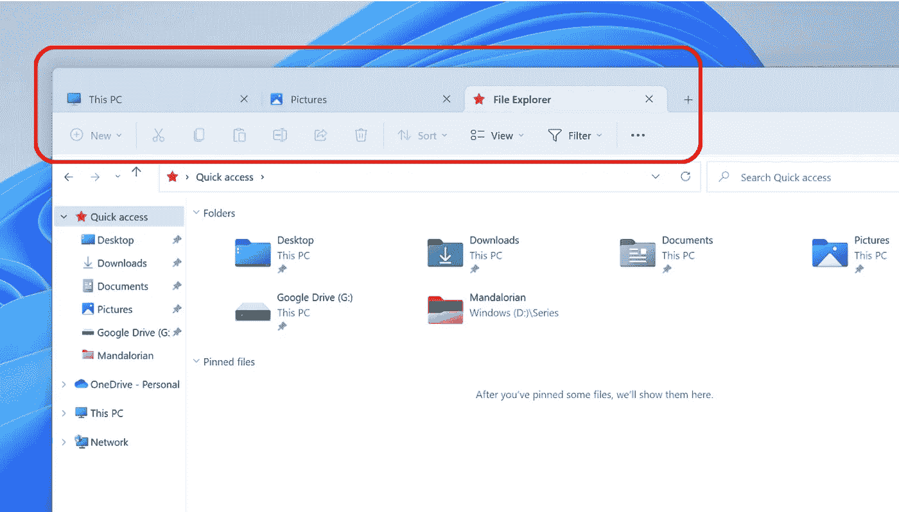

# Windows 11 现在支持文件资源管理器中的选项卡

> 原文：<https://medium.com/codex/heres-how-you-can-enable-tabs-in-windows-file-explorer-552e290e4405?source=collection_archive---------4----------------------->

图片作者[作者](/@jimclydemonge)

你没看错。Windows 文件资源管理器现在支持选项卡。

这个特性被许多狂热的 Windows 用户强烈要求已经有一段时间了。最后，微软正在努力将其纳入 Windows 11 的下一个测试版。嗯，我希望他们这样做，因为该公司尚未就此发表官方声明，该功能在默认情况下仍被禁用…