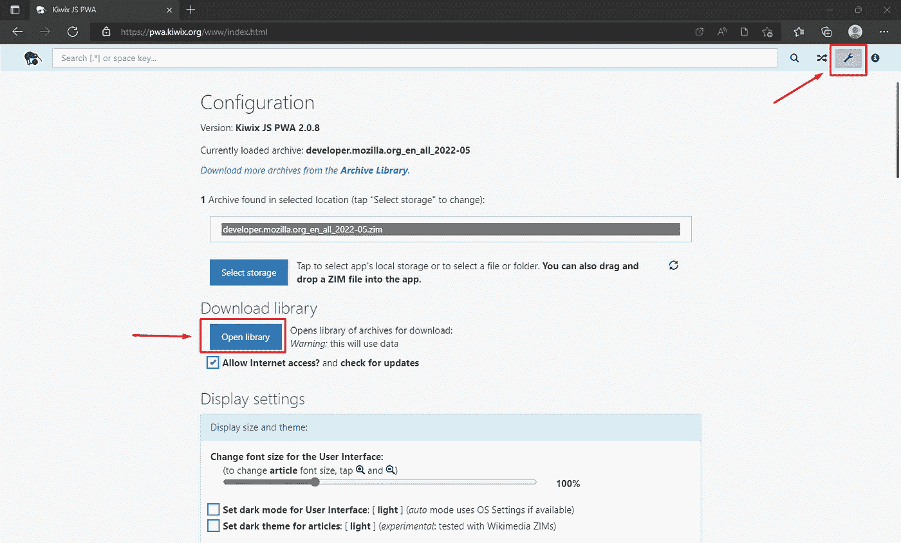
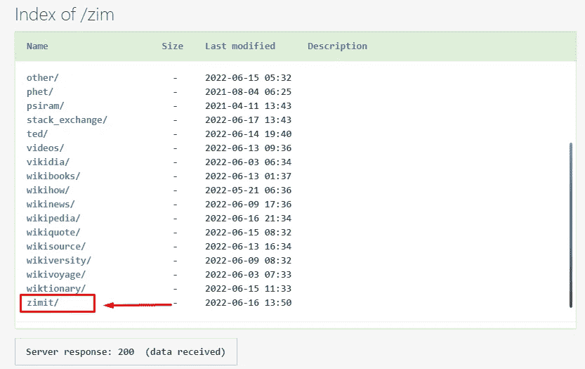
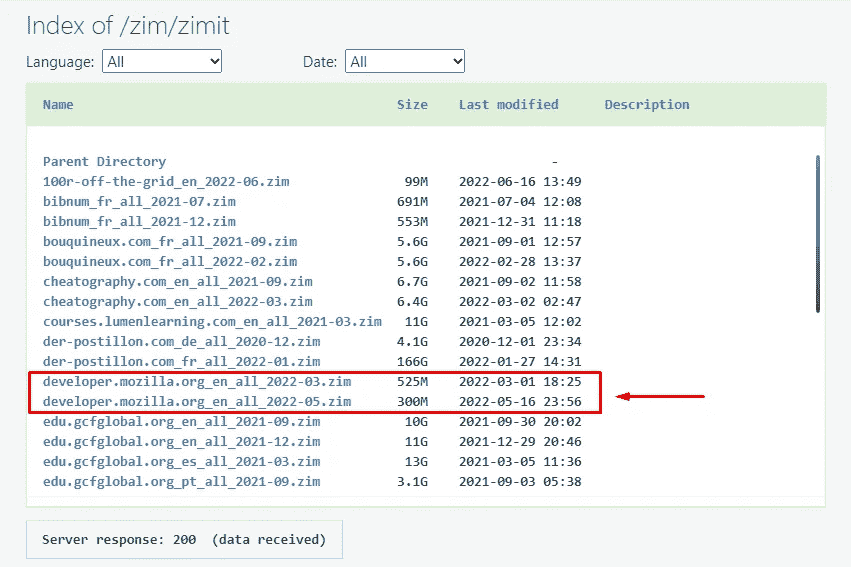
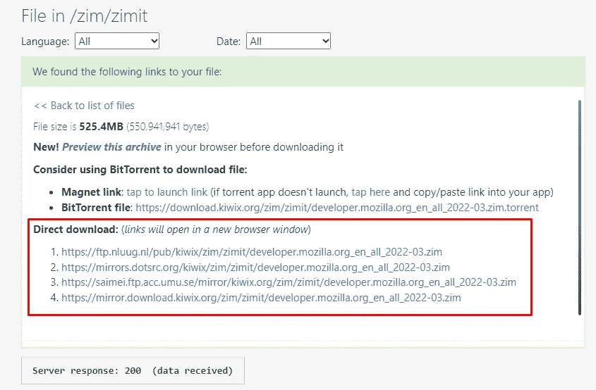
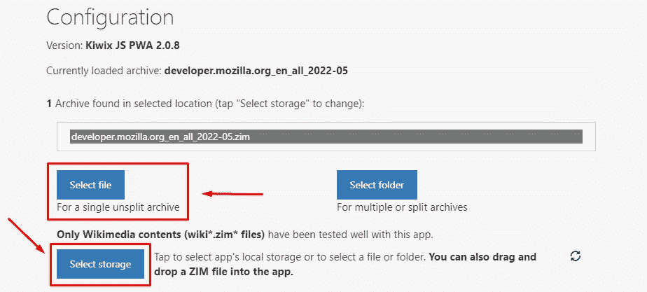
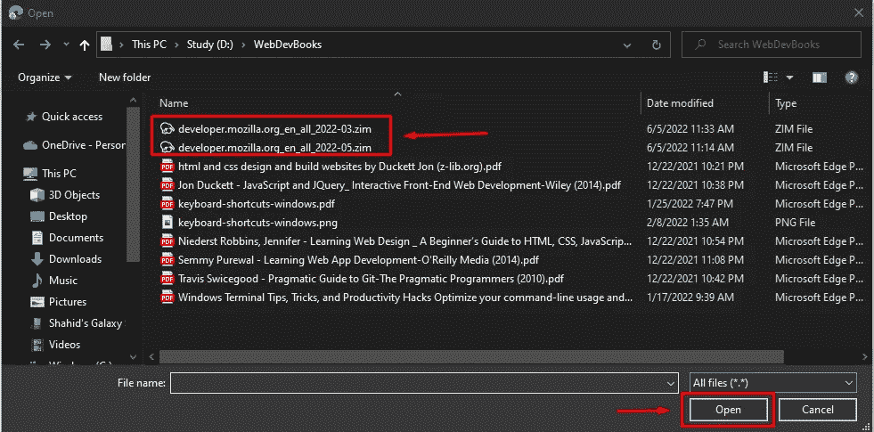
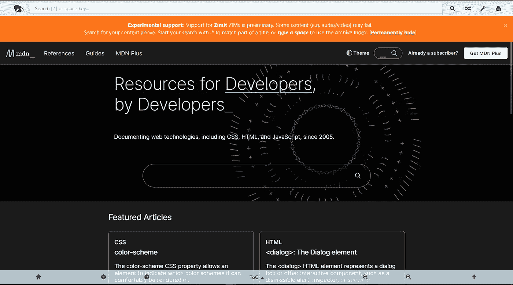

# 以下是脱机使用 MDN Web 文档的方法

> 原文：<https://medium.com/codex/heres-how-you-can-use-mdn-web-docs-offline-51c6558ad592?source=collection_archive---------13----------------------->

杰克逊·索法特在 [Unsplash](https://unsplash.com?utm_source=medium&utm_medium=referral) 上的照片

我是一名网络开发人员，有时我不得不面对糟糕和缓慢的互联网连接，有时甚至没有连接。每当我遇到任何技术困难或不明白某个主题时，我通常会参考 Mozilla developer Network (MDN)的 HTML、CSS 和 JavaScript 文档。它被吹捧为初学者和高级 web 开发人员最好的免费学习资源之一。

在本文中，我将向您展示如何离线获取 Mozilla 基金会提供的全部文档。

# 第一步

去 pwa.kiwi.org[安装成 PWA (progressive web app)。](http://pwa.kiwi.org)

如果你正在使用 chrome，会出现一个弹出窗口，告诉你把这个网站作为一个应用程序来安装

如果您使用的是 Microsoft edge，请单击三点菜单选项，然后选择应用程序，然后选择将此网站安装为应用程序。

# 第二步

现在打开应用程序，点击设置图标，然后选择打开图书馆

# 第三步

向下滚动并选择 zimit。

# 第四步

现在选择突出显示的选项。MDN 有两个版本，一个是旧版本，另一个是最新版本。选择你喜欢的任何东西。

# 第五步

将出现下载链接。你有不同的选择。要么去种子链接或选择直接下载。我会推荐直接下载链接，因为它们通常很快，如果你没有 torrent 下载器的话。

# 第六步

下载文件后，回到应用程序，点击设置图标。现在选择选择存储，然后选择文件

# 第七步

将出现一个弹出窗口，要求您选择刚刚下载的文件。就我而言。

# 第八步

享受离线学习😊。

MDN Web 文档脱机

分享给能从中受益的朋友。

快乐发展…