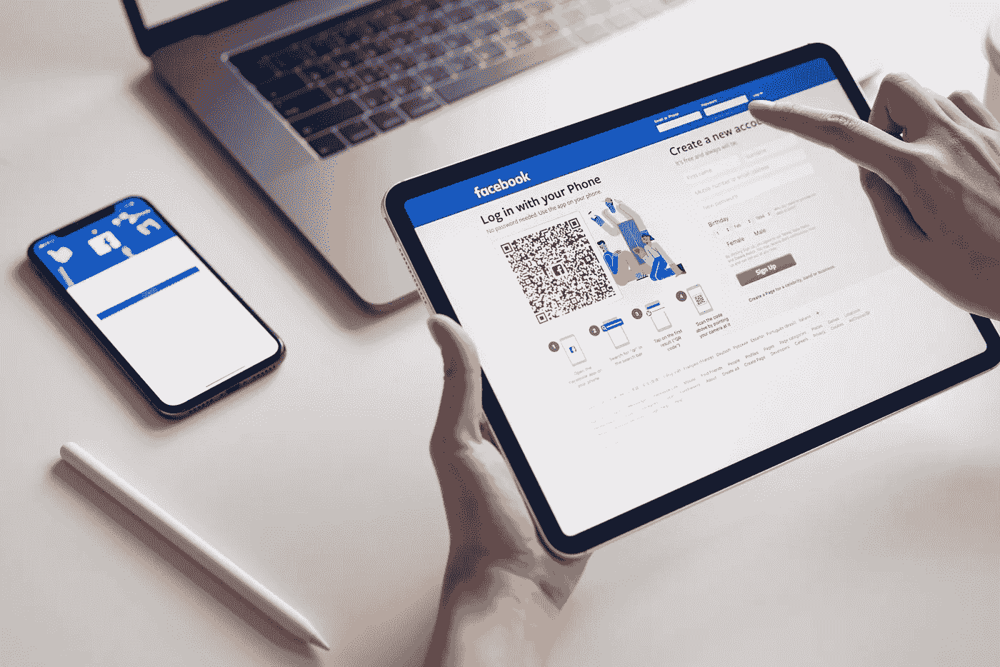

# 以下是人们避免购买苹果产品的原因

> 原文：<https://medium.com/codex/heres-why-people-avoid-buying-apple-products-56bfec1788ea?source=collection_archive---------2----------------------->

对一些人来说，苹果确实是一个非常敏感的话题。不知何故，我能理解他们。苹果往往是一个非常昂贵品牌，它对在数字世界中做事情有不同的看法。

苹果试图给他们的用户最好的体验:最舒适和灵活的工作和生活方式。这里没有错，但是和其他方面一样，舒适的花费更多。即使你打电话要一辆优步——舒适版也比优步 X 版的交通工具贵。

*舒适成本。* *这是苹果键*。

## 我的观点

我从 10 岁开始用苹果产品。我有很多来自不同产品的版本，比如:iPhone、MacBook、Apple Watch、iPad。我不会解释为什么这些产品都比竞争对手的好。在这里，你可以找到它们在其中发挥作用的生态系统的最佳描述。这是苹果公司立足之本。

嗯，所有这些产品都是在一个 iCloud 账户内链接的。这意味着每一个字节的数据都存储在云中，所以你可以从你的每一台苹果设备上访问它。例如，如果您使用 iPad 制作照片，您可以在 iPhone 和 MacBook 上查看照片。此外，如果你在 MacBook 上创建了一个文档，你可以随时从你的 iPhone 上打开、编辑和导出它。

如果你用你的 iPhone 打电话给某人，而不是打开扬声器，你可以用你的 MacBook、iPad 或 Apple Watch 与那个人通话。事实上，这有时节省了我很多时间——我在某个地方工作，而我把 iPhone 忘在了另一个房间，所以当有人打电话给我时，我可以用我的电脑接听。是的，没有 sim 卡。那是我在其他平台上没见过的。

如果我用 iPhone 从 App Store 下载一个应用程序，它会自动下载到我的 iPad 上，所以，例如当我在手机上安装网飞时，iCloud 知道我可能也会在平板电脑上看电影，所以它节省了我一些时间。

如果我在 iPhone 上打开睡眠模式，生态系统将在我的其他苹果设备上打开这一模式。这意味着如果我告诉我的 iPhone 我想睡觉，我将不会从我的 iPad 上收到网飞提醒。

## 让我着迷的是

我非常欣赏这家公司如何开发我们经常使用的日常技术，所以我对这些迷你电脑和他们创造的电脑的底层非常感兴趣。

也许你听说过航空标签。这个小东西，你知道它的确切位置，不需要你的手机蓝牙。

你不会相信我，但是你可以用苹果官网通知自己。这个小工具是这样工作的:

假设您在商店丢失了钥匙，并且您的钥匙串上贴有一个航空标签。没关系。现在你在出租车上，你有一个使用蜂窝数据的稳定的互联网连接。您尝试使用 AirTag 来定位您的钥匙串。

AirTag 会检测附近卖家的 iPhone，并使用卖家的互联网连接和您的互联网连接匿名 pings 您的 iPhone。是不是很迷人？谁想到过这种程序？只有天才。

## 他们的产品

我们都至少问过自己一次，为什么苹果产品那么贵，对吗？下面是我的“为什么”。

我看到苹果遵循“越贵越有质量”的理念——对于一个同时想要舒适和质量的人来说，这完全没问题。

MacBook —如果你厌倦了 Windows 蓝屏、超长加载屏幕、病毒和许多其他问题，你会买这款电脑。

**iPhone**——如果你厌倦了低质量的照片和完全低效的工作空间，你会买这款手机。

**iPad**——如果你的 MacBook 需要额外的屏幕，或者如果你需要比 MacBook Air 更小的笔记本电脑，你可以买这个小玩意。是的，你可以用苹果的 iPad Magic Keyboard 把你的 iPad 变成你的笔记本电脑。

**ai rpods**——如果你厌倦了耳机的这根长线缆，你就会买这款产品。

苹果手表(Apple Watch)——如果你需要一个高分辨率的迷你屏幕，你会买这款手表。这个适合学校。

## 结论

所以，如果你想为自己和自己的舒适投资一些钱&如果你有时真的很忙，你应该考虑为你的工作场所购买苹果产品。这很重要，相信我。

感谢阅读我的文章。